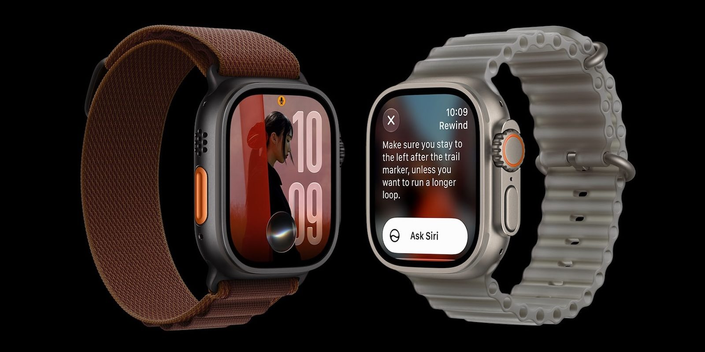
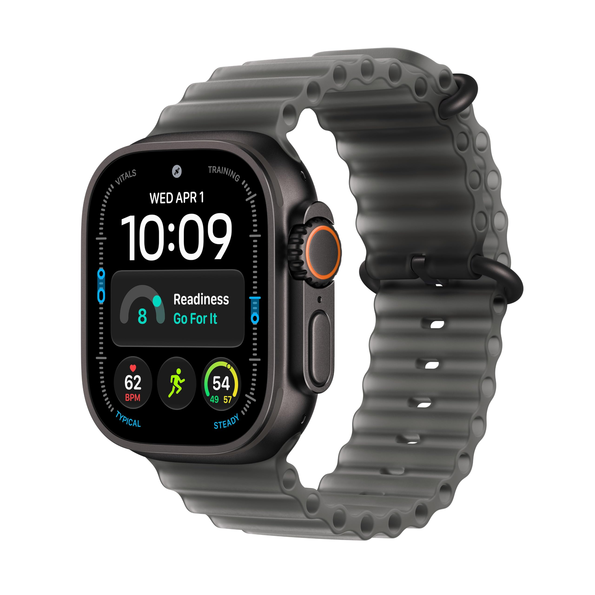
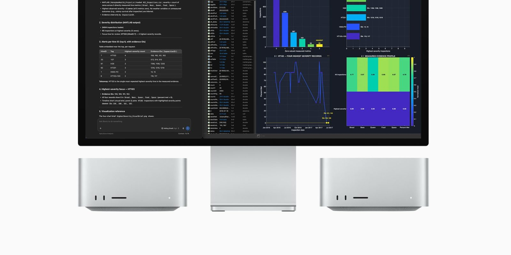
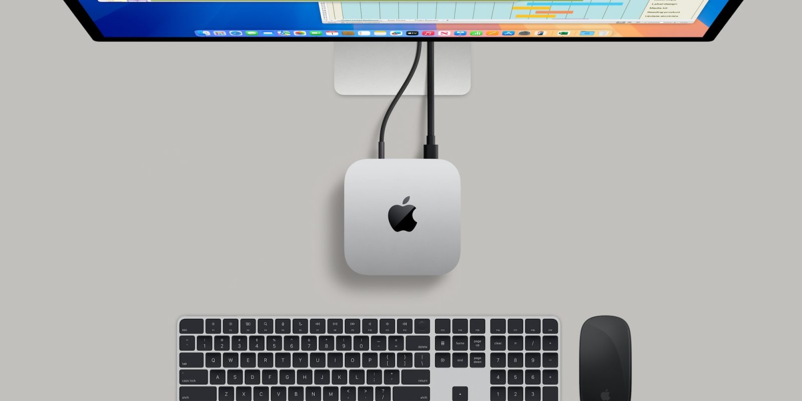

El **Apple Watch Ultra 4** ya está a la venta y, con él, llegan también los primeros descuentos. Amazon ha puesto en marcha ofertas de lanzamiento sobre varias configuraciones del reloj más resistente de Apple, una rebaja modesta pero suficiente para rascar unos cuantos dólares a quien no quiera esperar a la próxima bajada de precio. No se trata de grandes rebajas, advierte 9to5Mac, sino de un ajuste de bienvenida aplicado a algunas versiones de titanio.

El movimiento se enmarca en una semana cargada de lanzamientos: además del Ultra 4, han llegado a los compradores el Apple Watch Series 12 y el iPhone 18 Pro, y las tiendas han aprovechado para colocar sus primeras ofertas. Para quien venía siguiendo el desembarco del reloj —ya cubrimos los cambios de interfaz que traen [el Ultra 4 y el Series 12 con el modo Teatro](/noticias/apple-watch-series-12-ultra-4-theater-mode/)—, este es el primer momento en el que el precio se mueve.

## Qué configuraciones del Apple Watch Ultra 4 están rebajadas

La oferta se concentra en un puñado de versiones del Apple Watch Ultra 4 GPS + Cellular en caja de 49 mm. Amazon rebaja cada una de ellas a **780 dólares**, frente a los **799 dólares** de tarifa, es decir, **19 dólares menos**. Las rebajas alcanzan tanto a los acabados en **titanio negro** como en **titanio natural**, e incluyen un par de configuraciones con la nueva **correa Ocean translúcida**.

| Modelo | Precio rebajado | Precio de referencia |
| --- | --- | --- |
| Apple Watch Ultra 4 GPS + Cellular, 49 mm (cuatro configuraciones) | 780 $ | 799 $ |

La fuente no habla de descuentos generalizados, sino de la mejor disponibilidad de precio entre las distintas combinaciones de caja y correa. En la práctica, quien tenga decidido el modelo puede ahorrarse el equivalente a una comida; quien espere un recorte profundo tendrá que aguardar, porque el producto acaba de salir al mercado.

El lanzamiento también ha dejado ofertas tempranas en el **Apple Watch Series 12**, que mantiene parte de los precios de promoción de estos días según el mismo medio. La comparación con generaciones anteriores es inevitable: el Ultra 4 hereda el trono del catálogo deportivo de Apple, mientras alternativas como el [Moto Watch Ultra LTE](/noticias/moto-watch-ultra-lte/) siguen presionando por abajo. Y para quien mida cada euro del segmento wearable, conviene recordar la reciente [rebaja del Garmin Fénix 8](/noticias/garmin-fenix-8-price-drop/), una opción muy distinta pero igualmente de gama alta.

## El resto de ofertas que acompañan al reloj

El resumen de descuentos del día no se limita al reloj. Estas son las ofertas más destacadas que lo acompañan, en todos los casos según 9to5Mac:

- **AirPods Pro 3 a 199 dólares**, frente a los 249 de tarifa: un recorte de 50 dólares que se mantiene activo durante los días de entrega del nuevo iPhone.
- **Studio Display de 2026 desde 1.359 dólares** en la tienda oficial de productos reacondicionados de Apple, lo que supone 240 dólares menos que los 1.599 de tarifa del modelo de entrada con soporte de inclinación. La unidad conserva la garantía limitada de un año de Apple, la política de devoluciones de 14 días y la posibilidad de contratar AppleCare; no admite grabado ni envoltorio de regalo y, avisa la fuente, el stock es limitado.
- **Mac Studio de 2026 (36 GB de RAM, 512 GB, CPU de 18 núcleos y GPU de 32 núcleos) por 2.449,99 dólares**, apenas 50 dólares por debajo de su precio de tarifa y con la particularidad de que Amazon entrega antes que la propia Apple.

A ello se suman las reservas del **Mac mini con chip M6**, con descuentos de entre 19 y 30 dólares según la configuración y con la particularidad de que Amazon entrega algunos modelos antes que Apple. Son recortes pequeños, pero que en conjunto dibujan una semana de compras pensada para los primeros compradores.

## Qué significa para el comprador

Para el lector en España, lo primero es tener claro que los precios citados corresponden a la tienda estadounidense de Amazon y están expresados en dólares, sin impuestos ni gastos de envío: el coste final de traer el reloj depende de las condiciones de envío e importación, y no equivale al precio que Apple marca en el mercado español. La rebaja de 19 dólares es, en cualquier caso, la primera señal de que el Ultra 4 empieza a moverse en el mercado.

La lectura editorial es sencilla. Un descuento de lanzamiento tan contenido no es una oportunidad irrepetible, sino la constatación de que los grandes recortes llegan más adelante, cuando el producto pierde novedad. Quien quiera el Ultra 4 cuanto antes pagará prácticamente el precio oficial; quien pueda esperar, probablemente encontrará ofertas mejores en las próximas semanas, como ya ocurre con otros modelos del catálogo.
