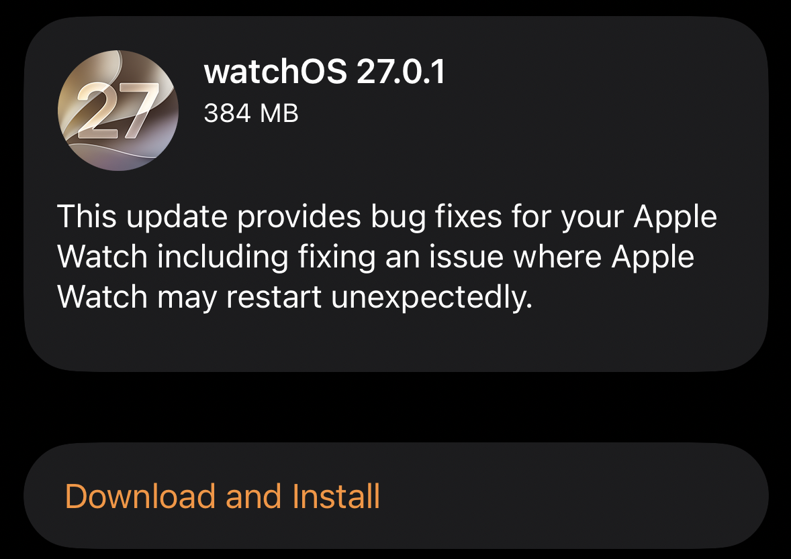

Apple ha publicado watchOS 27.0.1, una actualización de mantenimiento que llega apenas una semana después de la versión principal y que persigue un objetivo muy concreto: acabar con los reinicios inesperados que venían registrando algunos Apple Watch Series 12 y Apple Watch Ultra 4. La compañía distribuye el parche de forma exclusiva para esos dos modelos, según 9to5Mac.

## Un parche centrado en un fallo que se dejaba notar

Las notas de la versión son escuetas y no detallan la causa del problema. Apple se limita a señalar que la actualización incluye correcciones de errores y, en concreto, soluciona una incidencia por la que el reloj podía reiniciarse sin previo aviso. La propia pantalla de descarga del dispositivo muestra las notas de la versión y un paquete de alrededor de 384 MB.

El movimiento encaja con la frecuencia con la que Apple ha ido puliendo watchOS 27 en las últimas semanas: el sistema llegó el 14 de septiembre y desde entonces se han ido encadenando betas y revisiones, como la [segunda ola de betas que sincronizó iOS 27.2, macOS Golden Gate 27.2 y watchOS 27.2](/noticias/apple-beta-2-wave-watchos-27-2/).

## A quién afecta y a quién no

El fallo se dejó ver sobre todo en los relojes más recientes. En Reddit y otros foros, varios usuarios del Series 12 y del Ultra 4 relataron que sus unidades se reiniciaban de forma aleatoria varias veces al día. El problema no alcanzó a todos los propietarios, pero había suficientes casos como para que Apple publicara un parche específico.

La actualización es exclusiva para el Apple Watch Series 12 y el Apple Watch Ultra 4, los dos modelos que estrenan el sistema de medición de salud más frecuente del que ya hablamos al analizar [el ajuste del pulso continuo en Modo Teatro](/noticias/apple-watch-series-12-ultra-4-theater-mode/). Los relojes de generaciones anteriores que también ejecutan watchOS 27 no aparecen entre los destinatarios de este parche.

## Cómo instalar watchOS 27.0.1

La instalación sigue el cauce habitual de watchOS. La actualización se puede descargar desde la app Ajustes del propio reloj o desde la aplicación Apple Watch de un iPhone vinculado, como recuerda MacRumors. Para completarla, el reloj debe estar en el cargador y superar el 50 % de batería.

A falta de que más usuarios confirmen que los reinicios han desaparecido, el parche llega rápido después del lanzamiento del sistema, algo que encaja con el resto de la actualidad del ecosistema: en paralelo, Apple ha seguido afinando funciones como [el contador de pasos en vivo en la esfera](/noticias/apple-watch-series-12-fitness-feature/).
