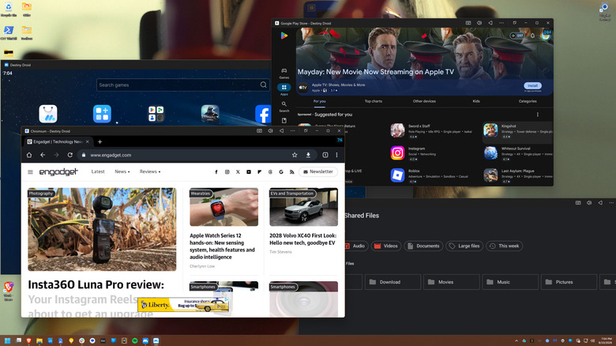
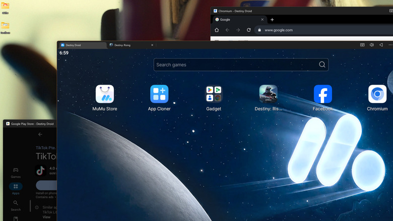

Ejecutar aplicaciones de Android en un PC con Windows sirve para jugar con teclado y ratón, usar aplicaciones móviles sin versión de escritorio y separar flujos de trabajo. Esta guía resume las vías que describe Engadget y está dirigida a usuarios que ya conocen lo básico de Android.

## Requisitos previos

- Un PC con Windows de la última década. Según el original, prácticamente cualquier equipo de ese periodo puede ejecutar un emulador de Android.
- Conocimientos básicos de Android para moverse por la Play Store y las aplicaciones.
- Conexión a internet para descargar el emulador o Google Play Games y las aplicaciones.

## Pasos

### Paso 1: Elegir la vía adecuada

El Subsistema de Windows para Android se retiró en 2024, por lo que en 2026 quedan dos vías principales: los emuladores de Android y la aplicación Google Play Games para PC. Existe una tercera opción, Phone Link de Windows 11, que transmite las aplicaciones o la pantalla del teléfono al escritorio de forma inalámbrica, aunque en ese caso las aplicaciones se ejecutan en el teléfono y no directamente en el PC.

### Paso 2: Instalar un emulador y crear teléfonos virtuales

Los emuladores son la solución más completa. Las dos opciones citadas son BlueStacks y MuMuPlayer. MuMuPlayer es gratuito, está desarrollado por NetEase y recibió una actualización a Android 15. El funcionamiento descrito es simple: se crean teléfonos virtuales y después se ejecutan las aplicaciones desde la Play Store o desde otros orígenes, igual que en un terminal físico.

BlueStacks también es una aplicación legítima, pero su interfaz muestra publicidad en casi todos los rincones. MuMuPlayer incluye menos anuncios, visibles solo en algunas pantallas de carga.

### Paso 3: Probar Google Play Games si solo interesan los juegos

Si el objetivo son únicamente los juegos, se puede probar Google Play Games para PC, un proyecto de Google que adapta los juegos de Android al PC mediante una máquina virtual ligera. Solo funciona con una selección de títulos cuyos desarrolladores han optado por participar, como Genshin Impact, Clash of Clans y la adaptación móvil de Disco Elysium. Otros títulos, como Destiny: Rising, no están disponibles en esta vía.

### Paso 4: Instalar las aplicaciones y aprovechar las funciones del PC

Una vez creado el teléfono virtual, se instala la aplicación deseada y se utiliza con las ventajas del PC: compatibilidad con ratón y teclado y mejor calidad gráfica cuando el equipo lo permite. El original cita el caso de Destiny: Rising, limitado a 60 fotogramas por segundo con los gráficos al máximo en una tableta Galaxy Tab S10 Ultra, frente a una calidad superior al emularlo en un PC con una Nvidia RTX 4070 Ti Super.

Los emuladores como MuMuPlayer o BlueStacks también permiten instancias paralelas, es decir, varios dispositivos Android emulados a la vez, una función que algunos jugadores usan para conseguir recursos, los creadores para gestionar varias cuentas y otros usuarios para separar cuentas personales y de trabajo. En la dirección contraria, también se puede [convertir el móvil en un mini PC con el modo escritorio de Android](/noticias/modo-escritorio-android-movil-pc/).

## Cómo verificar que las aplicaciones de Android funcionan en el PC

La aplicación de Android se abre dentro del teléfono virtual y responde al ratón y al teclado del PC. En juegos, la mejora se aprecia en la calidad gráfica y la fluidez respecto al móvil o la tableta. En aplicaciones sin versión de PC, como Instagram, TikTok, Snapchat o utilidades de hogar inteligente, la comprobación es que la aplicación móvil se ejecuta y se puede usar desde el escritorio.

## Advertencias y limitaciones

La emulación local consume recursos del propio equipo, aunque sirva para aislar ciertos flujos de trabajo del entorno principal. Google Play Games solo cubre los títulos adheridos, por lo que muchos juegos quedan fuera. El autor del original señala que no ha probado emuladores de consolas antiguas como PS3 o GameBoy dentro de Android por moverse en un terreno legalmente dudoso. Como atribuye Engadget, estas vías cubren juegos, aplicaciones sin edición de PC, pruebas de desarrollo y versiones móviles ligeras en equipos modestos, siempre que sus funciones más limitadas resulten aceptables.
