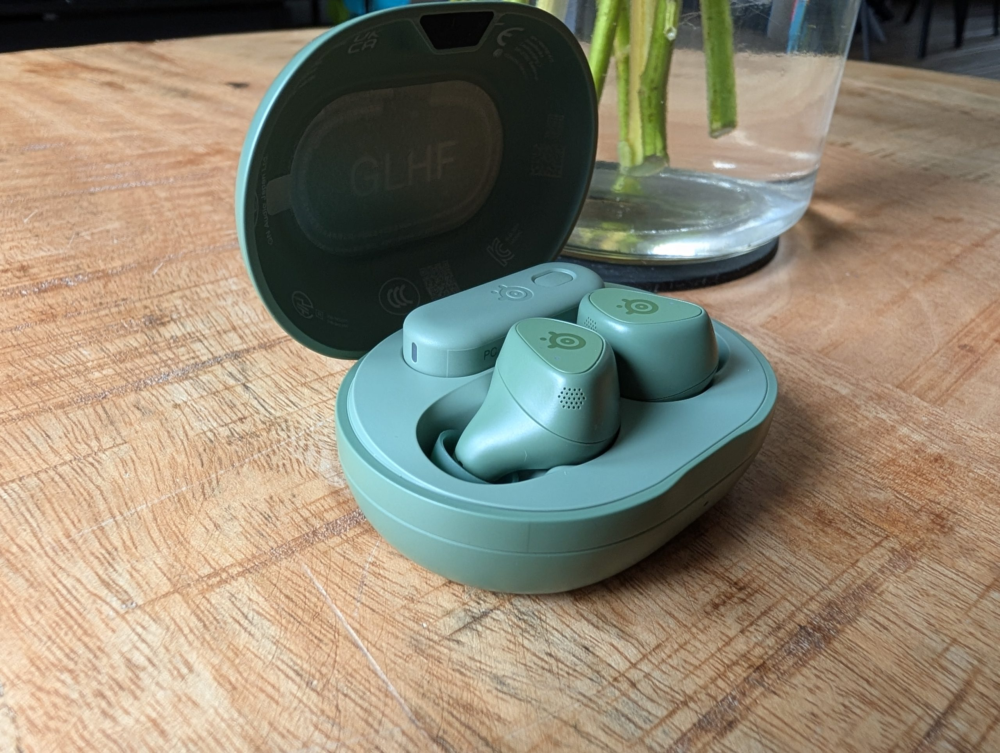
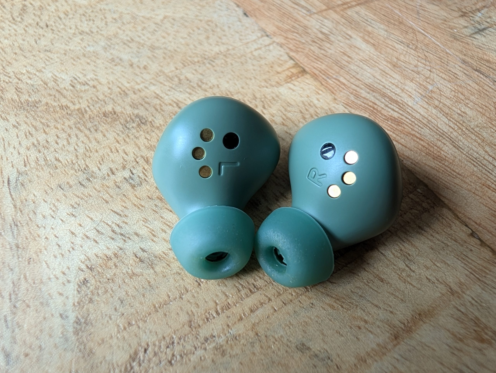
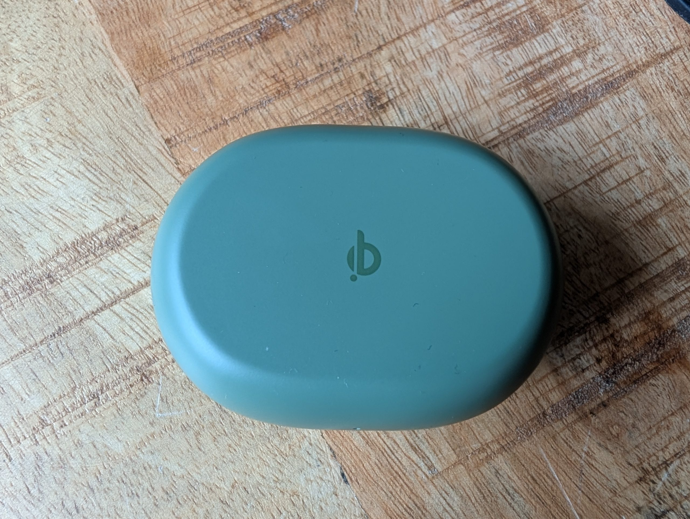
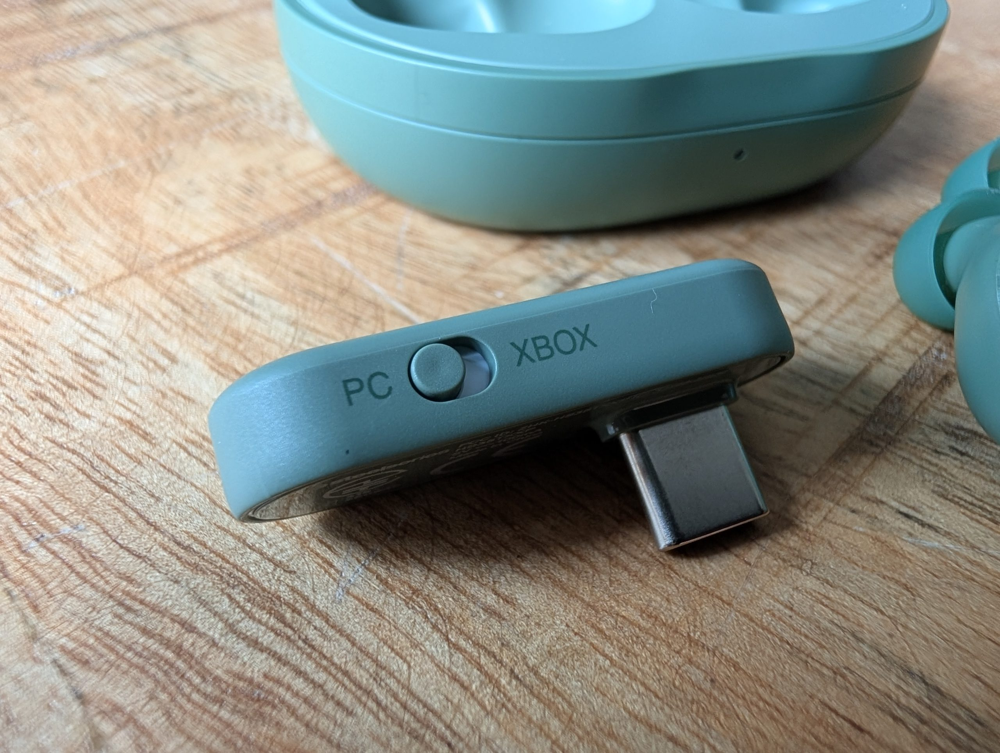
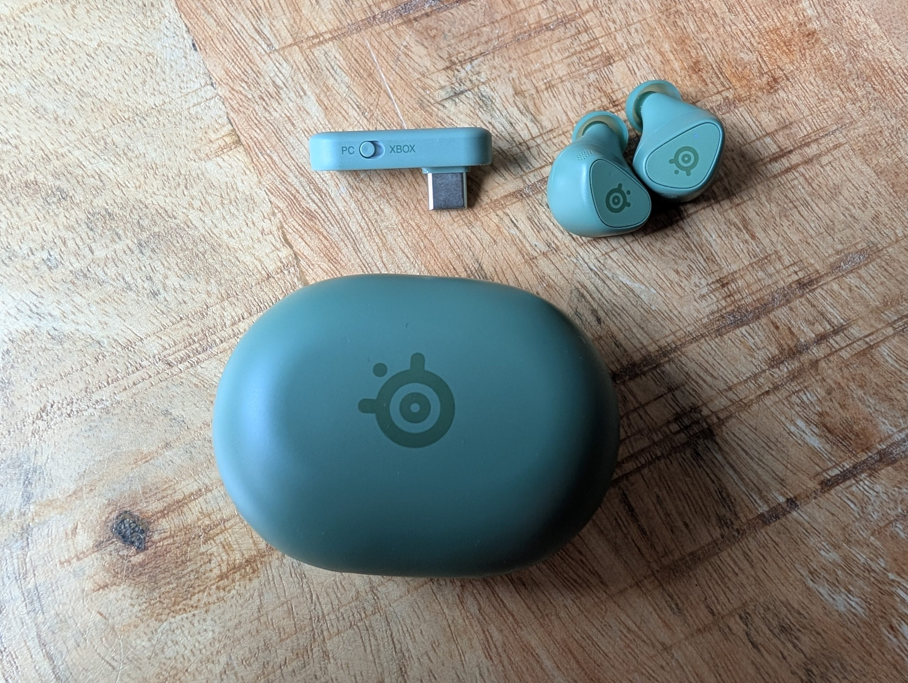

SteelSeries ha ampliado su familia de auriculares inalámbricos **Arctis GameBuds** con nuevos colores dentro de la edición limitada Cozy Collection. El modelo analizado por Wccftech es la variante **Matcha para Xbox**, un acabado verde suave que llega acompañado del tono Yuzu y que, más allá del cambio de pintura, mantiene intacta la propuesta técnica del producto lanzado en noviembre de 2024.

En otras palabras: no hay hardware nuevo, sino una nueva piel. Y aun así, la versión para Xbox sigue siendo la más interesante de la gama, porque su adaptador incluye un modo compatible con la consola de Microsoft y, además, funciona con PlayStation, PC, Nintendo Switch, dispositivos portátiles compatibles y móviles. Quien tenga varias plataformas en casa encontrará en este modelo la opción más flexible, incluso si juega sobre todo en PlayStation, ya que la edición para la consola de Sony no puede conectarse de forma inalámbrica a una Xbox.

## Diseño y comodidad de los Arctis GameBuds

El acabado Matcha recubre tanto los auriculares como el estuche de carga, lo que da un conjunto coherente. El analista destaca que el resultado es más discreto de lo que suele verse en el segmento gaming: salvo por los logotipos de SteelSeries, podrían pasar por unos auriculares de uso diario. El estuche, con forma de pastilla y un compartimento específico para el adaptador USB-C, busca resolver uno de los problemas clásicos de este tipo de accesorios: la pérdida del dongle.

Cada auricular pesa 5,3 gramos y adopta un diseño sin varilla. SteelSeries incluye almohadillas de silicona en tres tallas —pequeña, mediana y grande—, un detalle que la review considera importante porque el sellado correcto condiciona la comodidad, el aislamiento pasivo, los graves y la eficacia de la cancelación de ruido. Los controles son botones físicos en lugar de superficies táctiles: ofrecen una respuesta más predecible y reducen las pulsaciones accidentales, aunque al pulsarlos el auricular puede introducirse un poco más en el oído.

La resistencia al polvo y al agua es **IP55**, suficiente para el uso cotidiano, el transporte o una lluvia ligera, pero no para nadar. En conjunto, el apartado de diseño se apoya en una idea sencilla: que los auriculares puedan salir de la mesa de juego sin desentonar.

## Conectividad, cancelación de ruido y batería

El adaptador USB-C de 2,4 GHz es la pieza que separa a estos Arctis GameBuds de unos auriculares Bluetooth corrientes. La conexión dedicada reduce la latencia, algo clave para que los efectos de sonido y lo que ocurre en pantalla permanezcan sincronizados. El Bluetooth 5.3 queda para el móvil y el uso diario, y el cambio entre ambos modos se hace desde los propios auriculares, sin necesidad de devolverlos al estuche.

Conviene tener clara una limitación: **no se pueden mezclar las dos conexiones a la vez**. Se alterna entre 2,4 GHz y Bluetooth, no se escuchan ambas fuentes de forma simultánea. El adaptador, además, es bastante ancho y puede tapar un puerto contiguo en algunos portátiles y sistemas portátiles; SteelSeries incluye un adaptador de extensión como solución.

La cancelación activa de ruido (ANC) convive con un modo de transparencia. La review señala que el ANC reduce bien el ruido continuo y mejora la inmersión, aunque no silencia por completo una sala concurrida ni compite con los mejores auriculares premium del mercado. En el apartado de autonomía, la marca declara hasta **10 horas por carga** y un total de **40 horas** sumando el estuche, que se puede recargar por USB-C o sobre una base Qi inalámbrica.

## La app Arctis Companion y el rendimiento de audio

La aplicación Arctis Companion es uno de los puntos fuertes del producto. Ofrece acceso a más de **100 preajustes de audio específicos por juego** y permite cambiar de perfil desde el móvil, algo especialmente útil en consola: se ajusta el sonido desde el teléfono mientras los auriculares siguen conectados por 2,4 GHz a la consola. Algunos perfiles priorizan pasos y audio posicional; otros apuestan por un sonido más grave o cinematográfico.

En el plano acústico, los GameBuds usan **drivers magnéticos de neodimio de 6 mm** con una respuesta de frecuencia de 20 Hz a 20 kHz. Las cifras son convencionales, pero la review describe una presentación sorprendentemente espaciosa para su tamaño: graves con presencia y controlados, medios claros para diálogos y agudos suficientes para distinguir pasos y detalles direccionales. El **audio espacial de 360°** ayuda a crear una sensación de amplitud en los juegos compatibles, aunque un buen auricular de diadema sigue ofreciendo una escena más amplia y natural.

Los micrófonos —dos por auricular— cumplen para el chat de voz, las llamadas y el juego en línea casual, con una reproducción clara pero más fina y comprimida que la de un micrófono de brazo. Es una de las concesiones inevitables del formato. En música el rendimiento es bueno, aunque limitado por Bluetooth: el único códec compatible es **SBC**, sin opciones de mayor calidad para quien busque un uso musical más exigente.

## Precio, veredicto y alternativas

La review concede a los Arctis GameBuds una nota de **8,5 sobre 10** y los describe como unos auriculares de juego premium convincentes. Entre sus virtudes señala la calidad de sonido, el audio posicional, la baja latencia del enlace de 2,4 GHz, la amplia lista de preajustes, el ANC con transparencia, las 40 horas de autonomía total, la carga Qi y el almacenamiento interno del adaptador. Entre sus carencias apunta el precio de **199,99 dólares**, la imposibilidad de mezclar Bluetooth y 2,4 GHz, el códec SBC, unos micrófonos que no igualan a un micrófono de brazo y un adaptador USB-C más ancho de lo deseable.

Para el lector hispanohablante, la conclusión práctica es la de siempre en este segmento: la edición para Xbox es la que conviene comprar si se usan varias plataformas, porque es la más versátil y la única que cubre Xbox y PlayStation sin renunciar al PC o al móvil. SteelSeries ya demostró con productos como el [mando Aeon Pro](/noticias/steelseries-aeon-pro/) que apuesta por accesorios de gama alta y precio elevado, y estos GameBuds siguen esa misma línea. Quien prefiera alternativas más económicas para consola puede echar un vistazo a la [remesa de auriculares de PlayStation con drivers planares](/noticias/playstation-pulse-headsets/), una opción distinta en acústica y conectividad.

La muestra de análisis fue facilitada por el fabricante, según indica Wccftech en su review.
