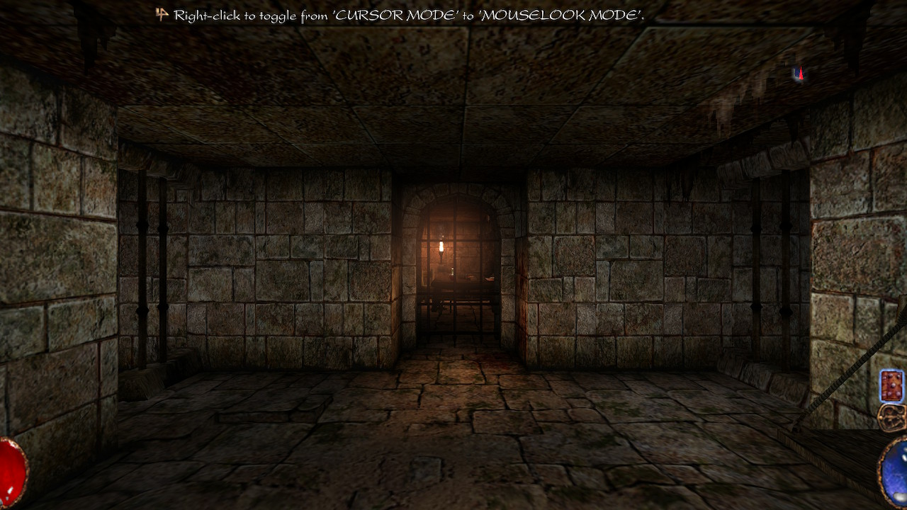
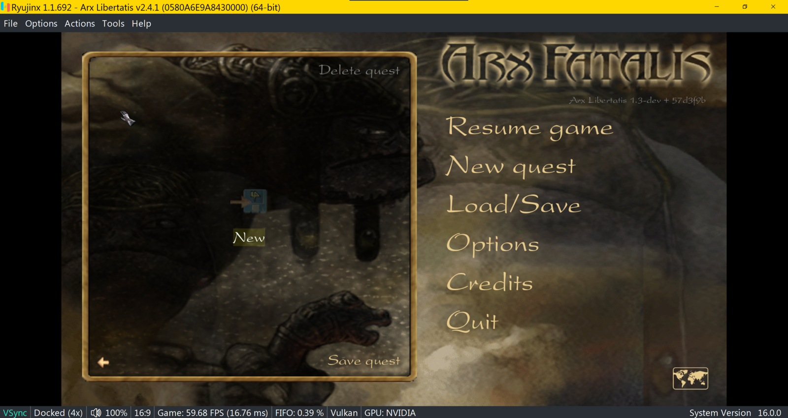

El 28 de septiembre de 2026, un usuario del hilo de GBAtemp dedicado al puerto de
Arx Fatalis para Nintendo Switch publicó una compilación nueva del proyecto,
dirigida al firmware 22.5.0 de la consola. El aviso llega después de varios
reportes de incompatibilidad: la versión oficial del port ya no arranca en las
versiones de firmware más recientes, así que quien lo quiere jugar en una
consola actualizada se queda sin build que usar.

El proyecto convierte a la Switch en una máquina capaz de ejecutar Arx Fatalis,
el RPG de mazmorras de Arkane Studios, sobre Arx Libertatis, la reimplementación
de código abierto del motor original. La primera versión del port se publicó el
21 de julio de 2021 y, comprobado hoy, el repositorio de su autor sigue
alojando una única release: la etiqueta `1.2-nx1`, presentada como «Switch
Release 1 (based on 1.2)» y descrita en el changelog como una «initial release».

## El puerto de Arx Fatalis, detenido por las firmwares recientes

El hilo lleva años sirviendo de soporte técnico, pero el bloqueo se confirmó en
marzo de 2026. Un usuario relató que el port se cierra al arrancarlo con el
firmware 21.2.0; otro replicó que actualizando la ABI de libnx le funcionaba, y
el primero comprobó que, con firmware 21.2.0 y Atmosphere 1.10.2, la
compilación seguía fallando incluso tras aplicar el parche. Solo quien seguía
en el firmware 21.0 relataba que arrancaba sin problemas.

La conclusión del último mensaje del hilo es tajante: el parche no sirve por
encima del firmware 21.0. El propio usuario, ya en el 22.5, relata que el port
se cierra en su consola. El resultado es que una build de 2021 se ha quedado
atrapada en una generación de firmware anterior, mientras la consola sigue
recibiendo actualizaciones: Nintendo publicó el firmware 23.0.0 en septiembre,
un salto que ya cubrimos junto al lanzamiento de
[Atmosphere 1.12.0](/noticias/atmosphere-1-12-firmware-23/).

## Una compilación no oficial, publicada fuera de GitHub

Ante ese bloqueo, el usuario que revivió el hilo compartió una compilación
propia apuntando al firmware 22.5.0, con un enlace de descarga en su mensaje y
la aclaración de que la preparó con ayuda de inteligencia artificial. No se
trata, por tanto, de una release del autor del port: el repositorio oficial no
se ha movido desde 2021 y la nueva build circula únicamente por el enlace del
hilo.

Ese matiz importa. La pieza es software de terceros, sin publicación en un
repositorio con historial de versiones, sin notas de cambio y sin
corroboración de otros usuarios en el propio hilo: la comprobación real llegará
cuando alguien la pruebe en consola y lo cuente. De momento, la única evidencia
es el testimonio de quien la creó.

## Qué cambia para quien quiera probarlo

Las instrucciones del hilo describen la instalación del build oficial: hay que
descomprimir el ZIP en la carpeta `switch` de la tarjeta SD, copiar los archivos
de datos requeridos del juego a `/switch/arx/data/` (con la versión de Steam
bastan `Graph`, `misc`, `data.pak`, `data2.pak`, `loc.pak`, `sfx.pak` y
`speech.pak`) y arrancar el homebrew desde el menú con sobrescritura de título o
un NSP del hbmenu, nunca en modo applet, porque la memoria no llega.

Quien lo instale debería conocer además dos detalles del propio autor. El port
precarga al arrancar el contenido de los archivos `.pak` para reducir los
tirones, de modo que la carga inicial puede ser larga; y, si algo falla, el
registro `/switch/arx/arx.log` indica la causa. Los controles se reasignan desde
el menú de opciones, con un apartado propio para apuntar con el giroscopio, y el
hilo recoge una limitación ya señalada en 2023: guardar exige escribir el nombre
de la partida, algo que un usuario no pudo hacer bajo emulación.

Quien espere una experiencia pulida debe temperar las expectativas: el autor
advertía en 2021 de que dibujar los sigilos con el giroscopio o el stick resulta
fino y requiere ajustes, y el port llegó como una primera entrega, no como un
producto terminado. El mismo criterio vale para la compilación de este lunes: es
el intento de mantener vivo un clásico de Arkane en una consola cuyo firmware ya
ha cambiado varias veces desde 2021.
