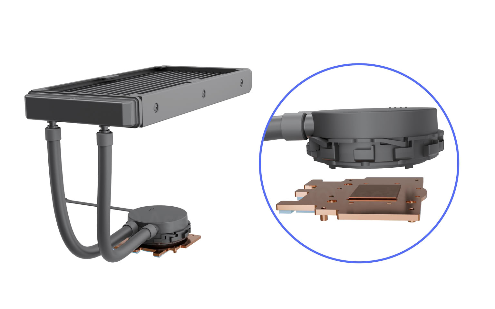

Asetek anunció en el marco del TOKYO GAME SHOW 2026 una colaboración con Mouse Computer y MSI para lanzar la **Mouse Original NVIDIA GeForce RTX 5070 Liquid-Cooled Overclocked Edition**, una tarjeta gráfica personalizada que llega a la gama de equipos de sobremesa G TUNE del fabricante japonés. El anuncio procede de un comunicado del propio fabricante de refrigeración, no de una prueba independiente, por lo que conviene leer las cifras que siguen como datos de diseño aportados por la compañía.

## Qué anunció Asetek

El sistema se apoya en una arquitectura de refrigeración líquida todo-en-uno (AIO) de 240 mm desarrollada específicamente para esta GPU. Según Asetek, el objetivo era atacar dos problemas habituales en las tarjetas modernas: la alta densidad térmica del núcleo y el calor que acumulan los módulos de memoria cercanos. Con un bloque de cobre de cobertura completa, el líquido refrigera tanto el punto caliente del chip como las memorias de vídeo que lo rodean, algo que la refrigeración por aire no siempre cubre con la misma eficacia.

## 300 W de margen térmico y expulsión directa del calor

La compañía cifra en **300 W la capacidad térmica de diseño** del sistema, frente a los 250 W de consumo por defecto de la RTX 5070. Ese margen queda disponible para overclocking y, según el fabricante, permite mantener las temperaturas lejos del límite de throttling. El radiador delgado de 240 mm expulsa el calor directamente fuera de la caja, de modo que no se acumula en el interior del chasis ni afecta al resto de componentes. Es una solución pensada para equipos compactos o con flujo de aire limitado.

## Ruido contenido y vida útil declarada

Asetek detalla también el apartado acústico. La bomba usa un motor de 8 polos y un rodete de 7 aspas para reducir las fluctuaciones eléctricas y la turbulencia del líquido, con un nivel de ruido declarado de **20 dB(A) a 1 metro** (27 dB(A) a 25 cm de la bomba). El sistema completo se mantendría en torno a **30 dB(A)** con una carga de 250 W y 35 °C de temperatura ambiente. En cuanto a la durabilidad, el comunicado cita metales resistentes a la corrosión y tubos de goma EPDM de baja permeabilidad para una vida útil estimada de **50 000 horas** sin mantenimiento. Son valores declarados por el fabricante que solo una prueba independiente podría confirmar.

## Disponibilidad: de momento, solo en Japón

Los equipos G TUNE con esta RTX 5070 refrigerada por líquido pueden pedirse desde el **17 de septiembre de 2026** a través de la web oficial de Mouse Computer y en tiendas físicas de Japón. El comunicado no menciona precios ni una fecha de llegada a otros mercados, así que por ahora se trata de un producto de alcance local. Para el lector hispanohablante, la noticia es relevante sobre todo como señal de tendencia: la refrigeración líquida de fábrica aplicada a tarjetas de gama media-alta deja de ser un extra de gama entusiasta y empieza a aparecer en equipos preensamblados de serie.
