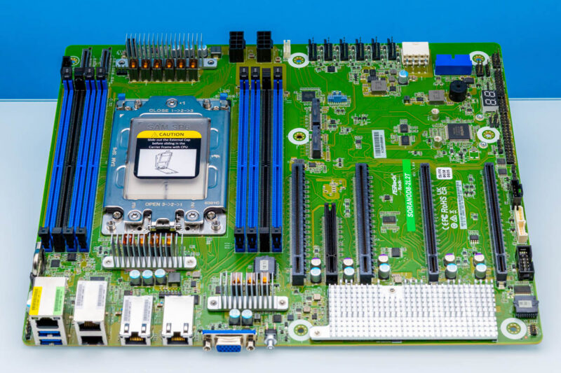
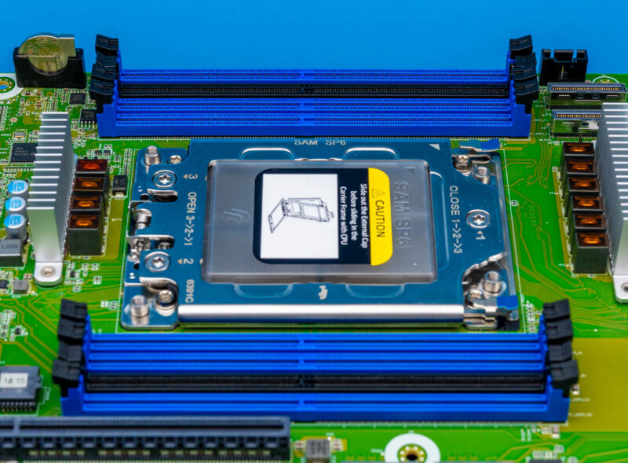
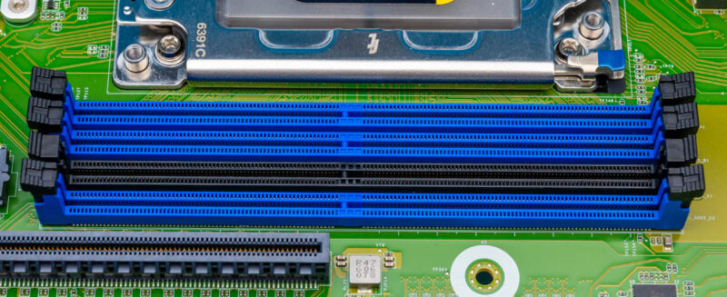
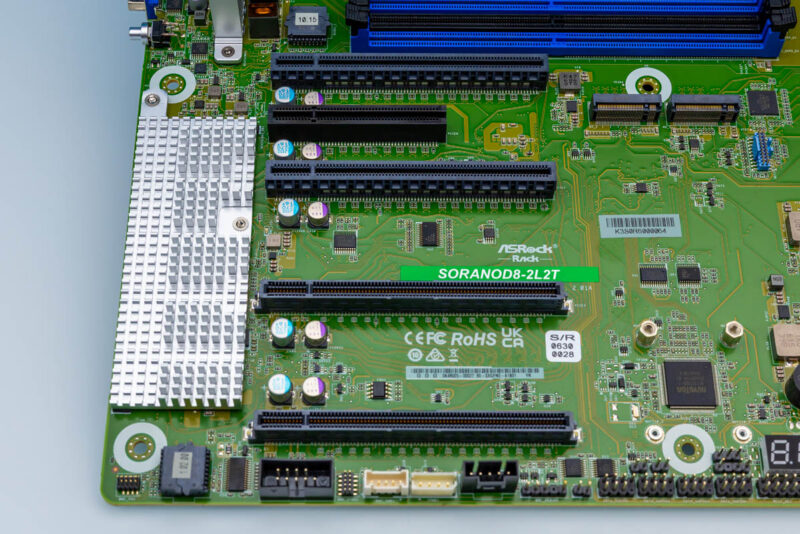
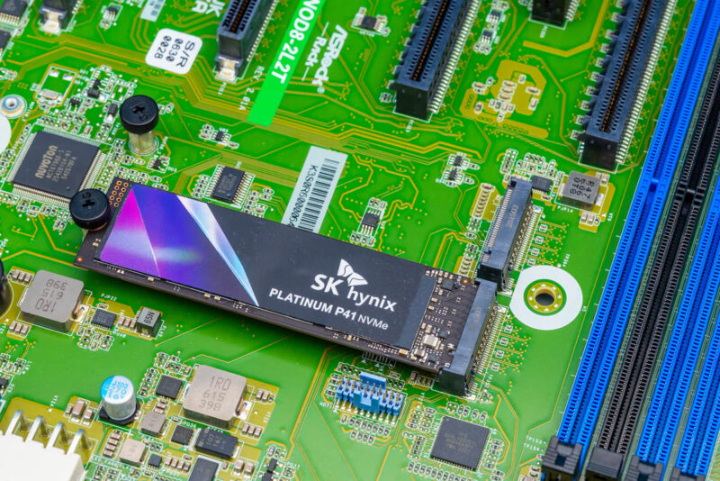
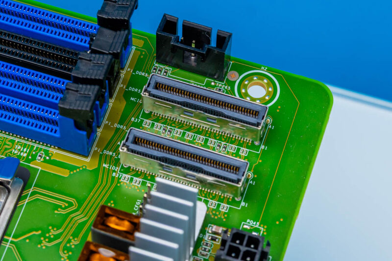
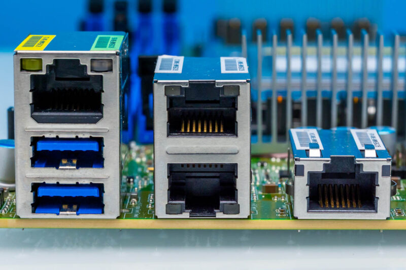
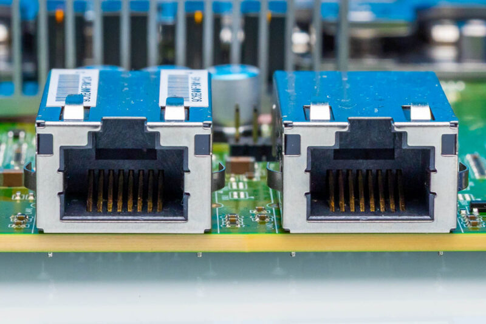

La ASRock Rack SORANOD8-2L2T es una de las primeras placas base diseñadas específicamente para los procesadores AMD EPYC 8005 Sorano, la gama con arquitectura Zen 5 para la plataforma SP6 que sustituye a los EPYC 8004 Siena. Según el análisis publicado por ServeTheHome, se trata de una placa sencilla y robusta que expone todo el potencial de E/S de estos chips: hasta 84 núcleos, 96 carriles PCIe Gen5 y red de alta velocidad integrada sin necesidad de tarjetas adicionales.

## Una placa base sencilla para exprimir los AMD EPYC 8005 Sorano

Sorano supone un salto notable frente a Siena porque reemplaza los núcleos Zen 4c por núcleos Zen 5 completos, con el consiguiente aumento de rendimiento en el mismo zócalo SP6. Aunque los procesadores nuevos son compatibles con las placas SP6 existentes tras actualizar la BIOS, algunos fabricantes han lanzado modelos renovados, y este es el caso de ASRock Rack: la SORANOD8-2L2T es la evolución directa de su anterior SIENAD8-2L2T, con un formato ligeramente mayor y pequeños cambios en la conectividad.

La placa admite procesadores EPYC 8004 y 8005 en zócalo SP6 (LGA 4844), monta un controlador de gestión ASPEED AST2600 y adopta un formato similar al ATX de 12 por 10 pulgadas, apenas un poco más ancho que la especificación ATX estándar. La filosofía del diseño es deliberadamente austera: más allá de los controladores de red, casi no hay hardware adicional. Es una placa pensada para hacer funcionar bien la CPU y dejar toda su conectividad en manos del integrador.

## Memoria, expansión y almacenamiento sin concesiones

Uno de los rasgos más singulares de la placa está en la memoria. SP6 es una plataforma nativa de seis canales, por lo que lo habitual serían seis o doce ranuras; ASRock Rack instala ocho. Las ranuras azules corresponden a los primeros módulos de cada canal y deben poblarse primero, mientras que las negras son los segundos módulos de dos de los seis canales y se llenan en último lugar. El objetivo es equilibrar capacidad y tamaño: con ocho ranuras la placa admite hasta 2 TB de memoria DDR5 RDIMM, a cambio de limitar la velocidad a DDR5-5200 en lugar de los DDR5-6400 que permitiría una configuración de un módulo por canal.

En expansión, la placa ofrece cuatro ranuras PCIe Gen5 x16 y una quinta Gen5 x8 de fondo abierto, que consumen 72 de los 96 carriles del procesador. La ranura superior es especial: junto a la conectividad PCIe y CXL, puede conmutarse para ofrecer 16 conexiones SATA de 6 Gbps mediante una tarjeta elevadora específica del fabricante. El almacenamiento fijo se completa con dos ranuras M.2 Gen5 x4 compatibles con formatos 22110 y 2280 —con los apreciados tornillos de apriete manual— y dos conectores MCIO x8 que aportan los 16 carriles restantes, configurables también como hasta 16 puertos SATA para servidores de almacenamiento de alta densidad.

## Red integrada y un enfoque claramente de servidor

Las siglas 2L2T del nombre aluden a sus dos parejas de adaptadores de red: dos puertos de 10 GbE basados en un controlador Intel X710-AT2 y dos puertos de 1 GbE sobre controladores Intel I210, a los que se suma el puerto de gestión IPMI del BMC. El panel trasero añade además un clásico conector VGA DB15 para la salida de vídeo del controlador de gestión y solo dos puertos USB-A de 5 Gbps, ampliables con otros dos a través del conector frontal de la placa.

En alimentación, la placa prescinde del conector ATX de 24 pines y emplea tres conectores ATX12V más un pequeño conector micro-fit de 4 pines para señalización, con un adaptador incluido para la fuente estándar. Los seis conectores de ventilador de 6 pines y los disipadores VRM contenidos —suficientes para chips de hasta 225 W en chasis con buen flujo de aire— confirman el planteamiento: aunque ASRock Rack la presenta como placa de servidor y estación de trabajo, es ante todo una placa de servidor, y quien la quiera como estación de trabajo deberá ampliar los USB por PCIe.

Para el lector español, la lectura práctica es clara: quien monte un servidor compacto para virtualización, almacenamiento o infraestructura de una pyme tiene aquí una base flexible que integra de serie la red de 10 GbE y expone casi toda la E/S de Sorano sin pagar por componentes superfluos. El análisis original completo, con el diagrama de bloques y las pruebas detalladas, puede consultarse en la reseña de ServeTheHome citada como fuente.
