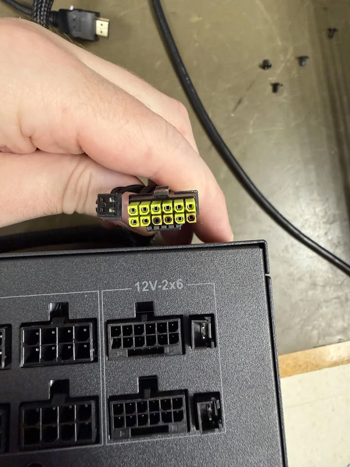

Un técnico de un taller de reparación ha documentado un nuevo caso de conector de alimentación de 16 pines derretido, esta vez en una fuente ASRock Taichi TC-1650T emparejada con una GPU de estación de trabajo NVIDIA RTX PRO 6000 Blackwell, cuyo precio ronda los 15.000 dólares. Según el relato publicado en Reddit, el conector falló de forma catastrófica por el lado de la fuente y se fundió dentro del propio zócalo, a pesar de que ambos extremos del cable estaban completamente insertados.

## Qué falló esta vez

La fuente Taichi TC-1650T incluye de serie cables 12V-2x6 nativos con un sensor de temperatura NTC propio de ASRock. La idea detrás del sistema, bautizado como TempGuard, es cortar la alimentación antes de que un conector llegue a derretirse. En este caso, sin embargo, la protección no llegó a dispararse.

La GPU, según el técnico, habría sobrevivido al incidente y los daños se limitaron al lado de la fuente de alimentación. El detalle más relevante del reporte es el lugar donde está montado el sensor: según el técnico, estaría colocado en la línea de tierra y no en el lado de 12 V que debería vigilar, lo que explicaría por qué el sistema no detectó a tiempo el aumento de temperatura.

## Un sistema que sí funcionó en el pasado

No es la primera vez que ASRock confía en el TempGuard para proteger sus conectores. El sistema ya demostró su utilidad en ocasiones anteriores, como cuando detectó una RTX 5090 modificada por shunt que llegó a superar los 1.300 W de consumo y evitó que sus conectores se fundieran.

El problema, sin embargo, no es nuevo para esta combinación concreta de fuente y GPU: en marzo ya circuló un incidente de fusión similar con el mismo dúo. Si la posición del sensor estuviera realmente mal en al menos una parte de los cables, la preocupación iría más allá de una unidad defectuosa, sobre todo tratándose de una tarjeta que cuesta tanto como un coche de segunda mano.

## Por qué importa

El conector 12V-2x6, heredero del polémico 12VHPWR, sigue acumulando casos de fusión a pesar de las revisiones del estándar. La particularidad de este caso es que apunta a un fallo de diseño en una protección pensada precisamente para evitarlo, más que a un error de conexión por parte del usuario. Mientras los fabricantes no revisen a fondo el diseño del conector y sus salvaguardas, los usuarios de las gráficas más caras del mercado seguirán expuestos a que una protección que debería apagar el equipo a tiempo llegue tarde.
