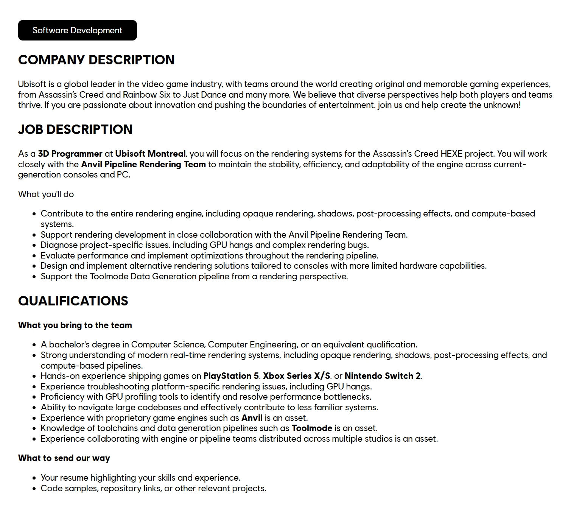

Una nueva oferta de empleo publicada por Ubisoft ha reavivado las especulaciones sobre el futuro de **Assassin's Creed Hexe**. El anuncio, para un puesto de programador 3D en el estudio de la compañía en Montreal, menciona **Nintendo Switch 2** entre las plataformas para las que el candidato debe tener experiencia, junto a PlayStation 5 y Xbox Series X/S. Ubisoft no ha confirmado oficialmente que el juego vaya a llegar a la consola de Nintendo.

La pista parte de la propia oferta publicada por la compañía y la recogió después el medio especializado Universo Nintendo, al que atribuimos esta información. Se trata, por tanto, de un indicio y no de un anuncio de plataformas.

## Qué dice la oferta de empleo de Assassin's Creed Hexe

La vacante, titulada «3D Programmer», está vinculada directamente al proyecto Assassin's Creed Hexe y al equipo Anvil Pipeline Rendering. El objetivo declarado es mantener la estabilidad, la eficiencia y la capacidad de adaptación del motor en las consolas de la generación actual y en PC.

Entre las funciones figuran evaluar el rendimiento e implementar optimizaciones a lo largo de toda la tubería de renderizado, así como diseñar soluciones alternativas pensadas para consolas con capacidades de hardware más limitadas. En el apartado de cualificaciones, Ubisoft pide «experiencia práctica en el lanzamiento de juegos para PlayStation 5, Xbox Series X/S o Nintendo Switch 2», además de soltura con herramientas de análisis de rendimiento de GPU y experiencia resolviendo problemas de renderizado específicos de cada plataforma.

## El historial de Ubisoft con Nintendo Switch 2

Que la compañía mencione Switch 2 no es casual. Ubisoft ya ha llevado a la consola títulos técnicamente exigentes como Assassin's Creed Shadows y Star Wars Outlaws, de modo que cuenta con experiencia previa adaptando su tecnología a ese hardware.

El historial reciente, sin embargo, es mixto. El remake Assassin's Creed Black Flag Resynced se anunció sin versión para Switch 2, y desde entonces las quinielas sobre un posible port no se han materializado. En paralelo, otros títulos de la editora sí han aterrizado en la consola, como [Far Cry 3 y Blood Dragon](/noticias/far-cry-3-blood-dragon-switch-2/), y la propia Ubisoft ha ido adaptando catálogo clásico a la nueva plataforma, como en el caso de [Rayman Legends Retold](/noticias/rayman-legends-retold-rtx-4080/).

## Un indicio, no una confirmación

Conviene ser prudente: incluir una plataforma en los requisitos de una oferta de empleo no equivale a anunciar el lanzamiento. Las vacantes describen el perfil técnico que busca el estudio y las plataformas que el candidato debería conocer, no necesariamente el catálogo final del juego. Hasta que Ubisoft publique de forma oficial las plataformas de Assassin's Creed Hexe, la versión para Nintendo Switch 2 sigue siendo solo una posibilidad.
