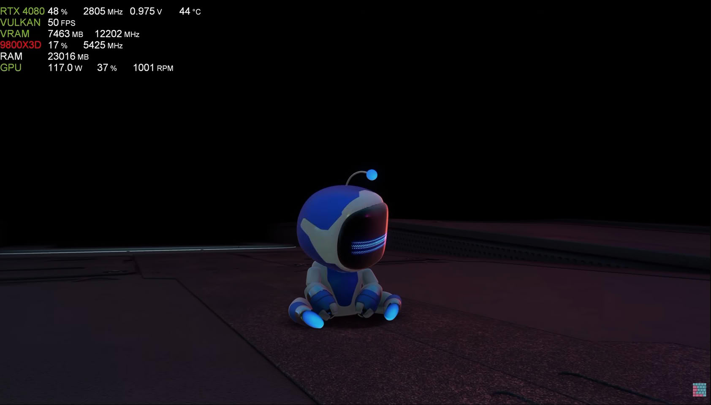
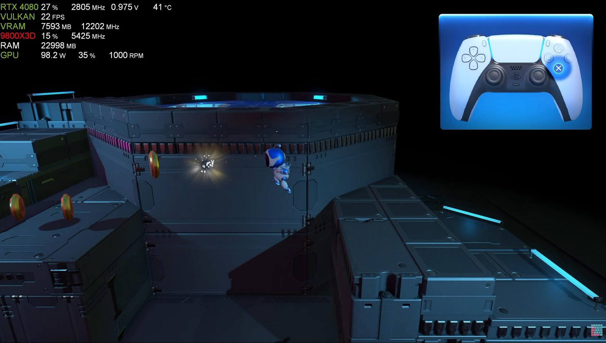

El emulador de PlayStation 5 de código abierto **KytyPS5** ha conseguido que
*Astro’s Playroom* deje atrás el arranque y llegue a la jugabilidad. Las
imágenes, publicadas por el canal de YouTube **Unreal Gaming** y difundidas por
TechPowerUp, muestran el título corriendo sobre un equipo con **Ryzen 7
9800X3D** y **RTX 4080**, la misma configuración que el proyecto venía usando
en pruebas anteriores.

## Un juego de presentación como banco de pruebas

*Astro’s Playroom* viene preinstalado en todas las consolas PS5 y sirve como
introducción interactiva al mando DualSense, así que conseguir que se ejecute
se considera un hito dentro del proyecto: es uno de los pocos títulos que todo
propietario de la consola ya tiene a mano y, a la vez, un buen punto de partida
para medir el avance real del emulador.

El logro se suma a una racha reciente. El mismo proyecto ya movía la versión de
PS5 de **GTA 5** a hasta 60 FPS y había mostrado progresos acelerados con el
remake de *Demon’s Souls*. Esos títulos, igual que *Astro Bot*, siguen
arrastrando problemas de rendimiento y bloqueos.

## Rendimiento: avance, pero todavía por debajo de lo jugable

El material deja claro que la experiencia está lejos de ser estable. Según
TechPowerUp, el juego cae por debajo de los 30 FPS con bastante frecuencia,
aunque el clip no registra bloqueos ni cierres inesperados, lo que lo sitúa
ligeramente por delante de otras pruebas recientes del emulador. Los contadores
superpuestos en las capturas permiten ver esa variación: 50 FPS en una escena
ligera y 22 FPS en el tramo que reproduce el tutorial del mando.

La exigencia de hardware sigue siendo alta. Al tratarse de un proceso con un
peso muy grande de CPU, un Ryzen 7 9800X3D se ha convertido en una especie de
referencia para este tipo de pruebas. Las cifras que se ven en los vídeos no
anticipan todavía una experiencia aprovechable de principio a fin.

## Qué cambia para quien juega en PC

- **KytyPS5 es gratuito y de código abierto**, con compilaciones para Windows y
  Linux y un soporte experimental en macOS. Está construido sobre una versión
  muy modificada del proyecto original Kyty.
- **No incluye juegos.** El proyecto no distribuye títulos ni software de
  sistema: para usarlo hay que aportar archivos obtenidos de forma legal.
- **Sigue en desarrollo temprano.** Su propia documentación advierte de
  bloqueos, fallos gráficos, compatibilidad limitada y un rendimiento pobre,
  que pueden cambiar de una compilación a otra.
- **Los requisitos no son de gama media.** Hace falta una GPU compatible con
  Vulkan 1.3 y, en la práctica, una CPU de gama alta para acercarse a las cifras
  de las capturas.

*Astro’s Playroom* no tiene versión oficial para PC, pero al venir preinstalado
en la consola es un título que muchos usuarios ya conocen y pueden usar como
referencia si cuentan con una copia obtenida de forma legal.

## Una lista de compatibilidad en construcción

El proyecto mantiene una lista de compatibilidad comunitaria con el estado de
cada juego según el sistema operativo, y el avance se produce en un marco de
desarrollo continuo: solo en la última semana se han publicado numerosas
compilaciones, con arreglos centrados en shaders, entrada y arranque.

Dado que la emulación de PS5 sigue en una fase temprana, es previsible que el
rendimiento de estos títulos siga mejorando con el tiempo. Por ahora, lo
prudente es leer cada avance como un paso técnico y no como la llegada de una
alternativa lista para sustituir a la consola.
