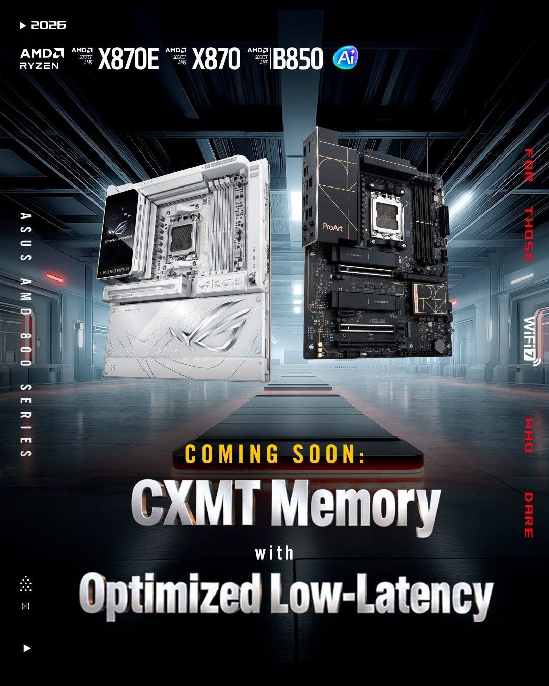

ASUS está preparando una nueva tanda de actualizaciones de BIOS para sus placas base con socket AM5 que apunta a reducir la latencia de la memoria en módulos DDR5 equipados con chips de CXMT. Las versiones beta ya circulan para varias familias de chipsets de las series 600 y 800, y la compañía espera ampliar su disponibilidad en las próximas publicaciones. El anuncio se apoya en material promocional de la propia ASUS, que etiqueta estas versiones como «CXMT Memory with Optimized Low-Latency».

## Una base de firmware nueva para varias familias de placas

Los ensayos se distribuyen para placas con chipsets X870, B850, X670 y B650, y están construidos sobre la versión de firmware AMD AGESA ComboAM5 PI 1.3.0.1d. ASUS no ha publicado cifras de rendimiento, así que por ahora no hay una comparación medida contra las BIOS anteriores. Lo que se espera, según el propio material de la marca, es un trabajo específico sobre el entrenamiento de memoria y los subtimings cuando el sistema detecta módulos basados en CXMT.

No es el primer movimiento en esta dirección: las actualizaciones que la compañía liberó en julio ya incluían mejoras de rendimiento de memoria y de estabilidad con chips de CXMT. La diferencia es el enfoque. Aquella tanda buscaba que los módulos funcionaran de forma fiable; esta apunta a exprimir su latencia. En el foro oficial donde ASUS publica estas versiones beta se recomienda, además, no reutilizar perfiles de overclock antiguos sobre la nueva base de AGESA, para evitar inestabilidades tras el reinicio.

## Qué es CXMT y por qué importa que una placa AM5 la optimice

CXMT (ChangXin Memory Technologies) es el principal fabricante chino de memoria DRAM y, en un contexto de crisis de precios de la DRAM, se ha convertido en una de las pocas fuentes de DDR5 convencional capaz de aliviar la escasez: mientras Samsung, SK Hynix y Micron desvían su capacidad nueva hacia la HBM que demanda la inteligencia artificial, la DDR5 de uso general se ha encarecido, y los módulos con chips de CXMT aparecen como alternativa más asequible. Que una placa AM5 los trate con timings ajustados importa porque deja de ser materia prima de segunda: si el firmware entrena bien esos chips, el usuario puede montar memoria más barata sin renunciar a un rendimiento competitivo.

El respaldo de la industria a estos módulos viene de antes. Ya se han visto configuraciones con DDR5 de CXMT superando los 9000 MT/s en plataformas X870E, y tanto ASUS como MSI y otros fabricantes han demostrado que en AM5 es más fácil pasar de los 8000 MT/s cuando la memoria emplea estos chips.

## Qué cambia para el comprador

Conviene ser prudente: son BIOS beta, ASUS no ha detallado qué mejora exacta traen y el rendimiento depende también del controlador de memoria del procesador y de la calidad de cada kit. Quien quiera probarlas puede buscar la descarga correspondiente a su modelo concreto en la web de soporte oficial de ASUS, verificando siempre que la versión sea la adecuada para su placa antes de actualizar.

Para el lector hispanohablante que esté armando o ampliando un equipo AM5 en plena subida del precio de la memoria, la noticia apunta a algo práctico: las placas que mejor entiendan la DDR5 de CXMT amplían el margen para elegir módulos sin pagar el sobreprecio de las marcas más consolidadas. Eso sí, con firmware de prueba y sin promesas de rendimiento firmadas por el fabricante, la recomendación sensata sigue siendo esperar a que estas versiones lleguen al canal estable.
