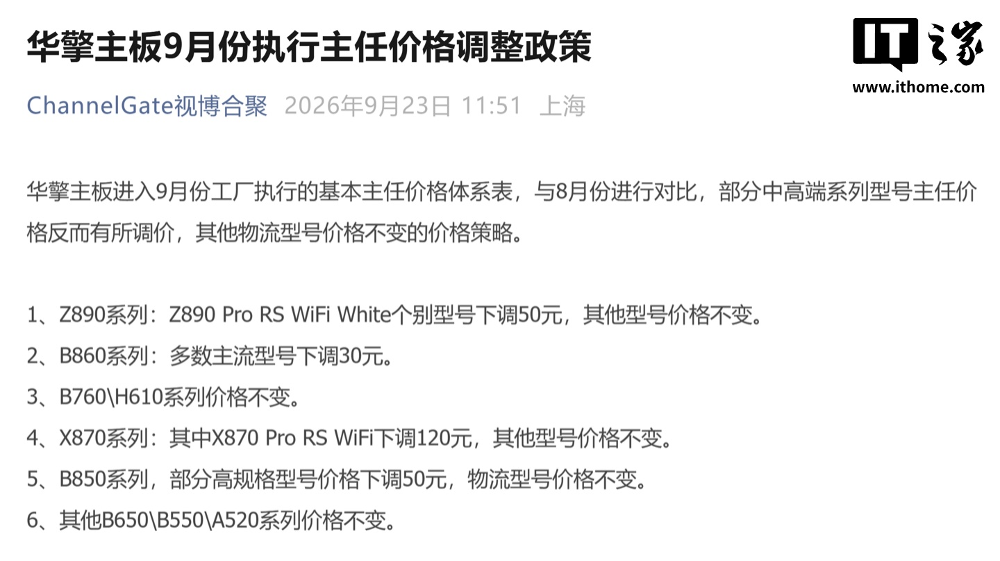
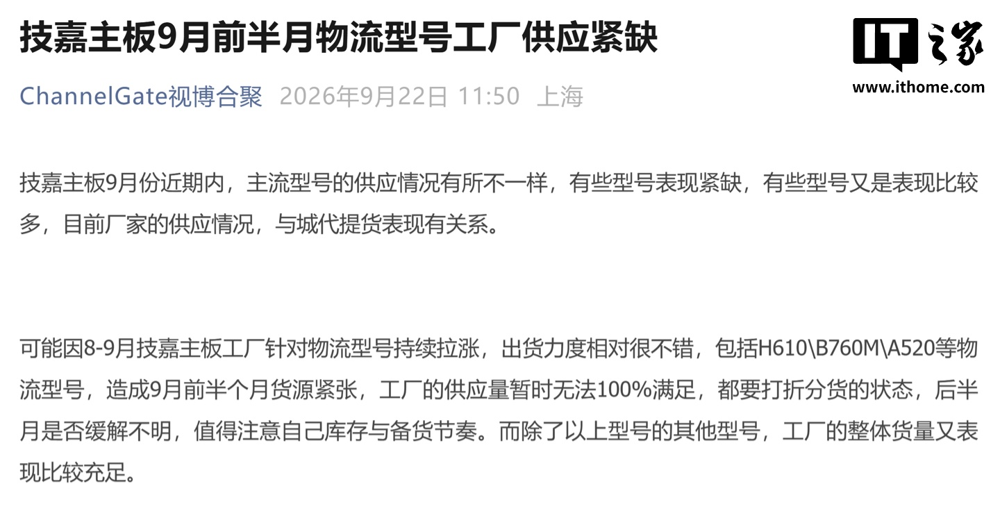

Según informa ITHome, la cuenta de canal china ChannelGate habría publicado que la fábrica de placas base de ASUS notificó una subida generalizada de precios a partir de octubre, con un incremento estimado de entre el 5 % y el 10 % según la gama. La información procede del canal de distribución y está pendiente de confirmación oficial por parte del fabricante, por lo que conviene leerla como un aviso del mercado, no como una tarifa definitiva.

El calendario que maneja la filtración sitúa la entrada en vigor después del 8 de octubre y recomienda a distribuidores y tiendas abastecerse durante septiembre. Los porcentajes que se barajan son escalonados: la serie PRIME subiría en torno al 5 %, la serie TUF alrededor del 7 % y la serie ROG cerca del 10 %, siempre a expensas del precio final que fije la fábrica.

## Por qué suben los precios de las placas ASUS

El argumento que recoge la publicación apunta a dos frentes de costes. Por un lado, la subida de las materias primas aguas arriba; por otro, un encarecimiento de en torno al 10 % en los chipsets de placa base suministrados por TSMC. Con esa presión, el coste de fabricación habría quedado entre un 10 % y un 15 % por encima del nivel actual, un margen que los fabricantes no podrían absorber sin vender por debajo de coste.

La misma fuente señala que ASUS ya aplicó una subida parcial anterior de entre 5 y 20 yuanes en algunos modelos, pero que ese ajuste no cubrió el aumento de costes y que muchos modelos ni siquiera lo recibieron, posiblemente para no comprometer los objetivos del tercer trimestre. La subida de octubre sería, según esta versión, el ajuste que pondría las tarifas al nivel real de costes de una sola vez.

## Qué cambia si planeas montar o actualizar un PC

De confirmarse, el impacto llegaría primero al canal chino y después, con el habitual desfase, al resto de mercados. Quien tenga en mente una placa ASUS —especialmente de gama ROG, la más afectada en porcentaje— debería vigilar la evolución de precios en las próximas semanas y no dar por sentado que las tarifas actuales se mantendrán tras el 8 de octubre.

Conviene poner la noticia en contexto: ASUS no es la única marca bajo presión de costes, y los movimientos de sus rivales confirman que todo el segmento se está reajustando. Además, la subida coincidiría en el tiempo con [el encarecimiento de las tarjetas gráficas en China](/noticias/gpu-prices-china-rise/), lo que pinta un otoño complicado para quien planee montar un equipo completo. Y si tu placa es AM5, recuerda que [ASUS prepara una nueva BIOS con latencia optimizada para memoria DDR5 de CXMT](/noticias/asus-am5-bios-cxmt-memory/): el soporte sigue avanzando aunque los precios suban.

## El resto del mercado también se mueve

La propia publicación repasa los ajustes de septiembre de otros tres fabricantes, con un panorama desigual. ASRock habría aplicado en septiembre una revisión de precios con bajadas puntuales en gamas medias-altas: 50 yuanes menos en la Z890 Pro RS WiFi White, 30 yuanes menos en la mayoría de los modelos B860, 120 yuanes menos en la X870 Pro RS WiFi y 50 yuanes menos en algunos modelos B850 de gama alta, con el resto de series sin cambios.

Colorful, por su parte, habría recortado en septiembre los apoyos de precio en sus modelos logísticos de gama baja (series B760, H610, B550 y A520), lo que equivale a una subida encubierta del coste neto de entre 10 y 20 yuanes, mientras las gamas medias-altas se mantendrían estables.

Y Gigabyte habría sufrido en la primera quincena de septiembre tensiones de suministro en sus modelos logísticos más vendidos (H610, B760M y A520), con la fábrica sin capacidad para cubrir toda la demanda y repartos parciales, en parte por el buen ritmo de ventas tras las subidas de agosto y septiembre.

En conjunto, el mensaje para el lector es claro: el mercado de placas base entra en un otoño volátil, con ASUS apuntando a subidas y sus competidores alternando recortes selectivos y problemas de stock. Si la compra puede adelantarse a octubre, este puede ser un buen momento para comparar precios.
