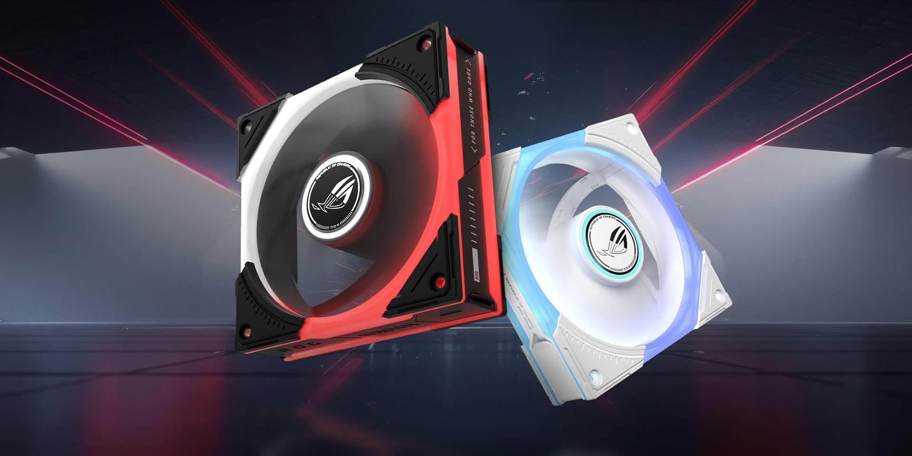
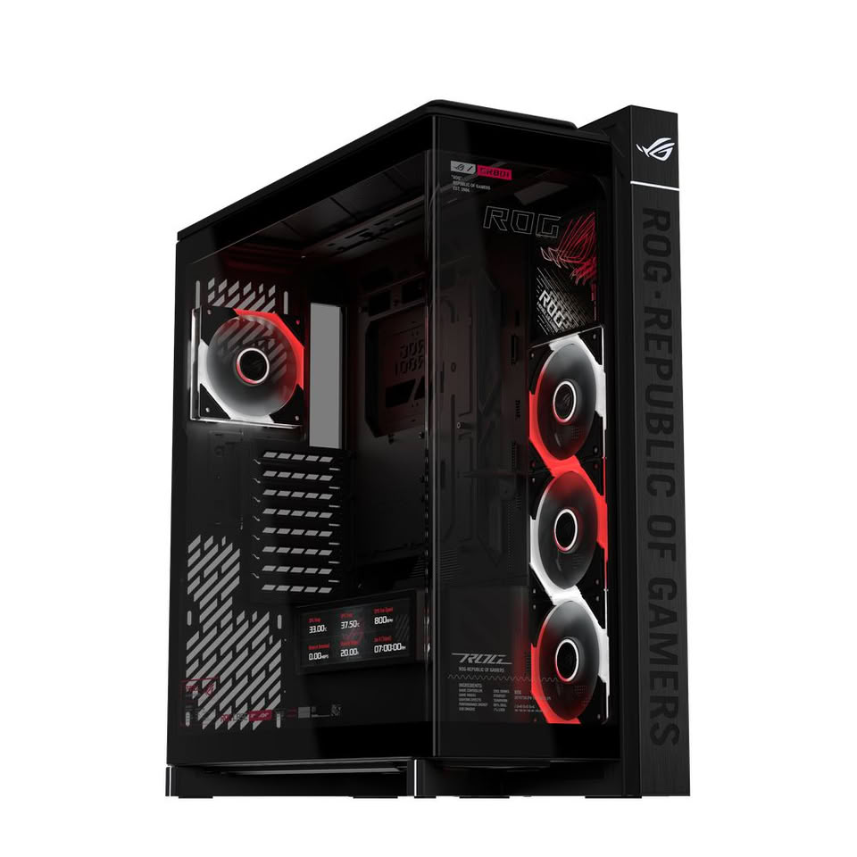
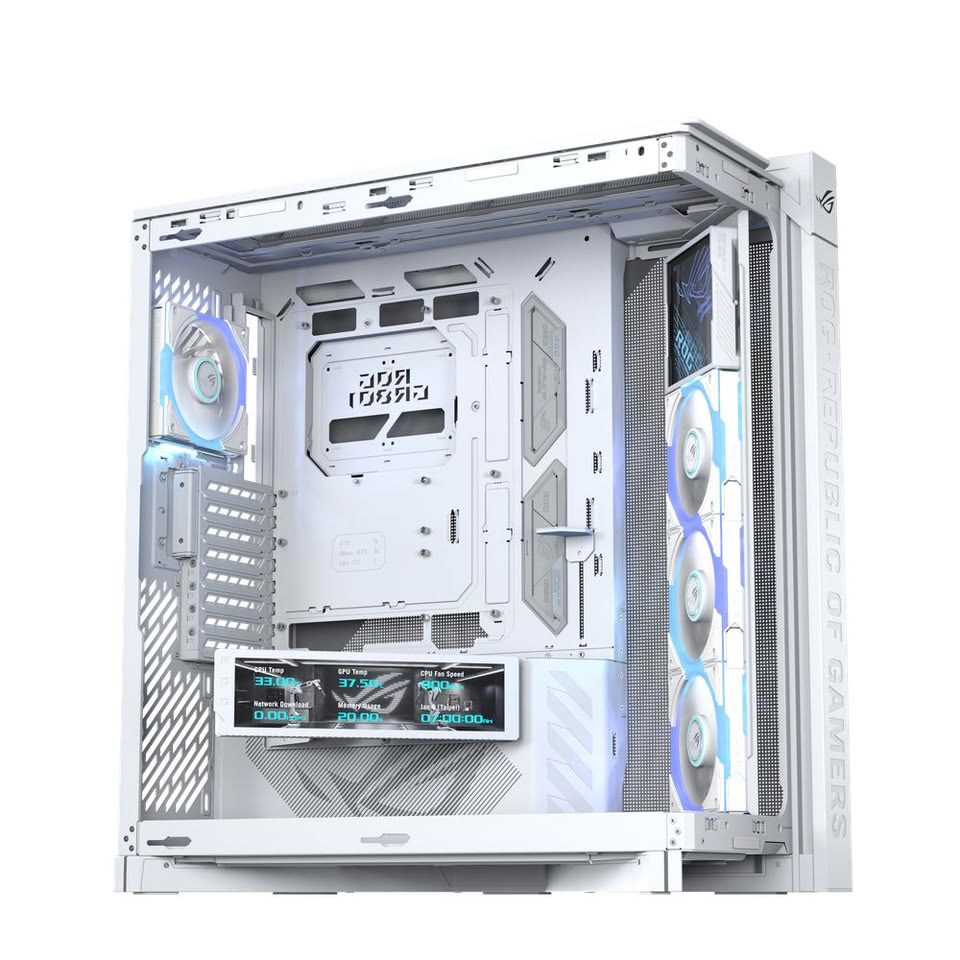
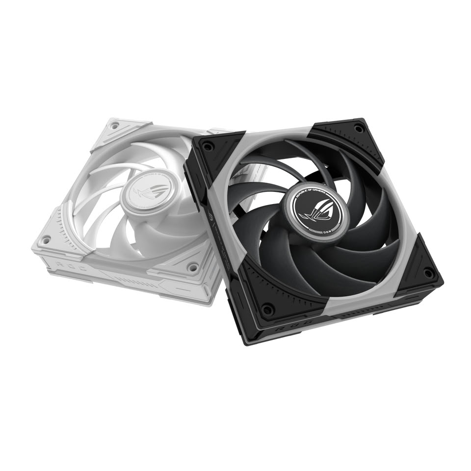

ASUS Republic of Gamers amplió su catálogo de chasis con la **ROG Cronox ARGB**, una torre completa con formato EATX que combina un panel lateral de vidrio templado curvado con una pantalla LCD integrada, y presentó en paralelo la familia de ventiladores **ROG Eurux GR120 ARGB**. El anuncio llega con precios y disponibilidad iniciales limitados a Alemania, Austria y Suiza.

## Una torre grande con pantalla propia

La Cronox ARGB es un chasis de torre completa pensado para montajes de gran tamaño. Su estructura admite placas **EATX, ATX, microATX y mini-ITX**, además de las placas **BTF** de ASUS, cuyos conectores van ocultos por detrás para dejar el interior más limpio.

El elemento más llamativo es su módulo de pantalla: un **LCD de 9,2 pulgadas** con resolución 1920 x 462, 60 Hz, panel IPS, 400 nits de brillo y contraste 1:1000. El módulo gira sobre una bisagra para orientarlo según convenga y puede mostrar un panel con datos de CPU, GPU, memoria, red y ventiladores, además de un reloj que permanece visible incluso con el equipo apagado.

En cuanto a espacio, la caja admite **tarjetas gráficas de hasta 400 mm** en instalación horizontal y hasta 115 mm de ancho en vertical, disipadores de CPU de hasta **180 mm de altura** y hasta **catorce ventiladores de 120 mm**. Para refrigeración líquida ofrece dos radiadores de hasta 360 mm, con montaje superior y lateral, más una posición trasera de 120 mm. Un soporte lateral giratorio patentado permite redirigir el flujo de aire hacia los componentes que más lo necesitan.

La caja llega con cuatro ventiladores ROG Eurux GR120 ARGB ya instalados —tres de aspas invertidas en el lateral como entrada y uno estándar en la parte trasera como salida— y con un panel de iluminación ROG Strix XIN120. El panel frontal de E/S incluye dos puertos USB Type-C de 20 Gbps con carga rápida de hasta 60 W, cuatro USB Type-A de 5 Gbps, conectores de audio y botones dedicados de encendido, reinicio e iluminación.

## Ventiladores Eurux GR120 ARGB: cifras y versiones

La familia Eurux GR120 ARGB está formada por ventiladores de 120 mm con aspas de polímero de cristal líquido (LCP). Según los datos oficiales, la **versión estándar alcanza hasta 2600 rpm**, mueve **85 CFM** con **4,5 mm H₂O** de presión estática y declara un máximo de **33 dBA**. La **versión de aspas invertidas** se queda en **2200 rpm**, **70 CFM** y **3,0 mm H₂O**, con **32 dBA**.

Cada ventilador incorpora tres zonas de iluminación direccionable y conectores en cadena patentados que simplifican el cableado. Se venden por separado o en packs de tres; el pack triple incluye un hub para hasta **14 ventiladores** con fusible de protección.

## Por qué importa

ROG no compite aquí por precio, sino por integración. La Cronox ARGB reúne en un solo producto varias ideas que ASUS ya venía empujando por separado: el ecosistema **BTF** de conectores traseros, un anclaje de tarjeta gráfica sin herramientas y un módulo de pantalla que hasta ahora solía resolverse con accesorios de terceros. Para quien monta equipos grandes con una GPU de gama alta, el soporte de hasta 400 mm y el tope de catorce ventiladores son los datos que realmente condicionan la compra.

El movimiento también consolida el formato EATX dentro del catálogo ROG y refuerza la apuesta por la refrigeración con componentes propios, en lugar de depender de fabricantes externos. Es una estrategia coherente con el resto de la gama, pero que ata al usuario al software de ASUS para exprimir la pantalla y la iluminación.

## Qué cambia para quien arma PC en España

De momento, nada inmediato: ASUS ha anunciado disponibilidad y precios solo para **Alemania, Austria y Suiza**. La caja se vende en acabados negro y blanco por **499,90 EUR/CHF** (IVA incluido), mientras que los ventiladores parten de **29,90 EUR** la unidad y **99,90 EUR** el pack de tres, tanto en versión estándar como invertida y en ambos colores.

Eso deja el desembarco en el mercado español sin fecha confirmada, algo habitual en los lanzamientos que ROG estrena primero en la región DACH. Para el comprador hispanohablante que esté planificando una torre de gama alta, la referencia útil es la compatibilidad: si tu placa es EATX o BTF y tu GPU ronda los 400 mm, la Cronox entra en la lista de candidatas; si no, su precio la sitúa por encima de la mayoría de alternativas de gran formato.
