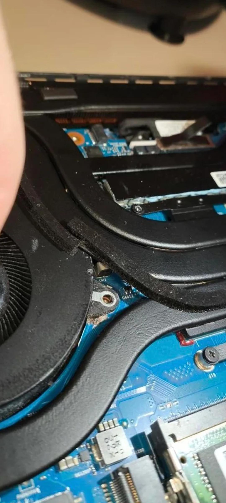

Un propietario de una ROG Strix G16 se libró de pagar 1.100 dólares por la sustitución de la placa base de su portátil. ASUS acabó cubriendo la reparación después de que el usuario reuniera pruebas suficientes de que el equipo arrastra un fallo de diseño que provoca cortocircuitos, y además el servicio técnico aplicó un pequeño refuerzo para intentar que el problema no vuelva a reproducirse. El caso lo recoge el usuario de Reddit **GreatCombinator** en el subforo r/ASUSROG y lo ha difundido Wccftech.

Según el relato, el afectado había recibido un presupuesto de 1.100 dólares por parte de un taller ajeno a ASUS para cambiar la placa base. La cifra no es menor para un componente de portátil gaming, y a eso se suma que, sin una solución de fondo, nada garantizaba que el fallo no reapareciera. El usuario no se quedó de brazos cruzados: acumuló publicaciones y fotografías de otros casos y las presentó a ASUS hasta que la compañía accedió a asumir el cambio sin coste.

## Un fallo de diseño que se repite en la ROG Strix G16 de 2023

La historia no arranca de un caso aislado. La versión de 2023 de la ROG Strix G16 acumula reportes de usuario que apuntan a un defecto de diseño capaz de dañar la placa base por un cortocircuito. Ese es el motivo por el que las pruebas que reunió el propietario resultaron decisivas: dejaban de ser la queja de un cliente con mala suerte para convertirse en un patrón documentado en varios equipos.

El proceso tampoco fue inmediato. Según el testimonio recogido, ASUS tardó alrededor de una semana en cambiar de criterio y autorizar la sustitución gratuita. El desenlace fue favorable, pero deja una pregunta incómoda: si el origen del problema es un diseño que se repite en toda una tanda de equipos, la reparación individual no corrige la causa y cada propietario depende de su capacidad para documentar el fallo.

## La cinta sobre la placa: un parche sencillo para un problema mecánico

El detalle más comentado llegó con el equipo ya reparado. El servicio técnico colocó un trozo de cinta entre los dos puntos que, en la placa anterior, habían entrado en contacto. En una de las imágenes se aprecia que la pieza metálica de fijación del ventilador tocaba la placa base, un contacto que acabó derivando en el cortocircuito que dejó el portátil inservible.

Conviene ser honesto con el alcance de esa solución. Por el aspecto que muestra la fotografía, no parece cinta de Kapton —aislante y resistente a la temperatura, la habitual en electrónica— sino una cinta negra común y corriente. Es una intervención barata y de sentido común, porque separar físicamente las dos superficies evita que vuelvan a tocarse. Ahora bien, es un parche sobre la zona conflictiva, no un rediseño: su durabilidad depende de que la cinta se mantenga en su sitio con el paso del tiempo y las vibraciones.

## Qué cambia para el lector hispanohablante

Para quien tenga una ROG Strix G16 de esa generación, la lección práctica es doble. Por un lado, ante un fallo de este tipo conviene documentar el caso con fotografías y reunir otros testimonios de usuarios con el mismo problema: en una avería que se repite, la evidencia de patrón es lo que mueve a un fabricante a cubrir la reparación fuera de garantía. Por otro, guardar el historial de contacto con el servicio técnico y no aceptar a la primera un presupuesto elevado de un taller externo.

También ayuda recordar que este episodio encaja en un debate más amplio sobre la fiabilidad de los portátiles gaming de ASUS, como el que dejó el incidente de la [bisagra de un TUF Gaming](/noticias/asus-tuf-laptop-hinge/) tras un uso indebido. La diferencia es que aquí no hubo maltrato por parte del usuario: el problema nace dentro del chasis y afecta a la pieza más cara de reparar.

Es justo reconocer que ASUS atendió el caso y asumió un desembolso de 1.100 dólares, algo que no siempre ocurre en el soporte posventa. Pero la solución aplicada —una cinta entre el anclaje del ventilador y la placa— invita a la cautela: los propietarios de una unidad afectada harían bien en revisar periódicamente esa zona y, ante cualquier síntoma de inestabilidad o apagón, no esperar a que el cortocircuito vuelva a hacer acto de presencia.

El origen de la historia es la publicación del usuario **GreatCombinator** en [r/ASUSROG](https://www.reddit.com/r/ASUSROG/comments/1wm8age/asus_rog_strix_g16_goodwill_repair/), difundida posteriormente por Wccftech.
