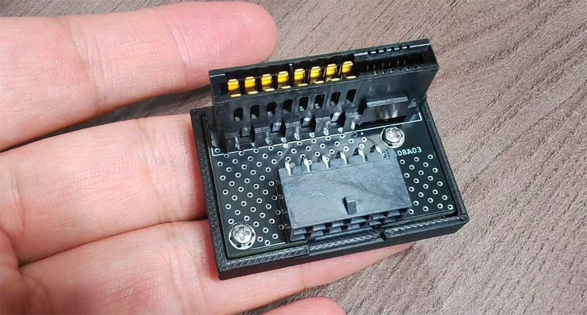

Las GeForce RTX 5090 más ambiciosas de ASUS, la ROG Astral Edition 20 y la
ROG Matrix 30th Anniversary, fueron diseñadas con un sistema de alimentación
doble que les permite alcanzar hasta 800 W. El inconveniente es que exprimir
ese modo exigía una placa base BTF 2.5 de ASUS, una familia de modelos escasa
y poco extendida. Un vendedor chino ha encontrado la forma de saltarse ese
requisito con un adaptador que convierte el conector propietario en una entrada
de 16 pines convencional.

## Cómo funciona el sistema de doble alimentación

ASUS divide la alimentación de estas dos tarjetas en dos vías: una llega desde
la placa base a través del conector BTF GC-HPWR y la otra lo hace directamente
desde la fuente por el socket 12V-2×6. Según el fabricante, la combinación de
ambas vías proporciona hasta 800 W y un margen de overclocking adicional de
hasta el 10 % en ambos modelos.

El adaptador mueve esa segunda vía de alimentación fuera de la placa base. En
lugar de recibir energía a través de una placa BTF, los contactos GC-HPWR de la
gráfica se conectan a un segundo cable de 16 pines de la fuente. El resultado es
una tarjeta con dos cables de 16 pines que funciona sobre una placa base
estándar, sin depender del conector BTF.

## Precio y riesgos de una solución no oficial

La solución tiene un coste notablemente inferior al de las alternativas con
estética ASUS. El adaptador de terceros se vende por 599 yuanes (unos 77 euros),
mientras que unos cables con aspecto oficial y la misma función se listan por
2.999 yuanes (unos 387 euros).

La principal incógnita es la seguridad y la garantía. Técnicamente, el montaje
reproduce lo que ya hace la configuración BTF: el cable de 16 pines llega a la
placa base y esta enruta la energía hacia la gráfica a través del conector BTF.
Este adaptador, en cambio, traslada esa conversión fuera de la placa. ASUS
podría rechazar una reclamación de garantía si detecta que se empleó un cable
modificado y no original, un riesgo a tener en cuenta antes de apostar por una
solución de este tipo.
