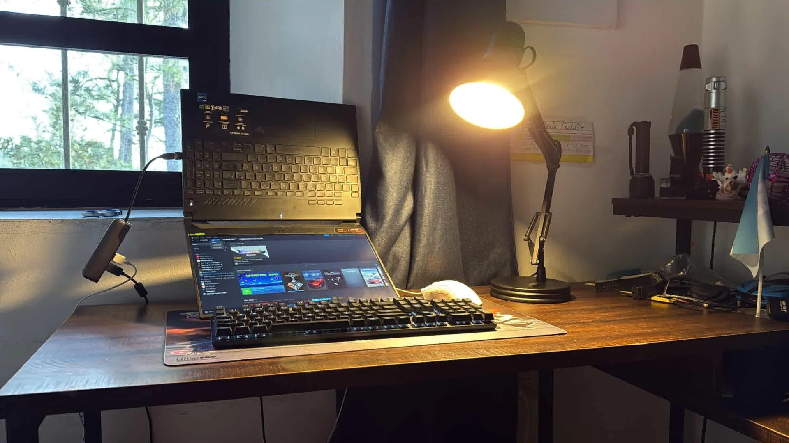
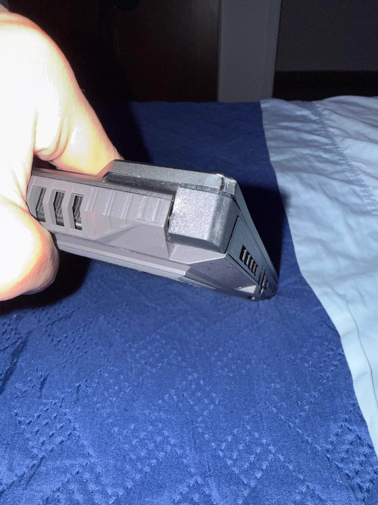
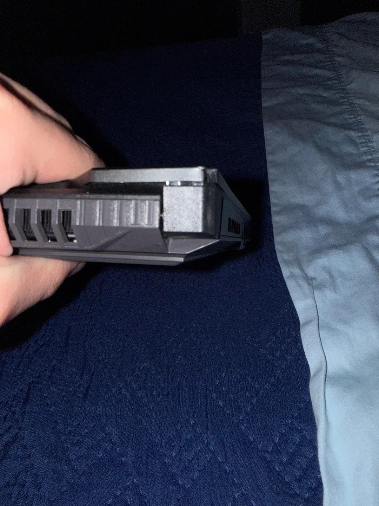

Colocar un portátil boca abajo para recrear uno de esos montajes que circulan por Instagram y otras redes sociales puede parecer una broma inofensiva, hasta que la bisagra deja de sostener la pantalla. Eso es lo que le ocurrió al usuario de Reddit **AArqjmct01**, que compartió en el subforo r/Asustuf cómo el mecanismo de su ASUS TUF Gaming terminó cediendo después de someter el equipo a esa postura forzada. Lo llamativo del caso no es solo el daño, sino que el portátil **no era suyo**.

Según el relato recogido por Wccftech, ambos mecanismos acabaron partidos. El usuario logró encajar uno de vuelta en su sitio, pero el segundo no respondió a los intentos de recolocarlo y todo apunta a que necesitará pasar por el servicio técnico. Antes de llegar a ese punto, varios comentarios en Reddit le habían advertido de que la idea era mala; el aviso no sirvió de nada.

## El plástico y las bisagras: un compromiso conocido

La familia TUF es la línea de entrada de ASUS en el terreno gaming, y su construcción recurre en buena medida al plástico. Ese enfoque abarata el producto, pero obliga a tomar decisiones de diseño en piezas sometidas a esfuerzo mecánico constante, y la bisagra es la candidata número uno. En función de cómo se abra y se cierre la tapa, el mismo modelo puede aguantar años o quedarse tocado en pocos meses.

Esto no convierte al TUF en un equipo defectuoso por definición: es una consecuencia esperable del segmento de precio. Una bisagra está pensada para un rango concreto de movimiento —abrir y cerrar la tapa sobre su eje—, no para soportar el peso del chasis en una orientación para la que no fue calculada. Forzar la pantalla más allá de ese rango concentra la tensión en los anclajes y acaba pasando factura.

## El problema de fondo: copiar montajes sin entender el hardware

El episodio conecta con un patrón más amplio: la tendencia a reproducir configuraciones llamativas de escritorio o de grabación sin evaluar si el equipo está preparado para ellas. Un soporte, un brazo articulado o una orientación poco convencional pueden quedar muy bien en un vídeo corto, pero el portátil es un objeto mecánico con límites documentados, no un decorado.

La situación se agrava cuando el equipo no es propio. El daño en un producto de otro —y la posibilidad de que la garantía no cubra una rotura causada por un uso indebido— convierte una ocurrencia en un problema económico para quien confió el dispositivo. Y aunque el usuario afectado pueda encajar una de las bisagras, una reparación de este tipo no siempre se resuelve con un gesto manual.

## Nuestra lectura

El caso tiene una parte de anécdota y otra de recordatorio útil. Es fácil señalar al usuario por imprudente, y lo cierto es que ignoró las advertencias de otros miembros del foro. Pero también conviene mirar el diseño: las bisagras de los portátiles económicos son un punto débil recurrente, y los fabricantes podrían comunicar con más claridad qué posturas están fuera de especificación.

Para el lector hispanohablante que esté pensando en montar un escritorio vistoso, la lección es sencilla. Antes de someter un portátil a cualquier orientación o soporte no previsto, conviene revisar el manual y, sobre todo, el sentido común: ninguna moda de redes sociales merece poner en riesgo un equipo que cuesta cientos de euros. Las tendencias cambian cada semana; el portátil, si se maltrata, no.

El origen de la historia es la publicación del usuario **AArqjmct01** en [r/Asustuf](https://www.reddit.com/r/Asustuf/comments/1w8mase/hinge_broke_after_using_laptop_upside_down/), difundida posteriormente por Wccftech.
