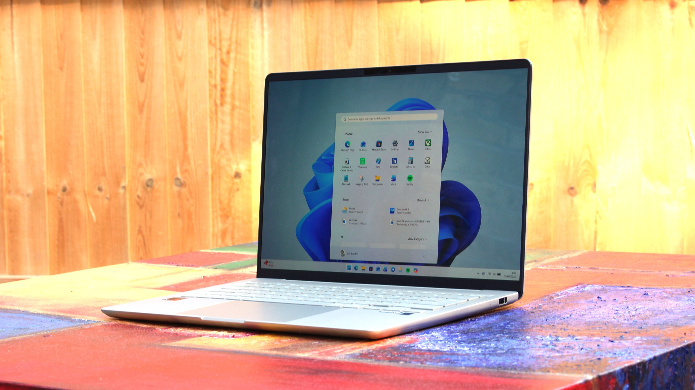
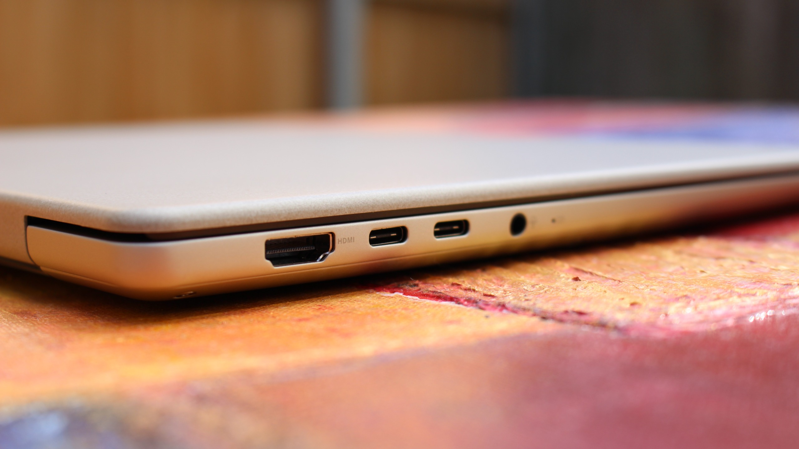
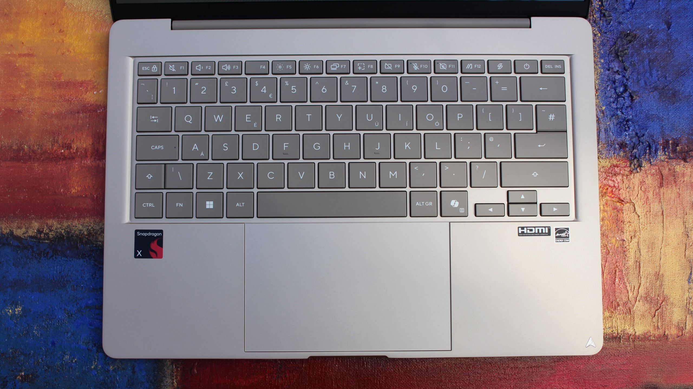
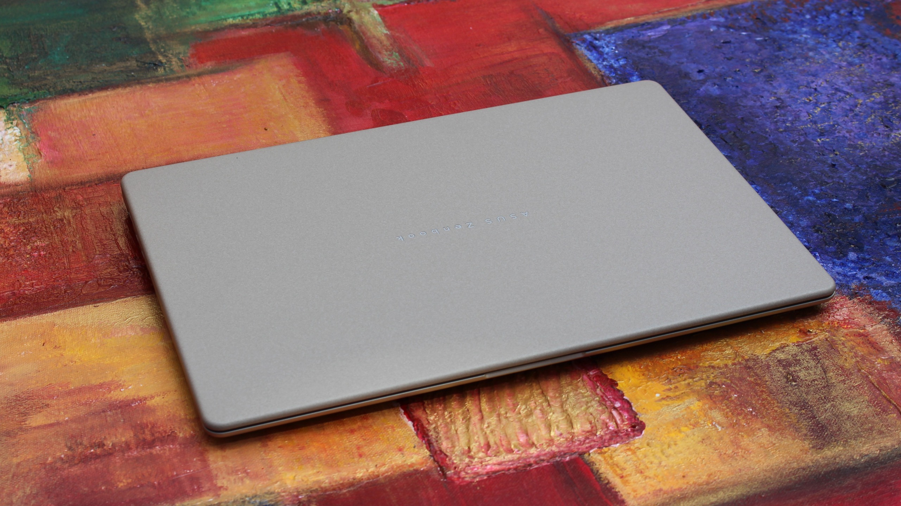
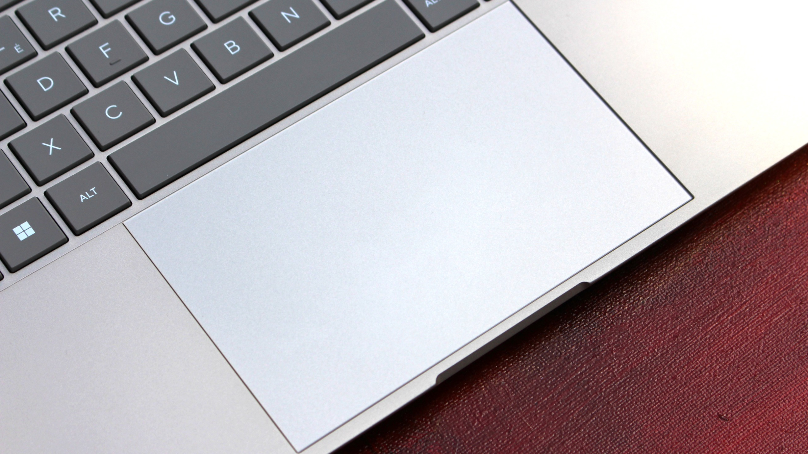
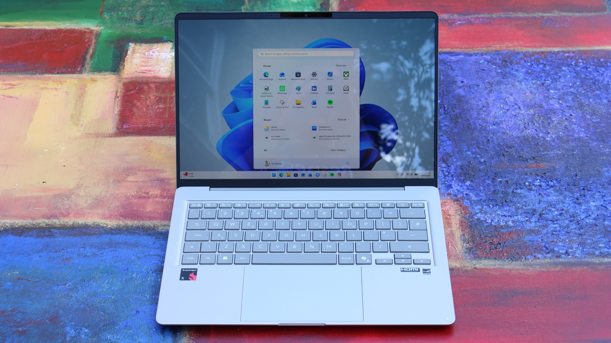
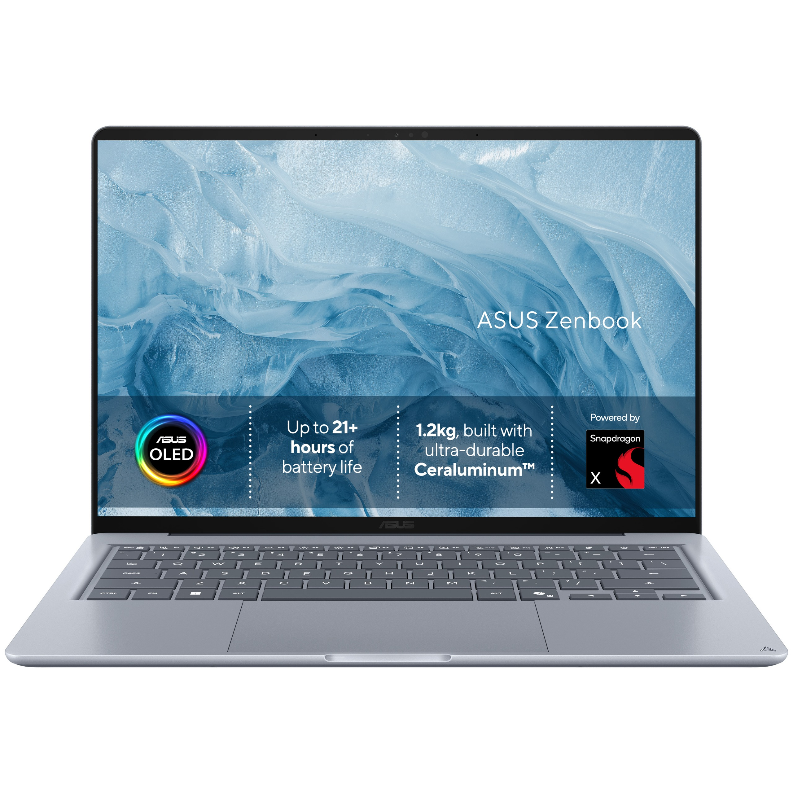

Desde que Apple lanzó el MacBook Neo, los fabricantes de portátiles Windows llevan meses compitiendo por ofrecer equipos que igualen su diseño y su precio. ASUS se suma ahora a esa carrera con el ZenBook 14 con Snapdragon X, un modelo que arranca en 799 dólares y que, según la review de Windows Central, es uno de los mejores exponentes de esa franja de precio.

El analista Zac Bowden ha convivido varias semanas con una unidad de este equipo y su veredicto es claro: se trata de "otro gran rival del MacBook Neo". La combinación de un chasis metálico cuidado, una pantalla OLED de 1080p, un teclado agradable y una batería que aguanta la jornada completa lo colocan por delante de buena parte de sus competidores directos.

## Diseño y pantalla: el punto fuerte

El ZenBook 14 apuesta por un chasis de metal con un recubrimiento que disimula bien las huellas y con un perfil más redondeado que el del MacBook Neo, lo que mejora la ergonomía al transportarlo. Con 1,30 kg de peso y unas dimensiones de 31,11 × 21,58 × 1,39–1,69 cm, se mantiene como un equipo ligero para su tamaño de 14 pulgadas. El analista señala una ligera flexión en la estructura, pero insuficiente para empañar la sensación general de producto premium.

La pantalla es, probablemente, el gran atractivo del conjunto. Se trata de un panel OLED WUXGA (1920×1200) con formato 16:10, 60 Hz, cobertura del 100 % de DCI-P3 y un contraste de 1.000.000:1. Bowden reconoce que su resolución es inferior a la del MacBook Neo o el Dell XPS 13, pero considera que los colores del OLED compensan de sobra esa diferencia.

En conectividad, el equipo no escatima: dos USB-C con datos, salida de vídeo y carga, un USB-A de tamaño completo, un HDMI 2.1 y un conector de 3,5 mm para auriculares. Una dotación poco habitual en este rango de precio.

## Rendimiento, autonomía y lo que no convence

El corazón del ZenBook 14 es el Snapdragon X X1 26 100, un SoC de ocho núcleos a hasta 2,97 GHz acompañado de GPU Adreno y una NPU Hexagon de hasta 45 TOPS. La configuración base de 799 dólares incluye 8 GB de LPDDR5X y 256 GB de SSD, una cantidad de memoria que el analista considera justa para 2026, aunque suficiente para productividad ligera y multitarea básica. Existen variantes con más RAM y almacenamiento a un precio superior.

La eficiencia del chip se traduce en una autonomía para todo el día, uno de los apartados mejor valorados. También destaca el teclado, descrito como uno de los mejores que el analista ha probado en este precio: táctil, silencioso y cómodo al pulsar. La webcam Full HD incorpora sensores IR para el desbloqueo facial con Windows Hello, un extra que no ofrece el MacBook Neo de 799 dólares.

No todo son elogios. El trackpad es el punto más criticado: aunque es amplio y suave, resulta más duro de pulsar de lo deseable y su precisión deja que desear. El analista también echa en falta retroiluminación en el teclado, y advierte de que los ventiladores pueden subir de vueltas y resultar ruidosos bajo carga intensa.

## Qué significa para el comprador hispanohablante

El ZenBook 14 con Snapdragon X confirma una tendencia clara: la franja de los 800 dólares ha dejado de ser territorio de portátiles de plástico y prestaciones justas. La presión del MacBook Neo ha obligado a fabricantes como ASUS, Dell o Acer a cuidar el diseño y a incorporar paneles OLED donde antes no los había. Para quien busca un equipo ligero de 14 pulgadas para estudiar, teletrabajar o moverse entre reuniones, es una noticia excelente.

Dicho esto, conviene leer la letra pequeña. Los 8 GB de la configuración base se quedan cortos para un uso intensivo, y las versiones con más memoria elevan el precio. A ello se suma el trackpad mejorable y la ausencia de retroiluminación en el teclado, dos detalles que se notan en el día a día. La recomendación implícita de la review es clara: es un gran portátil por lo que cuesta, siempre que sus limitaciones encajen con el uso que le vayamos a dar.

En conjunto, el ZenBook 14 se posiciona como una de las alternativas más equilibradas al MacBook Neo dentro del ecosistema Windows. La combinación de diseño, pantalla OLED y autonomía pesa más que sus carencias, sobre todo teniendo en cuenta el precio de partida.

