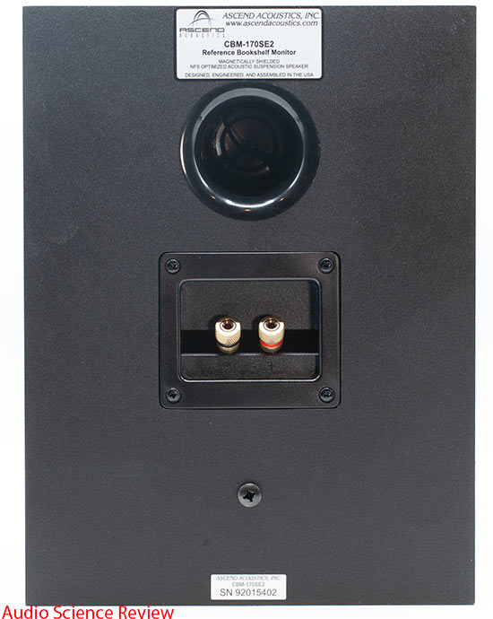
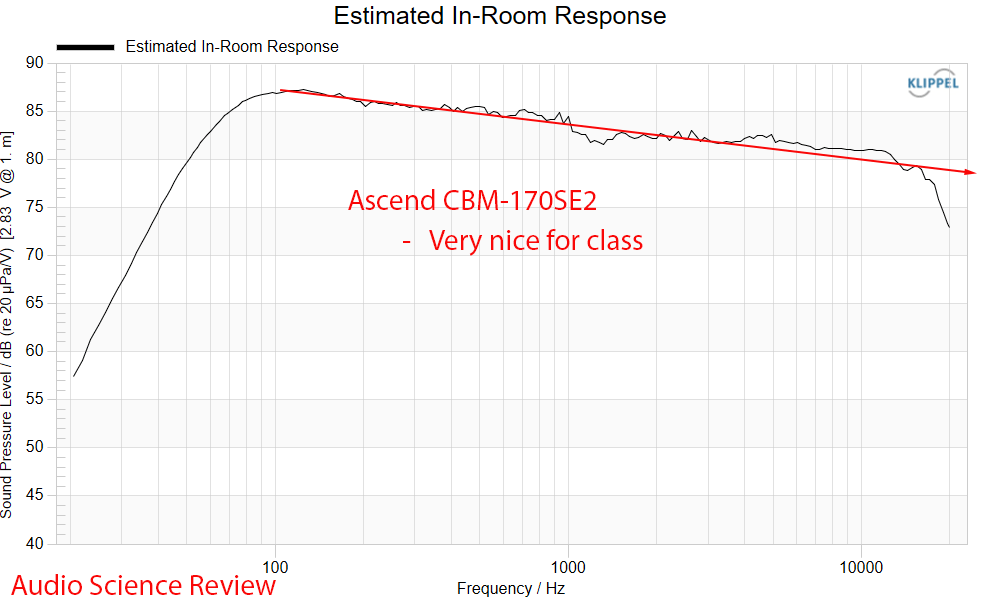
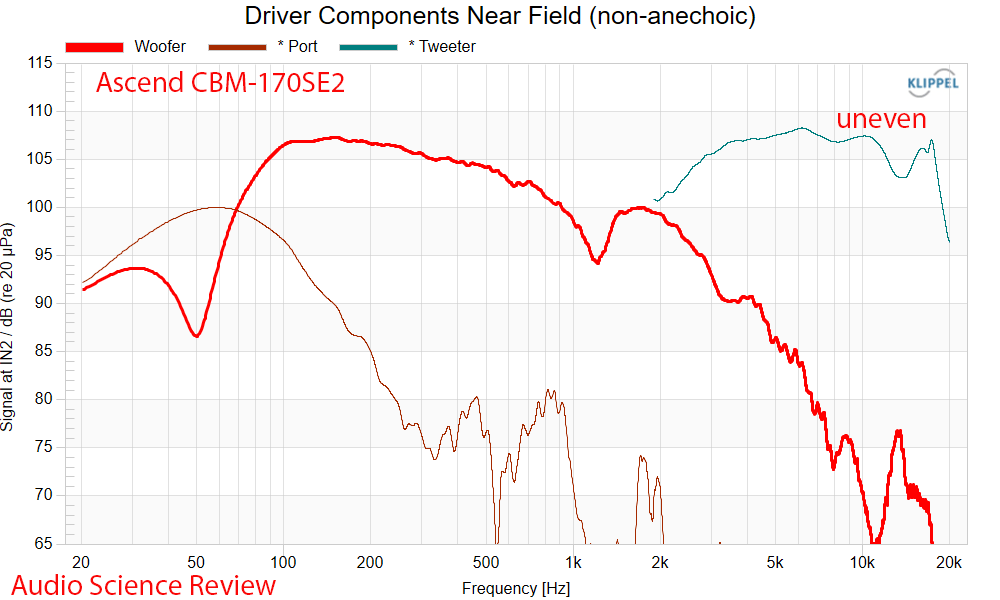
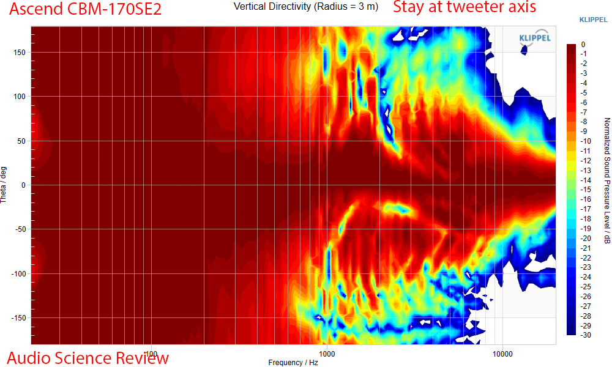
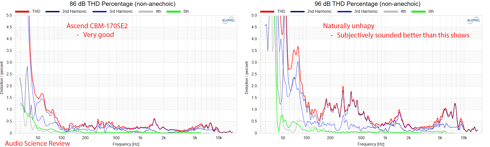
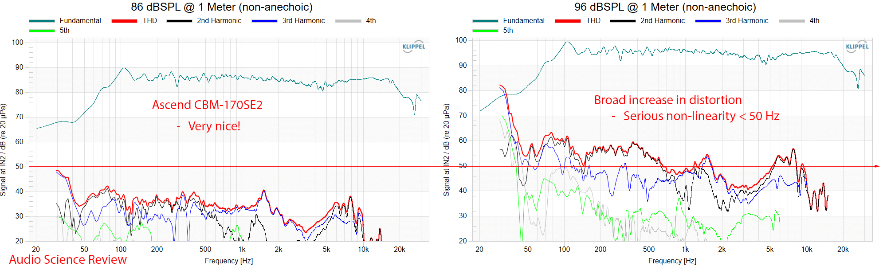
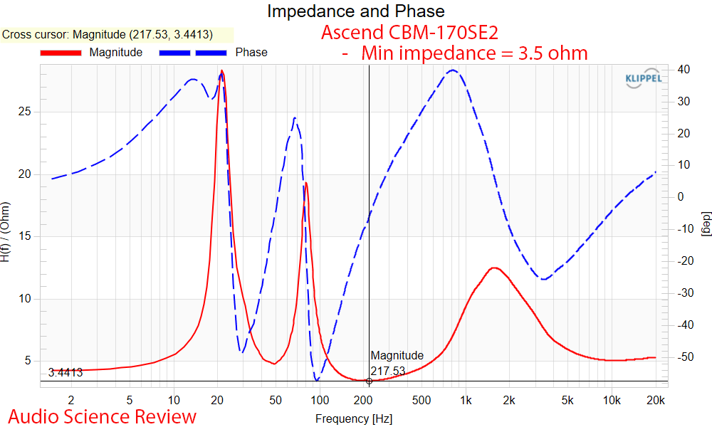
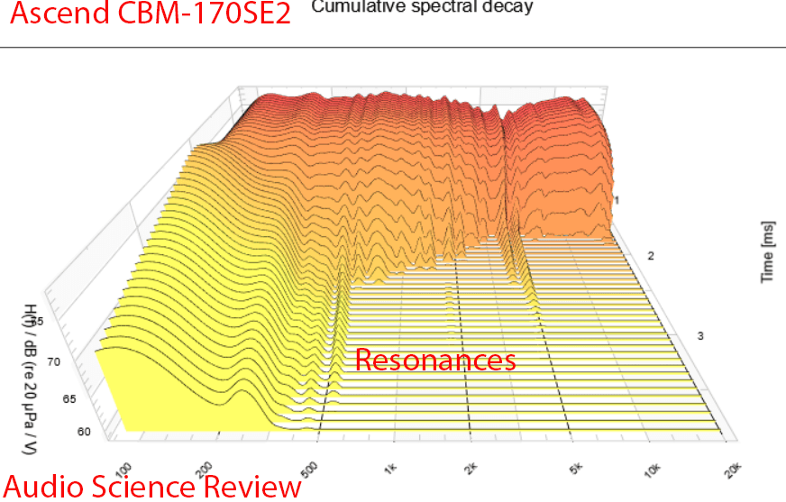
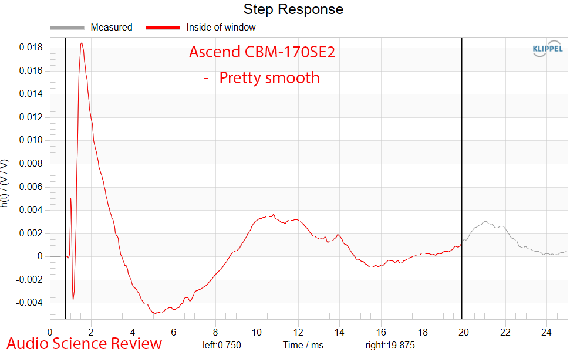

El Ascend Acoustics CBM-170SE2 es un altavoz de estantería de dos vías que cuesta 248 dólares la unidad, 468 dólares el par. Audio Science Review lo ha sometido a su batería habitual de mediciones con el sistema Klippel NFS, tomando como referencia el centro del tweeter, y la conclusión de su responsable, Amir, es una recomendación firme: un altavoz fabricado en Estados Unidos que rinde muy por encima de lo que sugiere su precio.

## El CBM-170SE2, una respuesta pensada para la sala

La respuesta en el eje principal es plana, que es lo deseable, aunque con matices: aparece una resonancia en torno a los 900 y 1.000 Hz y algunas carencias leves en agudos. La ventana de escucha, sin embargo, es suave, y las reflexiones de la ventana temprana suman bien, señal de que el diseño está optimizado en ese aspecto.

El resultado combinado da una respuesta prevista en sala sorprendentemente buena, un área en la que el diseñador del altavoz, Dave, puso especial atención según la review.

En campo cercano se aprecian algunas irregularidades del tweeter, que quedan mejor integradas en la respuesta global.

## Directividad, distorsión e impedancia

El CBM-170SE2 prescinde de guía de ondas, así que el tweeter genera un haz natural, con la ventaja de una dispersión más amplia en la zona baja de los agudos. La respuesta vertical es la típica de un altavoz de dos vías: conviene escucharlo a la altura del tweeter.

En potencia, el altavoz aguantó una señal de 96 dBSPL sin quejarse, algo que no siempre ocurre. La distorsión armónica es notablemente baja a 86 dBSPL en todo el rango; solo a partir de 101 dBSPL, al inicio del barrido, se aprecia algo de distorsión audible.

La impedancia medida ronda los 3,5 ohmios en su punto más bajo. El waterfall de decaimiento muestra las resonancias habituales de este tipo de caja, mientras que la respuesta al escalón es limpia.

## La escucha confirma lo que dibujan los gráficos

Las mediciones dejaban entrever que haría falta algo de ecualización, pero en la práctica no fue necesaria ninguna corrección: el altavoz sonó limpio y fuerte, con una fidelidad que no se corresponde con su aspecto ni con su precio. Con los ojos cerrados, la imagen espacial resultante es amplia, de unos dos metros alrededor y por encima del altavoz. En configuración estéreo llena una escena grande con una tonalidad y una precisión agradables.

El único límite claro es la extensión en graves: una pista con mucho subgraves no lo puso en apuros, pero el altavoz simplemente recorta esas frecuencias en lugar de reproducirlas y distorsionar. No es un defecto oculto, sino la consecuencia esperable de su tamaño y su precio.

## Precio, puntuación y para quién merece la pena

La puntuación de preferencia calculada a partir de las mediciones es de 5,80, y sube hasta 8,16 si se asume el apoyo de un subwoofer ideal. Ese cálculo lo hizo una herramienta de inteligencia artificial a partir de los datos de Amir, que no ha verificado su salida, así que conviene tomarlo como orientativo: lo sólido son las mediciones, no la nota. La limitación que explica esa diferencia está en la extensión por debajo de 51,3 Hz (−6 dB), no en la directividad ni en la suavidad de la respuesta.

| Especificación | Valor |
| --- | --- |
| Precio | 248 $ la unidad / 468 $ el par |
| Tipo | Estantería, dos vías, bass reflex |
| Tweeter | 27 mm, domo de seda, fabricado por SEAS (Noruega) |
| Woofer | 6,5", cono de polygel |
| Respuesta en sala | 43 Hz – 20 kHz |
| Respuesta anecoica | 64 Hz – 22 kHz (±3 dB) |
| Sensibilidad en sala | 91 dB (2,83 V / 1 m) |
| Impedancia nominal | 8 ohmios |
| Potencia máxima continua | 200 W |
| Dimensiones / peso | 30,5 × 22,9 × 24,1 cm / 6,8 kg por unidad |

Para quien busque un altavoz de estantería de calidad por menos de 500 dólares el par, el CBM-170SE2 es una opción a tener en cuenta: rinde muy bien en todo salvo en los graves más profundos, que se resuelven añadiendo un subwoofer. La gestión de potencia también es buena, así que no debería dar problemas con amplificadores de potencia modesta. Quien prefiera una solución activa para escritorio o televisor puede mirar el [análisis de los PSB iQ2 con BluOS](/noticias/audio/psb-iq2-altavoces/), otra alternativa de formato compacto.
