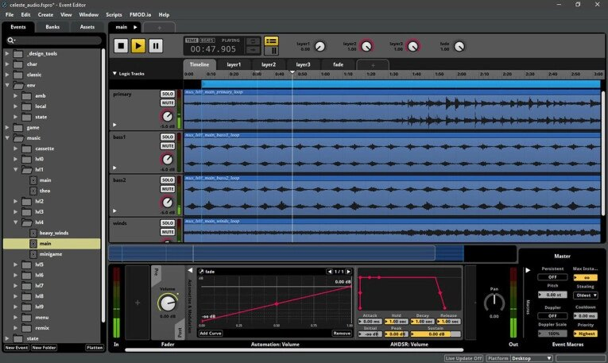
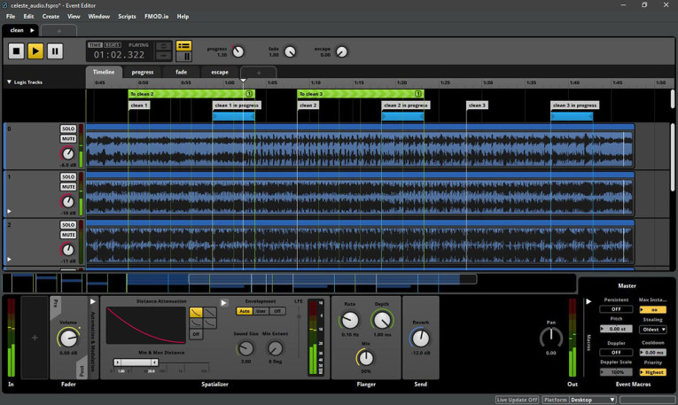

El 1 de octubre de 2026 Bose Corporation anunció la compra de Firelight Technologies, la empresa con sede en Melbourne (Australia) responsable de FMOD, un motor de audio interactivo asentado en la industria del videojuego. La operación integra la plataforma dentro del negocio de Audio Technology de Bose y amplía sus capacidades en audio que reacciona a eventos en tiempo real. Los términos económicos y las demás condiciones de la transacción permanecen confidenciales.

## Qué se lleva Bose con FMOD

La plataforma de Firelight combina dos piezas que suelen ir juntas en el desarrollo de un videojuego. Por un lado, FMOD Studio es el entorno de autoría donde los diseñadores de sonido y los compositores montan eventos, mezclas y música adaptativa. Por otro, el FMOD Engine se encarga de la reproducción en tiempo real y es multiplataforma: está pensado para integrarse con Unity, Unreal Engine y tecnología propia, y funciona en consolas, ordenadores de sobremesa, dispositivos móviles y web. Firelight describe FMOD como una solución de extremo a extremo desarrollada a lo largo de 25 años.

Ese enfoque es lo que separa a FMOD de un simple reproductor. El editor de eventos permite disparar sonidos según las acciones del jugador y hace que la música cambie con el estado de la partida, mientras que el mezclador ofrece enrutado, procesado DSP y *snapshots* para mezclas dinámicas. La función Live Update deja escuchar los cambios sobre un juego en ejecución, y el analizador de rendimiento permite revisar eventos, parámetros, actividad de voces y uso de CPU. El resultado es un flujo de trabajo iterativo, atado directamente a la aplicación final.

## Por qué importa fuera del videojuego

El videojuego es el foco inmediato del anuncio, pero Bose también señala la realidad virtual y aumentada, la automoción y otras aplicaciones de audio interactivo como oportunidades a más largo plazo. La compañía no ha detallado productos ni integraciones concretas en esas áreas, así que por ahora la compra se lee como una apuesta de plataforma: hacerse con las herramientas con las que se crea y se ejecuta el sonido adaptable, no con un producto final.

Ahí está el valor para quien desarrolla productos de audio: FMOD conecta el diseño sonoro con el comportamiento de la aplicación. A diferencia de una pista fija, el audio se decide en tiempo de ejecución según lo que ocurre en pantalla, algo que trasciende el ocio y aparece en cualquier entorno donde el sonido deba responder a un contexto.

## Un movimiento más dentro de la estrategia de compras de Bose

La adquisición llega después de que Bose comprara StreamUnlimited Engineering en junio de 2026. Las dos piezas se complementan: StreamUnlimited aporta software, módulos de hardware y servicios de integración para productos de audio conectados, mientras que Firelight añade herramientas para crear e implementar sonido y música adaptativos. En conjunto, dibujan un interés por tecnologías de audio que otras empresas y plataformas pueden incorporar en sus propios productos.

Bose no es una compañía cotizada y mantiene una estructura de propiedad poco habitual: desde 2011 la mayoría de sus acciones está en manos del MIT, que recibe dividendos pero no participa en la gestión. Esa independencia le da un horizonte de inversión más largo que el de una empresa atada al informe trimestral, y explica compras como esta o la del McIntosh Group, que en 2024 puso bajo su paraguas a McIntosh, Sonus Faber y Sumiko. La compañía organiza hoy su actividad en cuatro áreas —audio de consumo premium, automoción, tecnología de audio y audio de lujo—, con una I+D centralizada y recursos compartidos. [La compra de Sonus Faber en 2024](/noticias/audio/bose-compra-sonus-faber/) mostró cómo Bose aspira a preservar marcas diferenciadas mientras las conecta a una estructura mayor; Firelight encaja en esa misma lógica, esta vez en el terreno del software.

## Qué cambia para desarrolladores y usuarios

Bose afirma que FMOD seguirá siendo abierto y ampliamente soportado, con inversión continuada en la plataforma y en su comunidad de desarrolladores, socios y clientes. Es una promesa central para un negocio de *middleware* cuyas herramientas se integran en proyectos construidos con motores y plataformas de despliegue distintos: si el soporte se resintiera, los estudios que dependen de él serían los primeros en notarlo.

> «La adquisición de Firelight es un paso importante en el negocio de Audio Technology que estamos construyendo en Bose. El videojuego representa una oportunidad significativa para nuestro crecimiento y creemos que nuestra experiencia en audio puede ayudar a los creadores a ofrecer mejores experiencias a los jugadores», afirma Nick Smith, presidente de Bose Audio Technology y director de estrategia.

Brett Paterson, fundador y consejero delegado de Firelight Technologies, añade: «Unirse a Bose ofrece nuevas oportunidades para avanzar en la hoja de ruta de FMOD sin dejar de apoyar a la comunidad que depende de ella».

Para el usuario final no hay un cambio inmediato: no se ha anunciado ningún producto ni integración derivada de la operación. La consecuencia práctica, si se cumple el compromiso de Bose, es que la herramienta con la que se construye el audio de muchos juegos —y, a futuro, de experiencias de realidad virtual o automoción— sigue disponible y con desarrollo previsto bajo un propietario con más recursos. La duda razonable es la de siempre en este tipo de compras: cuánto de esa independencia se mantiene cuando el negocio de *middleware* deja de ser el centro de la empresa y pasa a ser una pieza dentro de una corporación mucho mayor.
