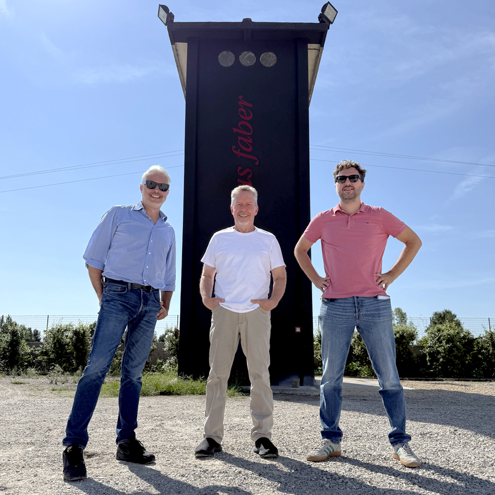
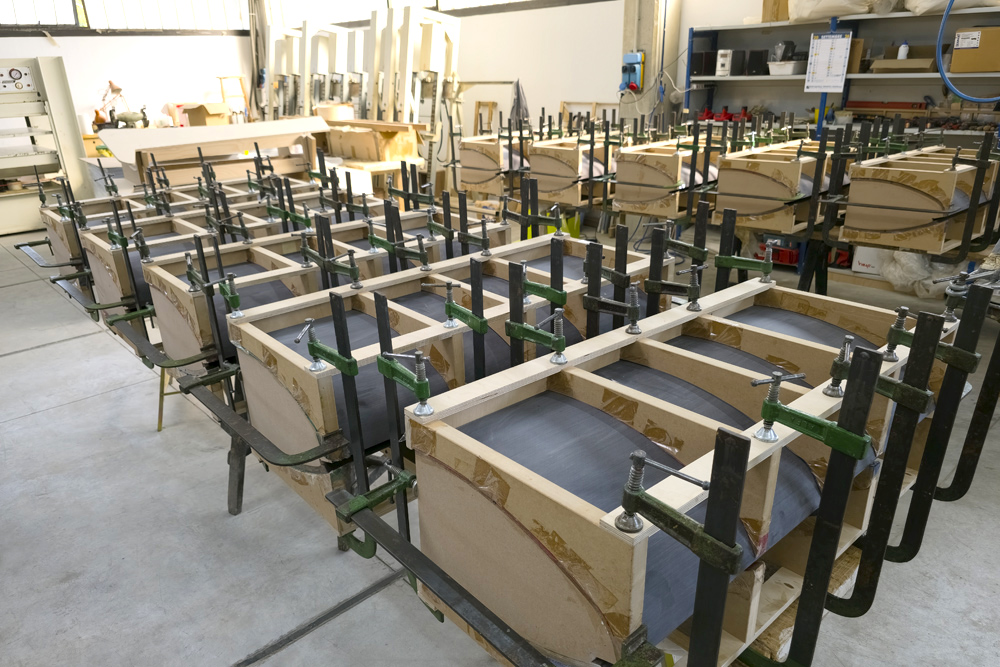
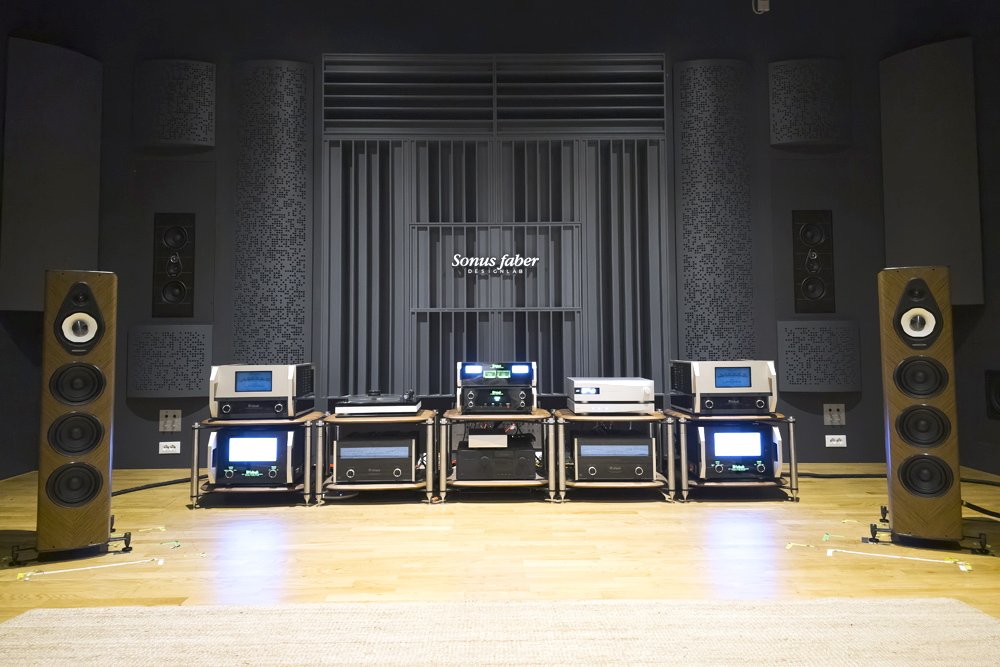

Bose cerró la compra del McIntosh Group en noviembre de 2024 y, con ella, se hizo con McIntosh Laboratory, Sonus Faber y Sumiko. Casi dos años después, la duda que se plantearon entonces los aficionados sigue sobre la mesa: qué ocurre cuando una firma italiana de altavoces de alta gama entra en el balance de una corporación estadounidense. La visita que el medio SoundStage! Hi-Fi publicó tras volver a la sede de Sonus Faber en Vicenza, en septiembre de 2026, permite responder con datos: el Olympica G3 y el Amati Supreme muestran qué ha cambiado y, sobre todo, qué no.

## De quién es Sonus Faber ahora

La operación de 2024 colocó bajo Bose tres marcas con una historia muy distinta: McIntosh Laboratory, Sonus Faber y Sumiko. Bose no es una compañía cotizada ni pertenece a un fondo de capital riesgo. Sigue siendo de capital privado y, desde 2011, la mayoría de sus acciones está en manos del MIT: el fundador Amar Bose donó esos títulos, que son sin derecho a voto y no se pueden vender, aunque el instituto recibe sus dividendos. Es una estructura poco habitual que aleja a la marca de la presión del informe trimestral.

Bose agrupa la iniciativa de las tres firmas bajo el nombre Bose Luxury y quiere usar su alcance para llevar Sonus Faber, McIntosh y Sumiko a un público mucho más amplio. El punto de partida es claro: la alta fidelidad lleva décadas vendiendo a un grupo pequeño de entusiastas, mientras que Bose sabe poner productos de audio delante de millones de personas que nunca pisarían una tienda especializada.

## Qué no ha cambiado

La respuesta corta es: lo esencial. Según la crónica de SoundStage! Hi-Fi, el equipo de ingeniería y diseño de Sonus Faber ha crecido con personal adicional, y la fábrica de madera se ha ampliado. Antes ocupaba un único edificio grande, situado a unos 30 minutos en coche de la fábrica principal; ahora se reparte entre dos. La compañía sigue diseñando sus propios altavoces —diseños a medida fabricados por proveedores externos según sus especificaciones— y los muebles y acabados que han definido la marca continúan construyéndose en Italia.

Livio Cucuzza mantiene el liderazgo de producto. Llegó a la empresa en 2010 y el Amati Futura, presentado en enero de 2011 en el CES de Las Vegas, marcó un antes y un después en su catálogo. La dirección técnica que él estableció sigue vigente: los modelos que se pudieron escuchar en Vicenza se desarrollaron con la línea de ingeniería de Sonus Faber previa a la compra, no con la de Bose. La experiencia y los recursos del comprador están disponibles, pero apenas pesaron en esos altavoces. Donde la influencia de Bose se nota hoy es en la estrategia de negocio y de marketing.

**El equipo de Sonus Faber y el autor de la crónica durante la visita de 2026**

## La tecnología del Suprema baja de gama

Cuando Sonus Faber presentó el Suprema, un sistema completo con dos subwoofers por 750.000 dólares, la lectura fácil era la de un objeto inalcanzable. La otra lectura, la que interesa, es la de plataforma tecnológica: buena parte de su ingeniería estaba pensada para acabar en productos más asequibles. Ese trasvase se aprecia ahora en dos lanzamientos.

El primero es el Olympica G3, tercera generación de una línea que debutó en 2013 y que se compone de cinco modelos: el monitor Olympica I, los de suelo Olympica III y Olympica V, el central Olympica C y el de pared Olympica W. Conserva los recintos de madera en forma de laúd y el característico puerto ranurado, pero refina el acabado con un nuevo patrón de espiga a 45 grados en la chapa de madera y detalles en aluminio gris mate con chaflanes pulidos. Hay dos acabados, Walnut y Wengé. Lo relevante está dentro: hereda el altavoz de medios Camelia con su recinto de corcho y el sistema que la firma llama Phase Coherent Crossover, pensado para alinear las relaciones de fase entre transductores y hacer que varios altavoces se comporten como uno solo. El Olympica V G3 cuesta 27.000 euros la pareja.

El segundo es el Amati Supreme, aparecido en otoño de 2025 por 78.000 euros la pareja. Su origen es casi experimental: el equipo del Design Lab se preguntó qué pasaría al montar los tres transductores de medios y agudos desarrollados para el Suprema —los mismos, no derivados más baratos, incluido el Camelia— en la arquitectura del Amati G5. Debajo van dos woofers de 8 pulgadas del Amati G5, y el mueble principal es esencialmente el de ese modelo con otros acabados. Debutó en Sabbia Oro (oro mate) y Terra Rossa (rojo mate), y después llegaron tres acabados en chapa: Wengé, Red y Graphite.

## Qué significa para quien compra

La conclusión de la visita es que Sonus Faber no ha retrocedido. Si el Suprema sirvió para bautizar una era V3.0, el Olympica G3 y el Amati Supreme no llegan a V4.0, sino más bien a un V3.2 o V3.5: evoluciones que incorporan tecnología nueva sin renegar de la identidad que hizo funcionar cada línea.

Para el comprador potencial, la consecuencia práctica es que las mejoras del buque insignia dejan de ser un escaparate y llegan a precios más bajos, aunque sigan siendo alta gama. En escucha, el medio y la neutralidad tonal son los rasgos que más se repiten, con la salvedad de que la comparación entre modelos de precio muy distinto nunca es lineal: pagar casi el triple no da tres veces más calidad. Ahí están los 27.000 euros del Olympica V G3 frente a los 78.000 del Amati Supreme.

Queda abierta la pregunta de fondo: cómo llevar una firma especializada a un público mucho mayor sin diluir aquello que la hacía especial. Por lo que se vio en Vicenza, Bose no parece estar interfiriendo en la ingeniería, y la dirección de producto sigue donde estaba. La duda no es qué ha cambiado en Sonus Faber, sino hasta dónde piensa llevarla su nuevo dueño. Como contexto de la misma marca, Bose también ha mantenido su pulso en el mercado de consumo con movimientos recientes como la [vuelta a los auriculares con cable USB-C](/noticias/bose-auriculares-cable-usb-c/) o la [actualización Auracast de los QuietComfort Ultra](/noticias/bose-quietcomfort-ultra-auracast/).

**Livio Cucuzza, durante una entrevista en la sede de Vicenza**

