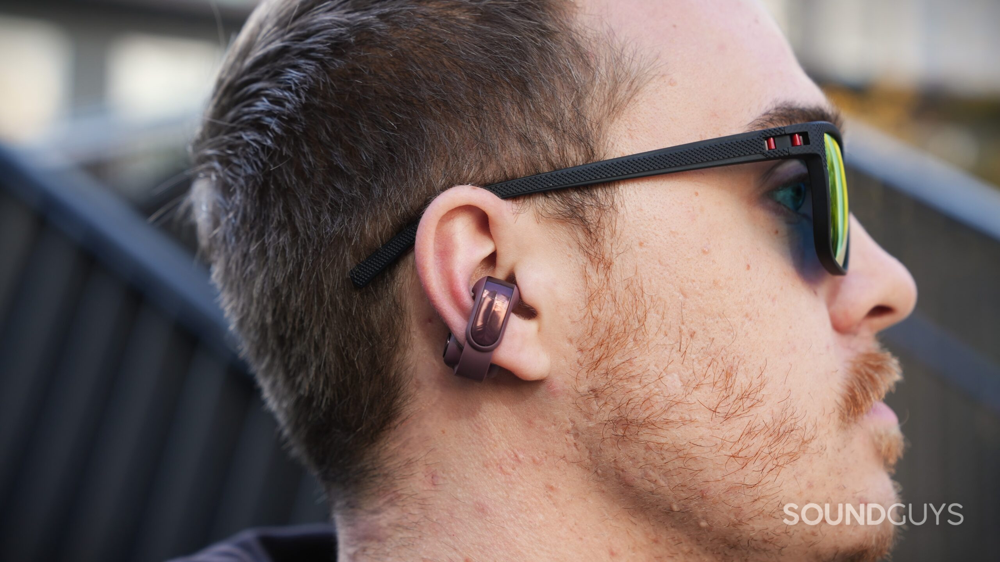
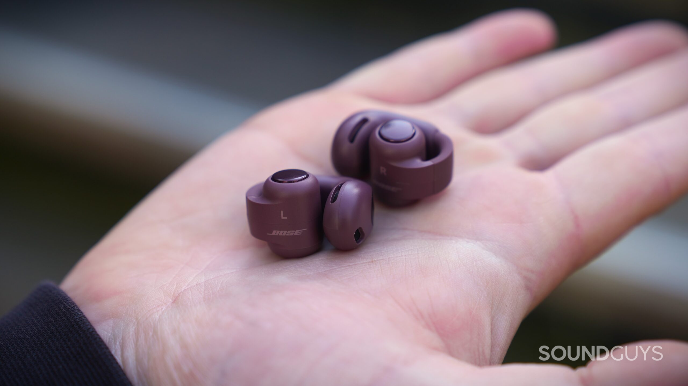
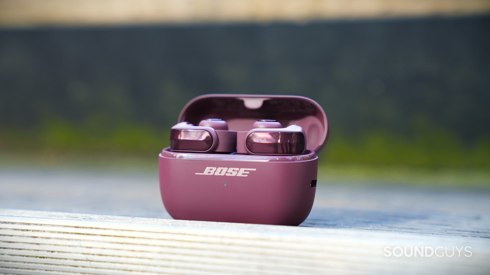
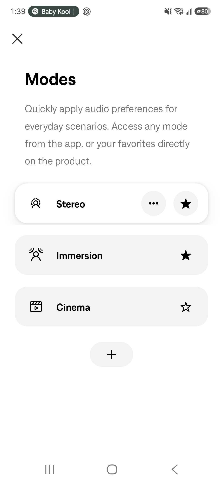
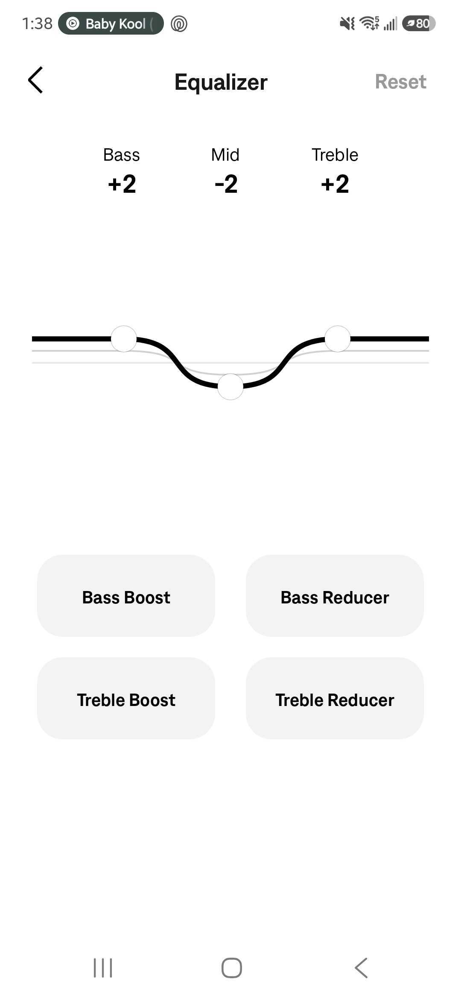

Bose pone a la venta la segunda generación de sus Ultra Open Earbuds al mismo precio que la primera: 299 dólares (modelo 897806-0030), con fecha de lanzamiento el 2 de octubre de 2026. La compañía sostiene que la nueva versión corrige los puntos flacos del modelo original —con un driver rediseñado para lograr más graves y más volumen, micrófonos nuevos y una batería de mayor duración— sin tocar el diseño de pinza que caracteriza a esta familia. SoundGuys ya los ha analizado y su veredicto es matizado: mejoran lo que fallaba, pero el precio sigue pesando.

## Qué cambia en los Bose Ultra Open Earbuds de 2ª gen

El formato no se mueve. Cada auricular mantiene la pieza que emite junto al conducto auditivo, la articulación de silicona que rodea el borde de la oreja y el cilindro de batería con los controles detrás. Lo que sí cambia es la rigidez de esa articulación, ahora más suelta y fácil de abrir, y un acabado exterior de aspecto metálico con borde biselado que, en realidad, sigue siendo plástico.

En el estuche hay cambios de uso más tangibles. Ahora se sostiene en vertical sobre una base de silicona y admite carga inalámbrica además de USB-C, algo que en el modelo original obligaba a comprar una funda aparte. El puerto USB-C y el botón de emparejamiento pasan a los laterales, de modo que se puede conectar el estuche o emparejar un dispositivo nuevo sin tumbarlo.

## Qué se mide: sonido, llamadas y batería

En sonido, la segunda generación gana donde la primera fallaba. El grave tiene más presencia y el agudo deja de resultar estridente siempre que se escuche a un volumen contenido. El aislamiento, en cambio, no mejora porque no es el objetivo del producto: al no sellar el conducto auditivo, apenas hay atenuación medible y no existe cancelación activa de ruido. Para bien, deja pasar el entorno; para mal, la música compite con el ruido de la calle y es fácil subir el volumen más de la cuenta.

Las llamadas eran el punto más débil del original y Bose ha trabajado en ellas. Cada auricular combina ahora un micrófono con una unidad de captación de voz que detecta las vibraciones al hablar, y el procesado SpeechClarity usa ambos para separar la voz del ruido. En condiciones ideales la grabación suena clara, pero en oficina, calle y sobre todo con viento la voz queda apagada y cuesta entenderla. SoundGuys advierte además de que sus pruebas se hacen sobre una cabeza artificial que no vibra como una real, por lo que llama a tomar los resultados de voz con cautela.

En autonomía, Bose declara hasta 9 horas de reproducción, pero en la prueba estandarizada del medio los auriculares aguantaron 13 horas y 1 minuto, más de cuatro horas que la generación anterior en el mismo test. El estuche suma otras 19,5 horas, hasta 28,5 en total, con carga rápida de unos 10 minutos para unas 2 horas de escucha. Ese margen cae hasta las 5 horas cuando se activan los modos de audio espacial o el volumen automático.

## Qué significa para quien busca unos auriculares abiertos

El nuevo modo Cinema, pensado para vídeo y pódcast, ensancha la escena sin desplazar los diálogos del centro, y la app de Bose mantiene su ecualizador de tres bandas con presets, más limitado que los de competidores como Soundcore o Sony.

El volumen automático heredado del primer modelo sigue sobrecorrigiendo: en la prueba subió el nivel de golpe porque detectó un ruido ambiente que apenas se oía. Bose ha prometido una actualización de firmware con Google Find Hub, Alexa+ integrado y un atajo de Apple Music.

En conectividad todo va al día: Bluetooth 5.4, códecs SBC, AAC y aptX Adaptive, y multipoint de serie para tener dos dispositivos enlazados a la vez. Lo que no llega es Auracast, la función que permite sintonizar retransmisiones de audio en espacios públicos o compartir sonido entre varios auriculares.

¿Merece la pena? SoundGuys concluye que estos auriculares corrigen la mayoría de los defectos del original —más graves, agudos menos agresivos y un estuche mejor resuelto—, pero que los 299 dólares son difíciles de justificar en un mercado cada vez más poblado. Los Bose Sport Open Earbuds cuestan 199 dólares, los Sony LinkBuds Clip 229,99 y los CMF Clip Pro se quedan en 79, con una experiencia que, según el análisis, se acerca bastante para la mayoría a un precio mucho menor. En el catálogo ya hay ejemplos de esa ofensiva más económica, como los [Ugreen ClipBuds Pro 2](/noticias/audio/ugreen-clipbuds-pro-2/), que apuestan por el mismo formato abierto a 99,99 dólares.
