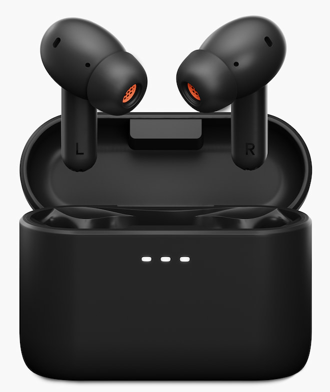
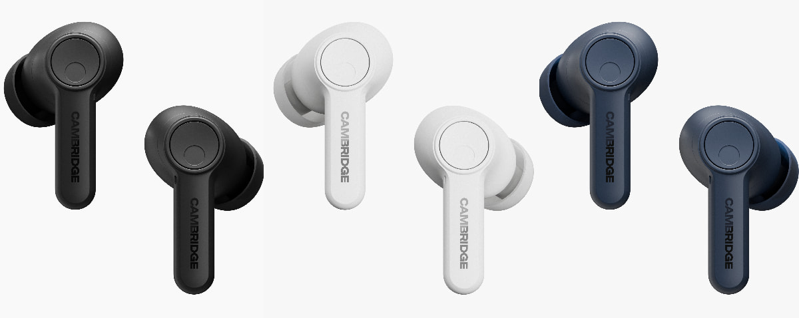
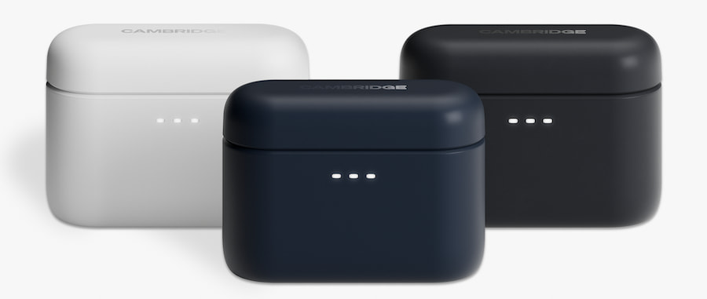

Cambridge Audio no reemplaza sus auriculares true wireless más asequibles, sino que los afina. Los **Melomania A100 SE** son una edición especial del A100 que llegó en 2025 y mantienen su precio de **149 dólares**, con tres cambios concretos: añaden **Dolby Audio** con audio espacial, estrenan una afinación revisada y suman un acabado azul a la paleta existente.

Es una decisión de gama razonable: conservar lo que ya funcionaba y tocar solo lo que el usuario percibe. Quien ya tenga el A100 no tiene motivos para cambiar; quien esté buscando unos auriculares por debajo de los 150 dólares, sí tiene un motivo más para mirarlos.

## Dolby Audio, rejillas nuevas y afinación

La incorporación más visible es **Dolby Audio con Spatial Audio**, que se activa desde la aplicación **Melomania Connect** (iOS y Android). Cambridge Audio asegura que mejora la claridad de voces y diálogos, además de ampliar la sensación de escena. Conviene aclarar un matiz que el fabricante ha confirmado: **no hay soporte de Dolby Atmos** dentro del conjunto de funciones, por mucho que el nombre invite a confundirlos.

El segundo cambio es más analógico: la **rejilla de cada auricular es ahora menos restrictiva**, lo que según la marca aporta más aire en los agudos. A eso se suma una **puesta a punto acústica revisada** que promete graves más profundos, medios más ricos y agudos más limpios respecto al A100 original. En el plano estético, el modelo SE añade un **acabado azul** que se suma al negro y al blanco.

## Lo que se mantiene en los Melomania A100 SE

La base de hardware no cambia, y eso es relevante porque es donde estaba el valor del modelo original. Sigue la **amplificación Clase A/B**, poco habitual en auriculares completamente inalámbricos de este precio, junto a unos **drivers de 10 mm con imanes de neodimio** y un **DSP Qualcomm Kalimba de doble núcleo a 240 MHz** que se encarga del procesamiento adicional para reducir la distorsión. El procesador es el **Qualcomm QCC3091** con soporte **Snapdragon Sound**.

En el plano inalámbrico se mantienen el **Bluetooth 5.4**, la conexión multipunto, Google Fast Pair y una latencia inferior a **80 ms** en modo Gaming desde la app. Los códecs disponibles son **aptX Lossless, aptX Adaptive, LDAC, AAC y SBC**, con resolución de **24 bits/96 kHz**.

La autonomía también se hereda: hasta **39 horas** totales con el estuche, que bajan a unas **21 horas** con la cancelación de ruido activa. La carga es por **USB-C o inalámbrica** (compatible con Qi, aunque sin certificar), y una carga rápida de **10 minutos** entrega unas **3,2 horas** de reproducción con la cancelación desactivada. El conjunto suma **seis micrófonos** (tres por auricular), cancelación **Adaptive Hybrid ANC**, modo transparencia, reducción de ruido de viento y detección de uso capacitiva. Todo se ajusta desde la app con un **ecualizador de 7 bandas**.

## Precio y disponibilidad

Los **Cambridge Audio Melomania A100 SE** ya están disponibles en la web de Cambridge Audio y en distribuidores autorizados por **149 dólares**, el mismo precio que tenía el A100 en su lanzamiento. El modelo original, que ya se puede encontrar con descuentos por debajo de los 100 dólares, sigue a la venta.

¿Merecen la pena? Para quien no tenga aún unos auriculares de este segmento, la combinación de **amplificación Clase A/B con LDAC y aptX Lossless a 149 dólares** sigue siendo difícil de igualar. El atractivo del SE no está en un salto generacional, sino en refinamientos que se notan en el uso diario: algo más de aire en los agudos y un sonido supuestamente mejor equilibrado. Como referencia de lo que ofrece este segmento, los [JLab Epic Sport ANC 3](/noticias/jlab-epic-sport-anc-3/) también apuestan por LDAC y ANC, aunque con un enfoque deportivo y un precio inferior.

