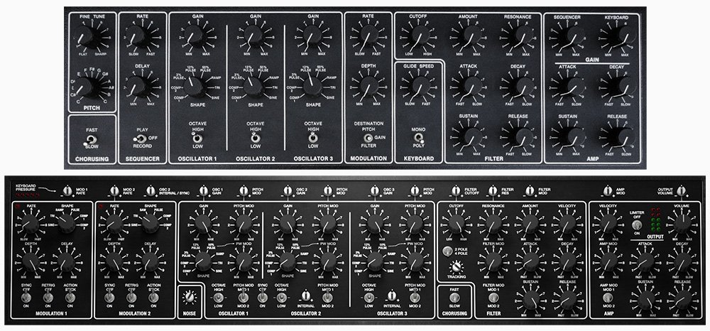

Cherry Audio ha publicado Pentaphonic, una emulación del Gleeman Pentaphonic, un sintetizador polifónico de 1981 del que se fabricaron menos de 70 unidades. El plugin cuesta 59 dólares, funciona en macOS y Windows y toma el diseño original como punto de partida para ampliarlo con más polifonía, un segundo LFO, un secuenciador por pasos y una sección de efectos.

## Un polifónico nacido en un garaje

El Pentaphonic lo diseñaron los hermanos Bob y Al Gleeman en un garaje de Mountain View, en pleno Silicon Valley. Era un instrumento de cinco voces y quince osciladores controlados digitalmente (DCO), tres por voz, apoyados en microprocesadores Intel para mantener la afinación estable. Cada oscilador ofrecía ocho formas de onda, dos de ellas descritas como complejas por su riqueza en armónicos, y el filtro era el Curtis CEM 3320 de cuatro polos, el mismo integrado que apareció en otros polifónicos de la época. Completaron el conjunto un teclado de 37 notas, un secuenciador polifónico de 300 notas, altavoz integrado y asa, con un precio que rondaba los 3.000 dólares.

Según recoge la historia que acompaña al lanzamiento, se montaron a mano unas 30 unidades negras. En 1983 llegó el Pentaphonic Clear, con una carcasa de acrílico transparente que dejaba ver la electrónica, iluminación interior opcional, joystick de dos ejes, 100 memorias programables y un secuenciador de 600 notas; se construyeron alrededor de 20, a unos 3.400 dólares. En 1994, David Kean, de la Audities Foundation, compró el inventario de piezas restante y ensambló, según se cuenta, otras catorce unidades entre ambas versiones. Pese a esa escasez, pasaron por él nombres como Oscar Peterson, que se hizo con un Clear nada más verlo, Martin Gore de Depeche Mode, R.E.M., The Band o Kansas.

## Qué añade Pentaphonic al diseño original

La base se mantiene fiel: formas de onda escalonadas en los osciladores, filtro de cuatro polos y el chorus de dos velocidades del original. A partir de ahí, Cherry Audio introduce cambios orientados al uso actual:

- **Polifonía de 2 a 16 voces**, con modos monofónico, polifónico y unísono con desafinación.
- **Osciladores** con modulación de ancho de pulso, sincronización y generador de ruido.
- **Segundo LFO**, ambos con las ocho formas de onda.
- **Filtro** con un modo adicional de dos polos (12 dB por octava) y seguimiento de teclado.
- **Expresión** por velocidad sobre filtro y amplificador, además de aftertouch de canal y polifónico asignable a 14 parámetros.
- **Arpegiador** de cuatro modos y **secuenciador polifónico** de 16 pasos con cuatro patrones encadenables, sincronizable con el DAW.
- **Parameter Animator**, un secuenciador de modulación de 16 pasos para corte, resonancia, modulación de tono y nivel de los osciladores.
- **22 efectos**, con hasta cinco en cadena.
- Tres aspectos de interfaz: negro, transparente y una variante transparente con opacidad ajustable.

El plugin incluye más de 375 presets repartidos en 14 categorías, entre ellos los 50 de fábrica del instrumento original.

## Precio, formatos y disponibilidad

Pentaphonic cuesta 59 dólares y ofrece una demo gratuita de 30 días. Se distribuye en formatos AU, VST, VST3 y AAX, además de una aplicación independiente. Requiere macOS 10.13 o posterior, con soporte para Intel y Apple silicon, o Windows 7 o posterior en 64 bits.

¿Merece la pena? Para quien busque el carácter de un polifónico que hoy resulta prácticamente inencontrable, la emulación es la vía más asequible de acercarse a él, y su lista de funciones supera con creces lo que ofrecía el hardware. Conviene recordar que se trata de una recreación por software: no sustituye a una unidad física, pero pone su sonido al alcance por mucho menos de lo que costaba el Clear en 1983.
