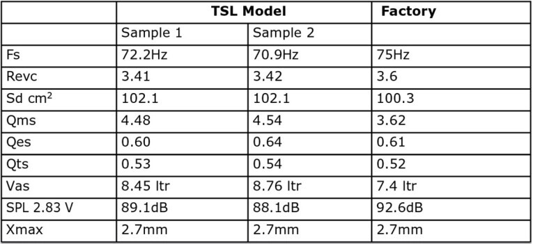
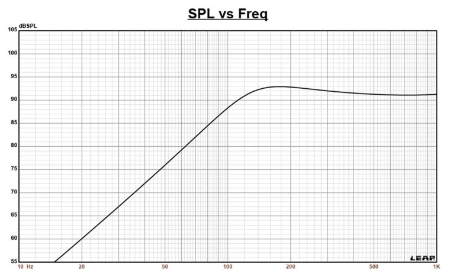
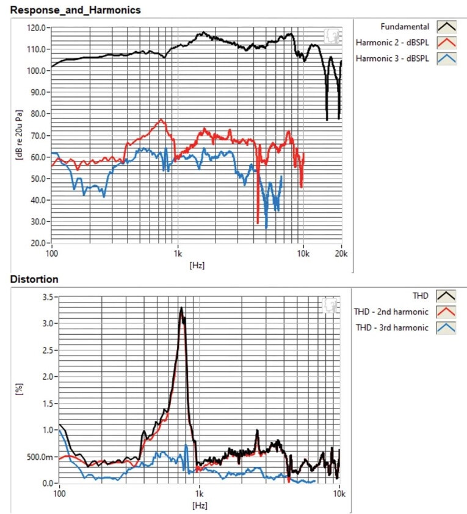
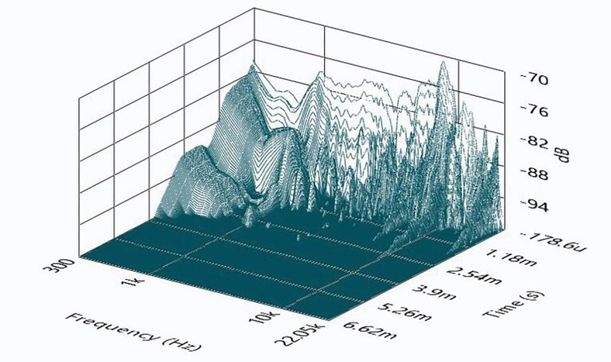
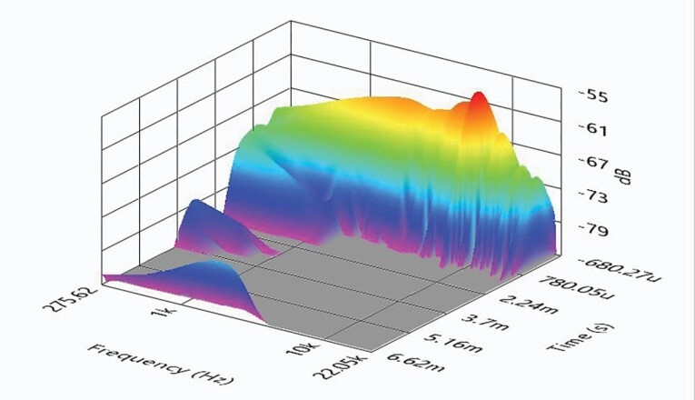

Dayton Audio vende por 59,95 dólares el E150MR-4, un altavoz de medios de 5,5 pulgadas con cono de fibra de carbono que forma parte de la gama Epique, la línea de transductores de gama alta y precio contenido de la marca. La revista Voice Coil lo ha pasado por su banco de pruebas, y los resultados acompañan a la etiqueta: materiales de altavoz caro con un coste que entra en cualquier presupuesto de montaje.

## Materiales de gama alta en un altavoz económico

El E150MR-4 usa un soporte de bobina de titanio, un material más rígido que el aluminio y menos propenso a deformarse en excursiones grandes. Además es paramagnético y, en su forma pura, no conduce el magnetismo, lo que evita efectos parásitos en el motor.

El chasis es un bastidor de aluminio fundido de seis brazos, con radios estrechos de entre 8,5 y 10 mm y afinados para reflejar poco. Queda completamente abierto por debajo de la plataforma de montaje de la araña, y esa abertura es el principal sistema de refrigeración del motor: este medio no tiene orificio en el polo, así que el aire se canaliza hacia la placa frontal en lugar de salir por detrás. Es un esquema útil en un altavoz que no va a trabajar por debajo de 100 Hz.

La parte móvil combina un cono de fibra de carbono moldeado de perfil curvilíneo, que estéticamente recuerda a los antiguos conos de fibra tejida pero es una pieza sólida, con un tapón de fase de aluminio. La suspensión es un surround de goma NBR de rodillo positivo con una transición suave hacia el cono, completada por una araña de tela plana de 3 pulgadas de diámetro.

El motor es de imán de ferrita, con el polo en T provisto de un anillo de cortocircuito de cobre (una pantalla de Faraday) y una camisa de aluminio sobre el polo. La bobina móvil mide 30 mm de diámetro, tiene dos capas de hilo de cobre redondo sobre el soporte de titanio, y el Xmax se queda en 2,7 mm, una cifra bastante generosa para un medio. La potencia admisible es de 60 W RMS y los terminales son de tipo Faston soldable, en un lateral del chasis.

## Qué dicen las mediciones del E150MR-4

Voice Coil analizó dos muestras con una única barrida de admitancia y tensión a 1 V mediante la caja IMP de Physical Labs, en lugar del protocolo de varios voltajes que suele usar para los altavoces que trabajan más abajo. El objetivo era fijar el volumen de caja y conocer la resonancia de impedancia y el factor Q, datos útiles si se diseña un filtro pasivo de paso alto, e irrelevantes si se usan filtros activos.

Los parámetros calculados coinciden bastante bien con los publicados por Dayton Audio, con una excepción: la sensibilidad de 2,83 V/1 m medida sale más alta que la que predicen los parámetros de fábrica, que probablemente se tomaron como una media. Aun así, la simulación de caja con los datos del fabricante se queda a menos de 1 dB de lo medido, señal de que las relaciones entre frecuencia de resonancia y Q son muy cercanas.

En la caja sellada de 0,12 pies cúbicos que recomienda Dayton Audio, con relleno de fibra de vidrio al 50 %, la respuesta cae 3 dB en 111 Hz (F6 de 92 Hz) con un Qtc de 0,89. Es un comportamiento de sobra para un medio que se va a cruzar por encima.

La respuesta en eje es moderadamente suave y ascendente: se mantiene dentro de ±2 dB entre 200 Hz y 750 Hz, sube unos 5 dB entre 750 Hz y 1 kHz, y a partir de ahí se aplana con ±1 dB hasta 7 kHz, con un pico de 3 dB centrado en 8 kHz donde arranca la caída de segundo orden. Fuera de eje, la caída de 3 dB a 30 grados respecto al eje se sitúa entre 2 kHz y 3 kHz, así que un punto de cruce de paso bajo en esa zona, o algo más abajo, da una buena respuesta de potencia.

Las dos muestras se comportan de forma muy coherente: la comparación de sus curvas de presión sonora se mantiene entre 0,5 dB y 1 dB en todo el rango de trabajo. Es la clase de consistencia que se agradece al comprar varias unidades para una misma caja.

En distorsión, medida a 94 dB a 1 metro con ruido rosa y el micrófono a 10 cm, destaca un tercer armónico muy bajo en la zona de trabajo y un pico de segundo armónico centrado en 750 Hz. Los gráficos de decaimiento espectral completan el retrato del motor.

## Qué cambia para quien monta altavoces

Para quien construye cajas, el E150MR-4 se presenta como un medio para cruzar entre 100 Hz y 200 Hz como mínimo, montado en un recinto sellado pequeño y con el paso bajo en la zona de 2 kHz a 3 kHz para cuidar la respuesta de potencia. No necesita un filtro de corrección de resonancia si se usan filtros activos; si se opta por un pasivo, los datos de F0 y Q permiten diseñar un filtro LCR conjugado que facilite ese paso alto.

Lo relevante no es cada cifra por separado, sino la combinación: soporte de titanio, cono de fibra de carbono y doble anillo de cortocircuito son soluciones que suelen verse en transductores más caros. A 59,95 dólares en Parts Express, y menos en precio OEM, deja margen para dedicar el presupuesto del proyecto a las vías que sí lo necesitan. ¿Merece la pena? Para un medio que no baja de 100 Hz, los datos medidos y su precio lo convierten en una opción difícil de superar en relación calidad-precio.

Para más análisis y novedades de sonido, la [sección de Audio](/noticias/audio/) recoge el resto de la cobertura.
