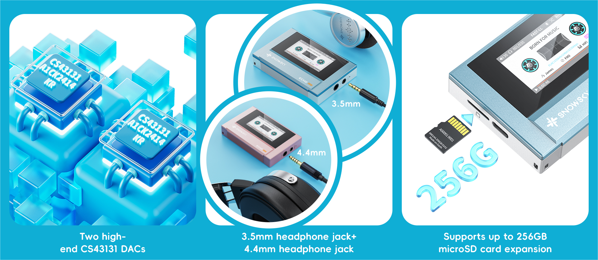
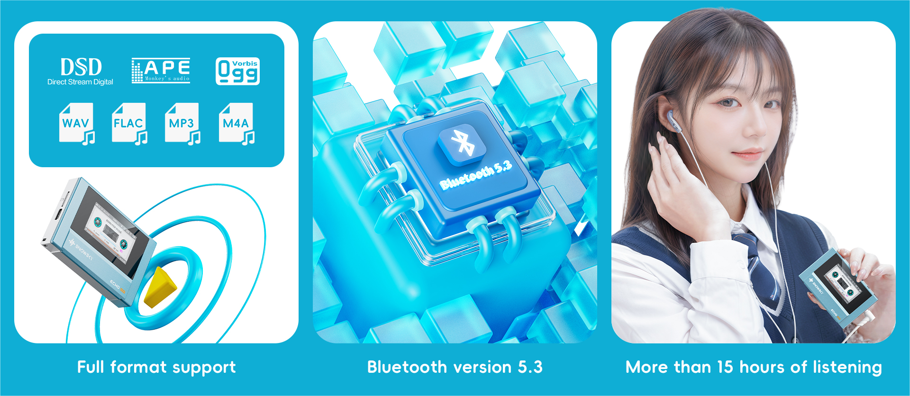

El Echo Mini es el primer producto de SnowSky, la submarca con la que FiiO recupera su línea de reproductores de música "puros". Llega con doble DAC CS43131, salidas de 3,5 y 4,4 mm y una estética que imita a los reproductores de casete, pero con pantalla a color y botones físicos.

## Un reproductor pequeño con vocación de Hi-Fi

Pesa alrededor de 55 gramos y es apenas un poco más grande que unos AirPods Pro. La carcasa reproduce el frontal de un radiocasete, con los controles en el borde y una pantalla IPS de color que recrea el giro de las cintas mediante animaciones; sobre ella se muestran la carátula del álbum y la letra de la canción.

Además del volumen, permite ajustar la ganancia, guardar pistas favoritas y aplicar ecualización personalizada, con un control de volumen de 120 pasos. También puede funcionar como tarjeta de sonido por USB. Se ofrece en cuatro acabados: oro titanio, negro, cian y rosa.

## El Echo Mini apuesta por doble DAC y salida balanceada

El punto técnico fuerte está en la sección analógica: dos convertidores CS43131, uno dedicado a cada canal, con una salida de 3,5 mm no balanceada y otra de 4,4 mm balanceada capaz de entregar hasta 250 mW. En un reproductor de este tamaño, la salida balanceada es poco habitual y es lo que lo separa de un modelo de gama básica.

En cuanto a formatos, admite DSD nativo, WAV, FLAC, APE, MP3, M4A y OGG. Incluye 8 GB de almacenamiento interno y se amplía con tarjetas microSD de hasta 256 GB. La transmisión Bluetooth es 5.3, aunque limitada al códec SBC: suficiente para escuchar sin cables, pero por debajo de lo que ofrecen otros reproductores con LDAC o aptX.

## Qué cambia para el usuario

Para quien escucha música en local y quiere sacar partido a unos auriculares por cable, el Echo Mini cubre lo esencial: una base digital solvente, salida balanceada y un precio contenido. La autonomía declarada es de hasta 15 horas con una batería de 1.100 mAh, aunque SoundGuys rebaja la cifra a unas 14 horas en uso típico.

El precio de referencia ronda los 60 dólares en Estados Unidos y el reproductor se vende a través de la tienda oficial de FiiO en AliExpress. No es un sustituto de un reproductor Android con streaming, y tampoco lo pretende: quien busque más potencia para auriculares exigentes tiene la [amplificación de escritorio Clase A de FiiO](/noticias/audio/fiio-class-a/). ¿Merece la pena? Si buscas un reproductor de bolsillo para tus propios archivos, con salida balanceada y sin depender del móvil, la propuesta encaja; si necesitas streaming o Bluetooth de alta calidad, este no es tu equipo.
