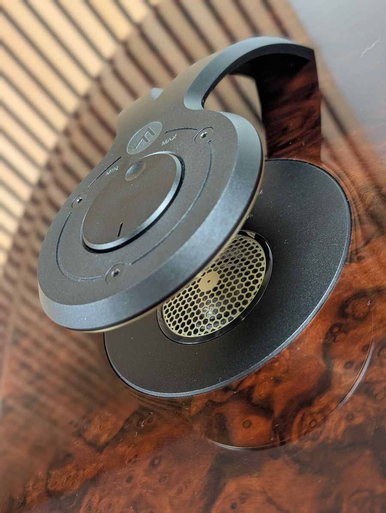
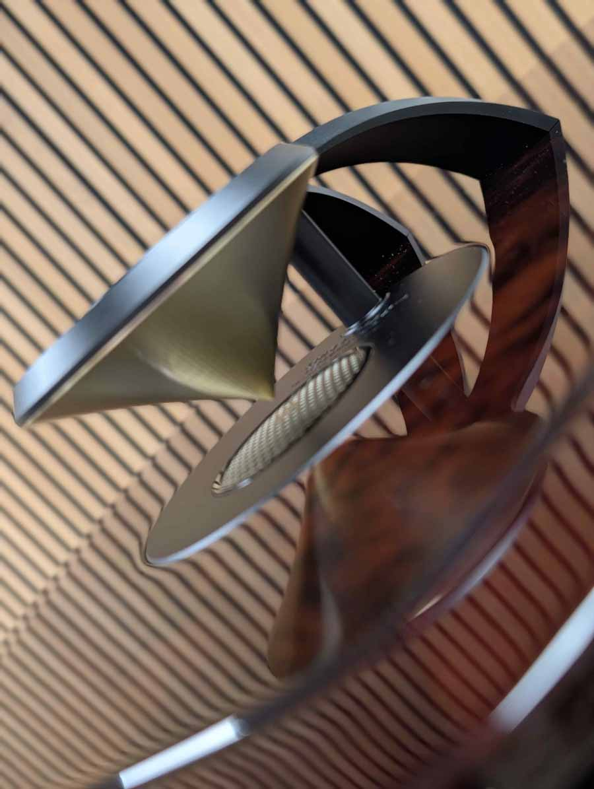
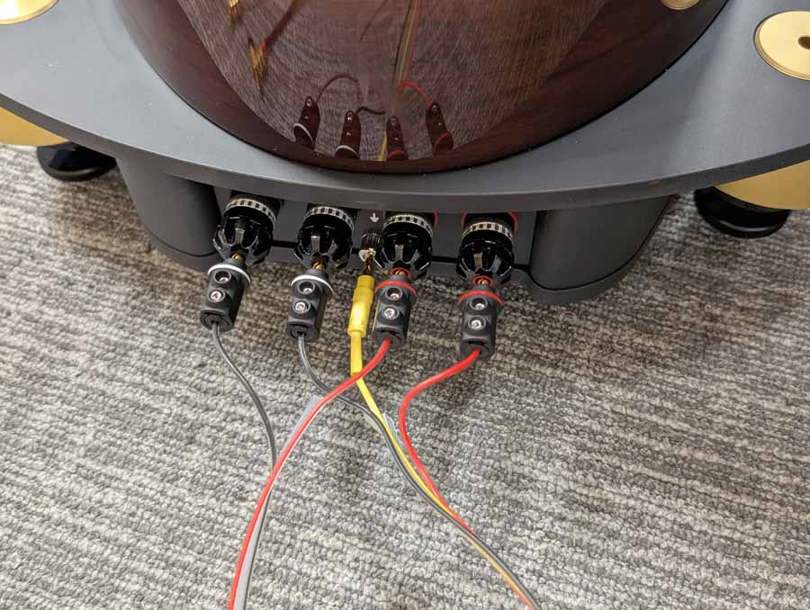
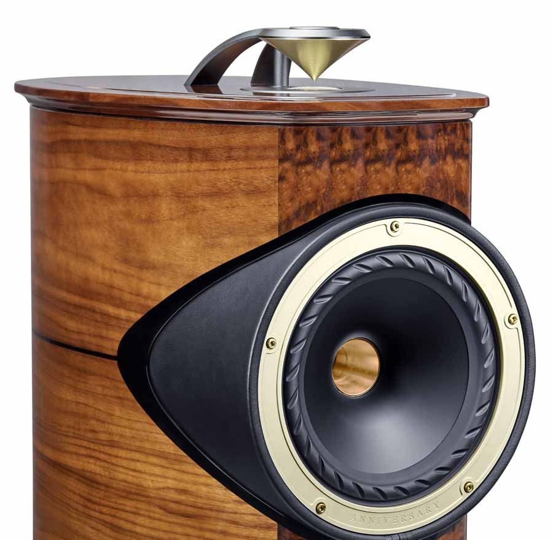
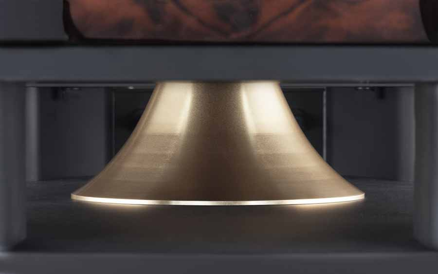

El Fyne Audio F1-10 Anniversary es un altavoz de torre de edición limitada a 30 pares numerados en todo el mundo con el que la firma escocesa conmemora los diez años del F1-10 original, el primer modelo que llevó su nombre. El precio es de 36.999,99 libras esterlinas (49.999,99 dólares; 42.999,99 euros) por par y ya puede encargarse a través de los distribuidores autorizados de la marca. Cada pareja se monta, ensambla, acaba y prueba en la planta que Fyne Audio tiene en Glasgow, con 100 horas de rodaje aplicadas antes de la entrega.

Hifi Pig, que ha escuchado el modelo en la sede de la compañía en Glasgow durante una visita a su fábrica, sostiene que no se trata de una simple actualización estética. El F1-10 Anniversary combina un driver IsoFlare rediseñado, la tecnología SuperTrax integrada en el propio mueble y un crossover construido a mano, además de retoques en el sistema de graves.

## Un IsoFlare rediseñado para el F1-10 Anniversary

El corazón del F1-10 Anniversary es un driver IsoFlare de fuente puntual de 250 mm. La novedad principal está en el tweeter de compresión de 75 mm, que estrena un diafragma de vidrio de aluminosilicato en lugar del domo metálico del modelo original. El cono de medios y graves, de fibra múltiple, mantiene la suspensión FyneFlute, y la vía de altas frecuencias recurre a un diafragma de vidrio ultrafino tratado químicamente para ganar rigidez sin sumar masa.

El driver de compresión trabaja hasta un punto de corte de 750 Hz. Fyne Audio ha desarrollado además una guía de ondas anular optimizada por ordenador para el nuevo diafragma de vidrio, con el objetivo de conservar las características de fuente puntual del IsoFlare y controlar su dispersión. El cambio de material en la vía de agudos apunta a un comportamiento más contenido en el extremo alto; de momento la marca no ha publicado gráficas de respuesta en frecuencia ni de distorsión, así que ese efecto habrá que confirmarlo con mediciones.

## SuperTrax se integra en el mueble

El F1-10 Anniversary es el primer altavoz de Fyne Audio que incorpora SuperTrax como parte integral del recinto. Se trata de un supertweeter de 25 mm con diafragma de carbono de capa fina (Thin Ply Carbon) montado en horizontal sobre el panel superior y orientado hacia arriba, donde se encuentra con un difusor de perfil Tractrix mecanizado.

El conjunto genera un frente de onda de 360 grados y extiende la respuesta del sistema por encima de los 60 kHz. El SuperTrax está alineado temporalmente con el driver IsoFlare e incluye un ajuste de ±3 dB de su energía en la banda que va de 16 kHz a 60 kHz. En altavoces de este tipo, el supertweeter no busca tanto sonar por sí solo como repartir la energía en el extremo alto de forma más uniforme en la sala.

## Crossover, graves y acabado a mano

El crossover se ha desarrollado específicamente para esta edición. Emplea inductores de núcleo laminado de bajas pérdidas, resistencias de película gruesa no inductivas y condensadores de polipropileno ClarityCap de grado PUR. En lugar de montarse sobre placas de circuito impreso convencionales, va cableado directamente sobre paneles rígidos de fibra, y cada unidad pasa por el proceso de tratamiento criogénico profundo (Deep Cryogenic Treatment) de la marca. El camino de señal incluye cableado interno Neotech PC-OCC y terminales biaamplificables WBT Nextgen bañados en oro, con un quinto terminal de masa y controles de agudos y presencia de ±3 dB.

En la parte baja, el sistema BassTrax Tractrix Diffuser se integra en un plinto de aluminio de doble capa y convierte la salida del puerto, orientado hacia abajo, en un frente de onda esférico de 360 grados. Un sistema de doble cavidad interno se encarga de gestionar las ondas estacionarias y el comportamiento del cono en torno a la frecuencia de afinación del puerto.

El recinto conserva la forma curvada del F1-10 original y combina madera de abedul de alta densidad con refuerzos internos, a los que se acopla mecánicamente el conjunto IsoFlare. El acabado es de chapa de nogal americano con contraste en nogal burl de alto brillo, molduras de nogal macizo y detalles en oro champán, todo bajo una laca de piano resistente a los rayos UV.

Cada par numerado se entrega con copas de protección para el suelo mecanizadas, una herramienta de ajuste, cables puente Neotech, un cuadernillo de aniversario firmado individualmente, certificados de aprobación, vasos Glencairn de whisky grabados en edición limitada y un kit opcional de embellecedor negro para el driver.

## Precio, disponibilidad y valoración

El F1-10 Anniversary se vende a 36.999,99 libras, 49.999,99 dólares o 42.999,99 euros el par, con una producción limitada a 30 pares numerados y disponibilidad inmediata a través de la red de distribuidores de Fyne Audio. Las cifras de ingeniería van más allá de un cambio de acabado: hay un diafragma nuevo en la vía de agudos, un IsoFlare revisado, el SuperTrax integrado por primera vez en el mueble y un crossover rediseñado, además de mejoras en el sistema de graves.

El lanzamiento llega además en un contexto de concentración en el segmento de altavoces de alta fidelidad, como muestra [la compra de Sonus Faber por parte de Bose](/noticias/audio/bose-compra-sonus-faber/). Para la mayoría de oyentes, 43.000 euros por par quedan fuera de alcance; lo relevante es comprobar si algunas de estas soluciones acaban filtrándose a modelos más asequibles. ¿Merece la pena? Como objeto de colección, sí para quien busque una serie numerada; como altavoz para escuchar todos los días, su interés real es el banco de pruebas que representa para la marca.
