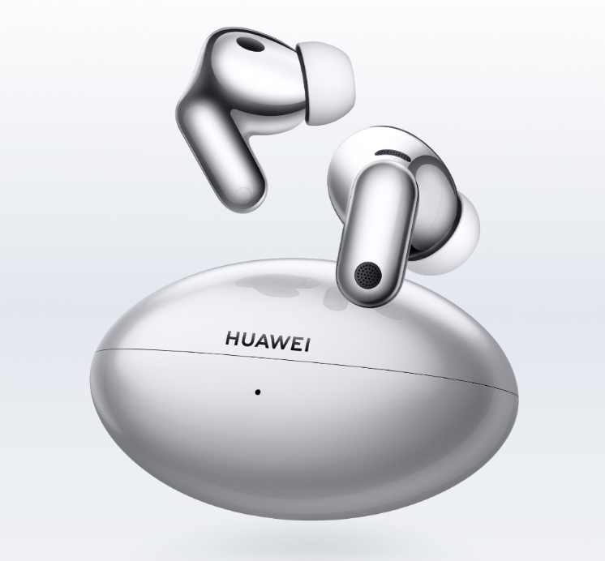
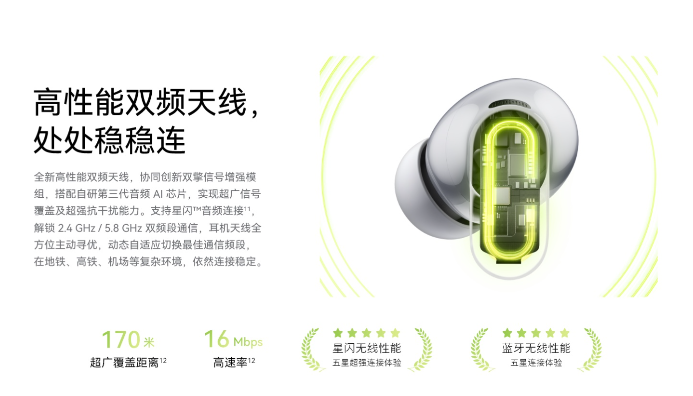

Los Huawei FreeBuds Neo ya son oficiales. La compañía los presentó en el mismo evento en el que anunció la serie Mate 90, con un precio de 699 yuanes que, por ahora, corresponde al mercado chino. La propuesta se apoya en dos cifras: un chip de audio con inteligencia artificial de tercera generación desarrollado por Huawei y una cancelación activa de ruido que la firma sitúa en 30 dB de media en todo el rango.

El estuche es un cuerpo curvado de una pieza, con un ángulo lateral de 31 grados, 41 gramos de peso y 41,22 milímetros de ancho. Los auriculares adoptan formato de varilla, pesan unos 4,8 gramos por unidad y, según Huawei, su curva se ha reconstruido en ocho dimensiones a partir de más de 10.000 muestras de orejas para repartir mejor la presión. Se ofrecen en cuatro acabados —blanco, negro, plata y rosa— con resistencia al polvo y al agua IP55 y certificación de protección auditiva de TÜV Rheinland.

## Qué hace el chip de audio con IA de los FreeBuds Neo

El corazón del sistema es un chip de audio con IA de tercera generación que combina dos DSP y un procesador NPU. Huawei cifra la recogida de información del ruido ambiente en 400.000 veces por segundo y el retardo de procesado en 8 microsegundos, dos datos que apuntan a la velocidad con la que el sistema puede reaccionar antes de que el ruido llegue al oído.

El esquema de cancelación es de doble vía: un camino frontal se ocupa de la banda de la voz y otro de retroalimentación analiza, con un algoritmo IMC, el ruido residual dentro del oído y lo corrige en tiempo real. La estructura del auricular también cambia, con un tubo en C y una entrada de aire que reorganizan el recorrido de la onda para reducir las reflexiones internas; así ataca el ruido de frecuencias medias y altas y el viento. Huawei asegura que este enfoque evita el salto de presión en el oído al cambiar de escenario.

En llamadas, el fabricante habla de 95 dB de cancelación bidireccional, con tres micrófonos y un micrófono de conducción ósea. Hay además un modo de conversación que no obliga a quitárselos: al empezar a hablar cambian solos al modo de transparencia y recuperan la cancelación al terminar.

## Audio, conexión y autonomía

El transductor es un controlador dinámico Turbo de 11 mm con cuatro imanes, apoyado en una estructura trasera de ventilación con múltiples aberturas y una membrana rígida ligera. La respuesta declarada va de 10 Hz a 48 kHz y el conjunto cuenta con certificación Hi-Res y HWA. En codecs admite LDAC hasta 990 kbps y, emparejado con un teléfono Huawei, hasta 2,3 Mbps con fuentes de 48 kHz y 24 bits. Añade audio espacial independiente del dispositivo y audio espacial de alta resolución dentro del ecosistema HarmonyOS, con seguimiento de cabeza y soporte del ecosistema Audio Vivid.

En conexión, los FreeBuds Neo usan tecnología NearLink y una antena de doble banda que Huawei cifra en 170 metros de alcance y en cobertura estable en interiores de 100 m², incluso atravesando paredes. También permiten el salto entre dos dispositivos. La autonomía declarada es de 10 horas por carga sin cancelación (40 con el estuche) y de 6,5 horas con cancelación activa (24 en total). Para juegos, el modo específico baja la latencia extremo a extremo hasta 43 ms en títulos compatibles, con un perfil de sonido propio para disparos en FPS y bloqueo de conexión al dispositivo en uso. También se pueden activar por voz o con una pulsación larga los asistentes Xiao Yi y Doubao, con avisos inteligentes, notas rápidas y traducción en varios idiomas.

## Qué cambia para el comprador

En el papel, los FreeBuds Neo compiten en la franja de los auriculares con cancelación activa de gama media-alta, un terreno donde 30 dB de media ya es una cifra de aislamiento notable. La duda razonable no está en la lista de especificaciones, sino en cuánto de ese rendimiento se mantiene fuera del ecosistema Huawei: los 2,3 Mbps con LDAC dependen de un móvil de la marca, y el audio espacial completo también.

En la misma jornada, Samsung ha presentado sus [Galaxy Buds On](/noticias/audio/samsung-galaxy-buds-on/), unos auriculares clip-on con otro enfoque de sujeción, lo que deja claro que la batalla de esta temporada no es solo la cancelación, sino la forma y el ajuste. Con 699 yuanes de salida en China, faltará ver a qué precio y con qué versión llegan a España si Huawei decide traerlos.
