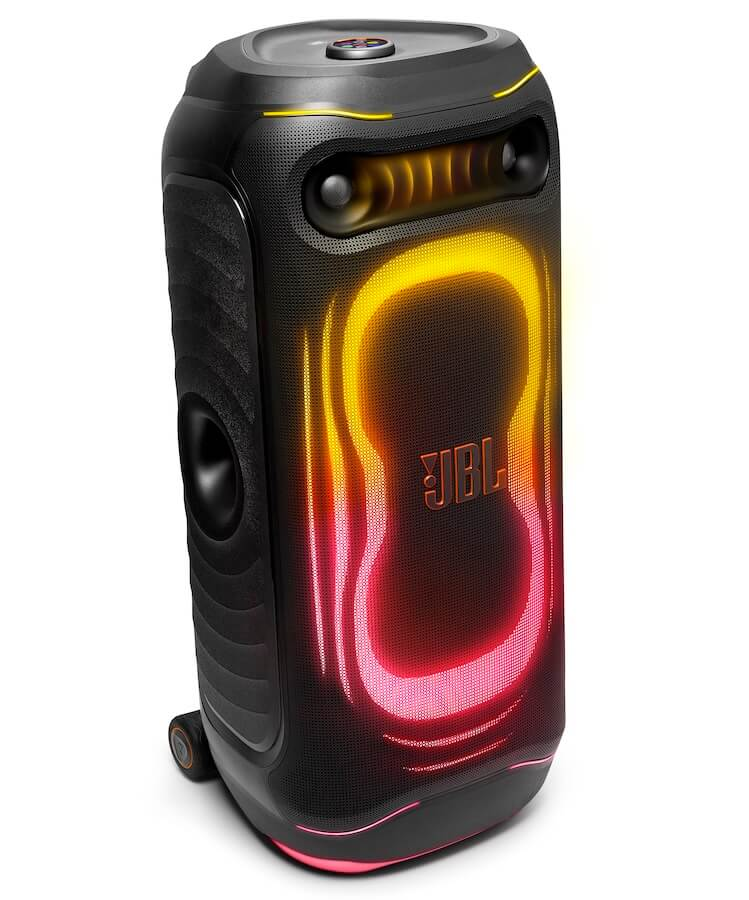

JBL ha puesto precio al **PartyBox Ultimate 2**: 1.799,95 dólares en Estados Unidos. Es el altavoz de fiesta más potente de la marca y sustituye al PartyBox Ultimate original, del que conserva la idea pero cambia la arquitectura acústica. La ficha oficial declara **1.500 W RMS**, dos woofers de 10 pulgadas, dos altavoces de medios de 5 pulgadas y dos tweeters con guía de onda tipo bocina heredados de la experiencia de JBL en audio profesional. El conjunto pesa 47,68 kg y mide 466,7 × 1.052,5 × 493,3 mm. No hay batería: funciona solo conectado a la red eléctrica.

## Qué cambia el PartyBox Ultimate 2 respecto al original

El salto no es solo de vatios. El modelo anterior partía de 1.100 W y usaba dos woofers de 9 pulgadas, medios de 4,5 pulgadas y tweeters convencionales más grandes; el Ultimate 2 monta woofers y medios de mayor diámetro y añade tweeters con bocina. Sobre el papel, la respuesta en frecuencia declarada llega de **28 Hz a 20 kHz (-6 dB)**.

A eso se suman dos funciones de procesado: **AI Sound Boost**, que analiza la señal de entrada en tiempo real para ajustar la salida y contener la distorsión al subir el volumen, y **Smart EQ Mode**. Es también el primer PartyBox con pantalla táctil integrada: el control de volumen superior hace de display y de centro de control para música, iluminación y ajustes, sin depender del móvil. El espectáculo de luces se rehace además con efectos de ondas en todo el panel, iluminación multicapa y proyección en el suelo.

## Más altavoz de red que de fiesta

La conectividad es lo menos esperable en un altavoz de este tipo. El Ultimate 2 admite **Wi-Fi 6**, **Bluetooth 6.0**, Bluetooth LE Audio, **Auracast**, AirPlay, Google Cast y Spotify Connect, y se gestiona con la aplicación JBL ONE. Por su plataforma Wi-Fi, JBL lista además **TIDAL Connect, Qobuz Connect y Roon Ready**. El puerto USB-C reproduce audio sin pérdidas y Auracast permite enlazar varios altavoces compatibles para instalaciones mayores, un ecosistema que la marca ya explota en productos como las barras [Cinema SB MK2](/noticias/jbl-cinema-sb-mk2/).

En la práctica, esto lo sitúa por encima de muchos altavoces de fiesta en credenciales de audio en red, y por debajo en algo más básico: llevarlo de un sitio a otro.

## La gama PartyBox 720 y el karaoke con IA de EasySing

El Ultimate 2 no llega solo. JBL renueva la familia PartyBox y estrena la tecnología **EasySing**, orientada a cantar. Según recoge [Gizmochina](https://www.gizmochina.com/2026/10/05/jbl-partybox-new-speakers-easysing-ai-mics/), el nuevo tope de gama de la serie es el **PartyBox 720**: 800 W RMS con dos woofers de 9 pulgadas y tweeters de cúpula de 30 mm, hasta 15 horas de reproducción, ruedas, asa ergonómica, resistencia IPX4 y dos entradas XLR para micrófonos, guitarras o equipo de DJ. Por debajo quedan el PartyBox 330 (280 W, dos woofers de 6,5 pulgadas, hasta 18 horas) y el PartyBox 130 (200 W, dos woofers de 5,25 pulgadas, hasta 15 horas).

Los portátiles PartyBox On-The-Go 2 entregan 100 W y hasta 15 horas; la versión **AI Plus** añade EasySing AI Vocal Removal, soporte de tono y reverberación natural, e incluye un micrófono EasySing. JBL vende además los **EasySing Mics** por separado en pareja, con eliminación de voz por IA, refuerzo de voz, reverberación natural, control de eco y supresión de ruido por IA; declaran 10 horas de batería y 30 metros de alcance inalámbrico. En el Ultimate 2, esa misma eliminación de voz convive con entradas de micrófono y guitarra, una entrada óptica para karaoke desde el televisor y una entrada de línea XLR para conectar equipo de DJ.

En India, el PartyBox 720 se queda en 99.999 rupias, el 330 en 64.999 y el 130 en 46.999; los On-The-Go 2 AI Plus y Encore 2 AI Plus salen a 44.999 y 39.999 rupias, y el On-The-Go 2 estándar, a 39.999.

## Precio, movilidad y alternativas

La movilidad tiene truco. JBL lo llama transportable y, técnicamente, lo es: monta ruedas más grandes y un asa robusta. Pero pesa 47,68 kg y no tiene batería interna, así que se puede mover, no llevar lejos de un enchufe. La carcasa suma una resistencia **IPX4**, suficiente para bebidas y lluvia ligera, no para una exposición seria al agua.

Frente a la competencia, el precio es el punto discutible. El rival directo es el Sony ULT Tower MAX, lanzado el mes pasado por 1.499 dólares: mide media pulgada más, pesa unos 19 kg más y suma más drivers, pero declara 310 W y no ofrece eliminación de voz. Marshall, cuya familia Bromley ya cubrimos con el [Bromley 150](/noticias/marshall-bromley-150/), vende el Bromley 750 por 1.299 dólares con dos woofers de 10 pulgadas, 127 dB de SPL máximo, más de 40 horas de batería e IP54, aunque sin el ecosistema Wi-Fi, la pantalla ni el karaoke con IA de JBL. El SOUNDBOKS 4, por 1.199 dólares, apuesta por la robustez: 126 dB declarados, unos 16 kg y batería intercambiable.

¿Merece la pena? Para quien organiza fiestas grandes, alquila espacios para eventos, pincha como DJ o monta karaoke en un local, el Ultimate 2 reúne en un solo equipo potencia, audio en red y procesado de voz que en otros productos hay que sumar por separado. Para quien busca un altavoz Bluetooth realmente portátil, sigue siendo un aparato de 47,68 kg que no funciona sin enchufe.
