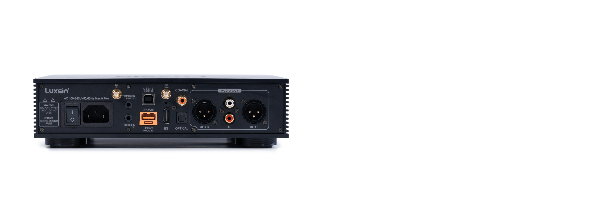

Ocho convertidores Cirrus Logic CS43198, un núcleo DSP propio y ecualización asistida por IA por 699 dólares. Es la carta de presentación del Luxsin X8, el segundo DAC y amplificador de auriculares de sobremesa de la marca china, que llega seis meses después del X9 con un enfoque más digital que su predecesor.

## El X8 apila ocho DAC CS43198 en paralelo

Los ocho convertidores CS43198 trabajan en una arquitectura dual-mono real: cuatro por canal, con alimentación, trazado y ruta de señal independientes para izquierda y derecha. Según Luxsin, la suma de las salidas analógicas en paralelo reduce el ruido y mejora el rango dinámico y la relación señal/ruido. Cada chip incorpora su propia cubierta de apantallamiento para aislarlo del resto de la electrónica digital.

El apartado digital lo firma el Digital Audio Core, un módulo basado en un DSP HiFi-5 de doble núcleo y arquitectura ARM STAR, con una frecuencia de reloj por encima de los 500 MHz. Es el bloque que Luxsin describe como base para futuras funciones y para el procesamiento de audio dentro del propio dispositivo.

## Ecualización asistida por IA: qué promete y qué está por ver

El X8 estrena el sistema de ecualización asistido por IA que la marca anuncia como el primero de su clase. La idea es que el usuario ajuste el perfil tonal general o afine detalles concretos con una orden de voz o de texto, y que la IA traduzca esa petición en una curva. El control se hace desde la aplicación móvil (Android e iOS) o desde la interfaz web para PC, con soporte multilingüe.

Conviene separar la parte medible de la promesa. La electrónica del ecualizador paramétrico (PEQ) ya existía en el X9 con diez bandas, y Luxsin confirma que el X8 mantiene esas diez bandas. Lo nuevo es la capa de IA que decide los ajustes. La propia marca ha señalado en el foro que recogerá primero la opinión de los usuarios del X8 antes de decidir si esas funciones llegan por firmware al X9.

## Amplificación, alimentación y conexiones

La etapa de salida combina operacionales OPA1612 y drivers de alta corriente TPA6120A2 para atacar cada canal por separado. Luxsin declara una potencia de L+R ≥ 4840 mW + 4840 mW a 16 ohmios en salida balanceada, y de L+R ≥ 2900 mW + 2900 mW en la no balanceada, con una impedancia de salida inferior a 1 ohmio. La detección de impedancia cubre ahora las tres salidas de auriculares (jack de 6,35 mm, 4,4 mm y XLR de 4 pines) y ajusta la ganancia en consecuencia.

La alimentación es lineal y separa los circuitos digitales de los analógicos, con un ajuste de tensión analógica de 12 V o 15 V. En cuanto a conectividad, el X8 acepta USB-B y USB-C, óptica, coaxial e IIS —con hasta ocho configuraciones personalizadas— y añade disparadores de 12 V para integrarlo en un equipo ya montado. También incorpora Wi-Fi de 2,4 y 5 GHz y Bluetooth 5.1. La pantalla es táctil, de 4 pulgadas y 960×480 píxeles, con el frontal inclinado 15 grados sobre un chasis de aluminio mecanizado.

## Precio y encaje en la gama

El X8 se vende a 699 dólares y 699 euros, sin variantes anunciadas. La marca mantiene el X9 por encima en la jerarquía: aquel usa un DAC AKM de gama alta, reloj de femtosegundos y control de volumen R2R, componentes que el X8 no incluye. La diferencia, por tanto, no está en la potencia bruta sino en el enfoque: el X8 apuesta por más convertidores y por el procesado digital.

Para quien ya tenga un DAC de sobremesa, merece la pena mirar si el salto aporta algo tangible. Frente a alternativas como el [SMSL SU-3](/noticias/audio/smsl-su-3/), un DAC de escritorio con EQ paramétrico de 32 bandas por 189 dólares, el X8 cuesta casi el cuádruple y lo justifica, sobre todo, por la etapa de amplificación y la pantalla. Quien busque solo amplificación de escritorio tiene opciones como el [FiiO CLASS A](/noticias/audio/fiio-class-a/). La pregunta abierta es si la ecualización con IA termina siendo una función útil o un extra que se usa pocas veces; hasta que haya unidades en manos de usuarios, es una promesa, no un dato medido.
