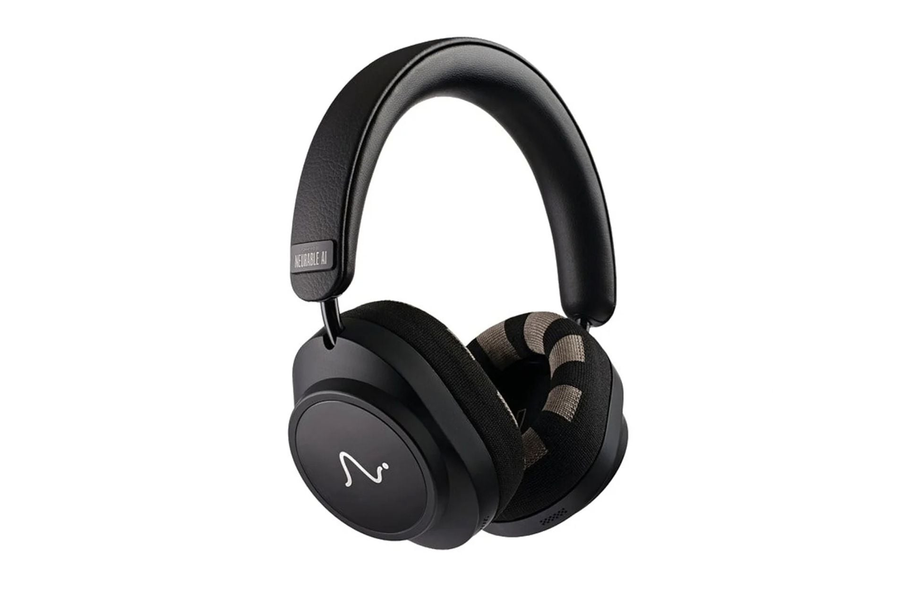

Neurable abrió las reservas de los Neurable One por 499 dólares. Son sus primeros auriculares inalámbricos de diadema fabricados en solitario y mantienen la seña de identidad de la casa: integran electroencefalografía (EEG) para leer la actividad cerebral y convertirla en métricas como el nivel de concentración o la ansiedad. El cambio de fondo respecto a la generación anterior es que la compañía prescinde de Master & Dynamic, su socio de hardware hasta ahora, y asume el diseño por su cuenta.

## Qué añade el Neurable One: la «capacidad»

La novedad más destacada es una medida que Neurable llama «capacidad» y que pretende estimar cuánto puedes concentrarte antes de llegar al agotamiento. A ella se suma la frecuencia de pico alfa, que la compañía describe como una suerte de «variabilidad de la frecuencia cardíaca para el cerebro». Los auriculares también cambian la forma de recoger datos: toman lecturas pasivas mientras los llevas puestos, en lugar de limitar la captura a sesiones concretas, lo que permite observar tendencias a lo largo del tiempo.

## La parte de audio: 40 mm, ANC y 22 horas

Sobre el papel, la sección de sonido se mantiene en un terreno razonable: controladores de 40 mm, cancelación activa de ruido (ANC) y una autonomía de 22 horas por carga. Esa cifra cae casi a la mitad, hasta 12 horas, cuando el EEG está en funcionamiento. Es el coste energético de leer la actividad cerebral de forma continua, y conviene tenerlo presente: el dato de 22 horas no aplica si usas la función que distingue a estos auriculares. Quien busque solo sonido para todo el día encontrará alternativas más eficientes en ese mismo presupuesto, como unos [Technics EAH-A1000](/noticias/technics-eah-a1000/), planteados desde la autonomía y la cancelación antes que desde la biométrica.

## Lo que conviene mirar con cautela

La propia tecnología del EEG marca los límites. IEEE Spectrum señala que las señales se recogen mejor cuando el pelo no las obstruye, un detalle relevante para quien busque una lectura fiable. Y aunque las conclusiones a largo plazo pueden ser útiles, la información en tiempo real de un EEG doméstico sigue siendo irregular. ¿Merece la pena? Depende de qué se le pida: por 499 dólares, un modelo de diadema con ANC y controladores de 40 mm no destaca frente a rivales centrados solo en audio. El valor está en las métricas cerebrales, y ahí la exactitud todavía no está garantizada.
