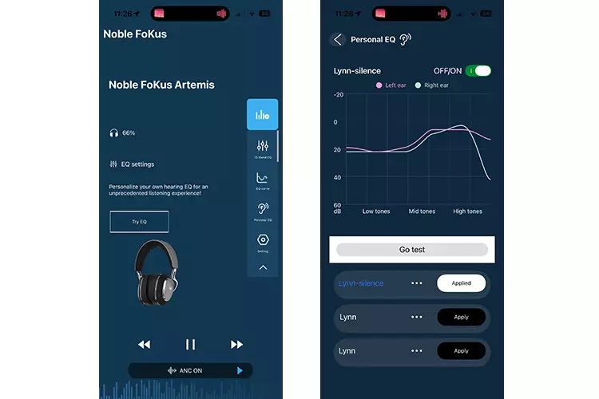
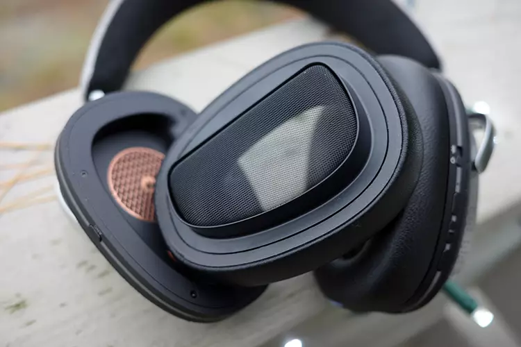
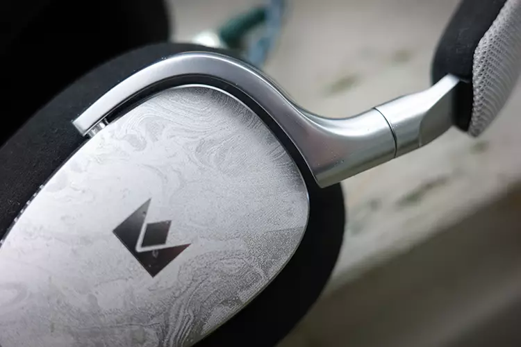
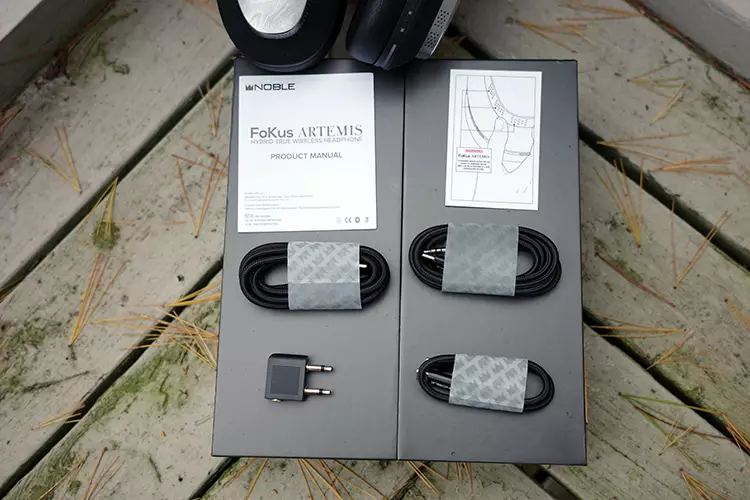
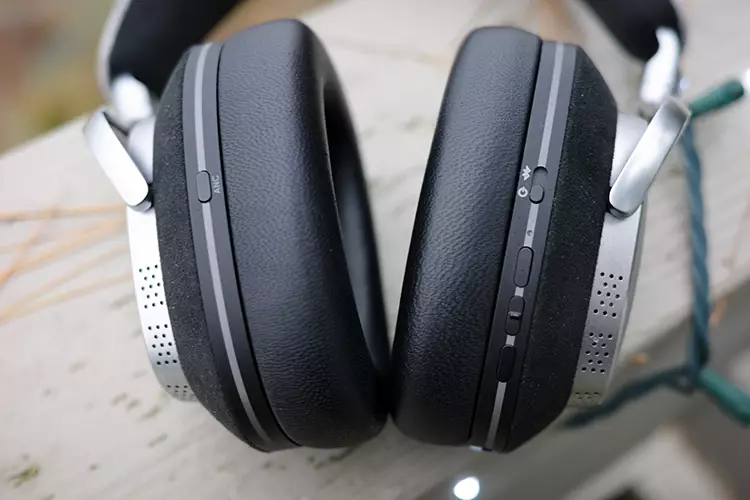

Noble Audio ha puesto a la venta los FoKus Artemis, unos auriculares inalámbricos de diadema cerrados con cancelación activa de ruido (ANC) que se colocan por encima de los FoKus Apollo y Apollo Pro dentro de su catálogo. El precio de salida es de 899 dólares y su rasgo más identificable es un sistema de tres vías que combina un driver dinámico, uno de armadura equilibrada y otro planar.

## Triple driver para cubrir todo el espectro

La apuesta del Artemis es repartir el trabajo entre tres tipos de transductor en lugar de confiar todo el sonido a una sola unidad. El driver dinámico se encarga de la parte baja, la armadura equilibrada —habitual en los IEM por su tamaño reducido— cubre medios y agudos, y el driver planar rellena donde hace falta. Según Headfonics, recurrir a un planar da a Noble más margen para afinar la firma, tanto en los graves como en el conjunto.

Esto marca una diferencia respecto a los modelos anteriores. El Apollo original era conocido por su cantidad de graves, y el Apollo Pro recortó ese extremo en busca de una presentación más equilibrada. El Artemis busca un perfil más neutro y maduro apoyándose en los tres drivers, con la posibilidad de recuperar ese grave profundo mediante los ajustes de la app.

## Conectividad, autonomía y app

En el apartado inalámbrico, el Artemis usa Bluetooth 6.0 sobre el chip Qualcomm QCC3095 y admite conexión multipunto. A los códecs de alta resolución LDAC y aptX HD se suma ahora aptX Lossless, una mejora respecto al Apollo. Headfonics destaca además un alcance de conexión muy largo: en sus pruebas volvió a enlazar a unos 50 metros.

La autonomía declarada es de algo más de 55 horas sin ANC y de más de 35 horas con cancelación activa. El medio verificó estas últimas con tres descargas completas y una media de 35,5 horas. Una carga rápida de diez minutos aporta entre 3 y 5 horas de escucha adicionales. La app permite personalizar el sonido con la prueba auditiva "Personal Sound", un ecualizador de 10 bandas y el modo Audiosphere, disponible en versión sutil o inmersiva.

## Diseño y aislamiento de los FoKus Artemis

El Artemis apuesta por una construcción robusta y reparable: certificación IP52, piezas sustituibles y una batería que el propio usuario puede cambiar, un detalle poco habitual que alarga la vida del producto. Las almohadillas son desmontables y dejan a la vista la cavidad de la batería. La diadema tiene un rebaje central que evita puntos de presión, aunque Headfonics señala que es la parte que queda por debajo del nivel de gama alta.

En aislamiento, la firma no persigue la reducción máxima de decibelios como Bose, Sony o Sennheiser, sino integrar el ANC en la propia firma sonora. En sus pruebas, la cancelación no restó detalle con el modo alto activo, y el ruido exterior desaparecía al empezar la música. La presión de sujeción también le pareció acertada.

## Qué significa para quien busca auriculares de gama alta

La review de Headfonics cierra con una valoración global de 8,9 sobre 10, con un 9 en calidad de sonido y diseño y un 8,9 en confort y prestaciones. Entre sus puntos fuertes señala la recuperación del "factor divertido" en la firma, un ajuste excelente y la batería reemplazable; entre los débiles, una diadema un escalón por debajo de lo tope de gama y unos medios que pueden resultar demasiado frontales en algunas canciones.

Frente a la competencia directa, los 899 dólares sitúan al Artemis en un tramo exigente. Por ejemplo, los [Technics EAH-A1000](/noticias/technics-eah-a1000/) que cubrimos hace unas semanas prometen hasta 90 horas de batería y también compiten con ANC, aunque por debajo en autonomía quedan los Artemis con sus 35 horas con cancelación activa. La propuesta de Noble no es la de más horas ni la de más reducción de ruido, sino la de un sonido con tres drivers y una personalización muy cuidada desde la app.

En resumen: si buscas inalámbricos con ANC que rindan bien en sonido y puedas mantener durante años gracias a sus piezas reemplazables, el Artemis es una opción a considerar. Si tu prioridad es la máxima autonomía o el aislamiento más agresivo, hay alternativas que juegan otras cartas. Como siempre, conviene probarlo antes de gastar: la firma de tres vías se percibe distinta según el ajuste y el tipo de música.

