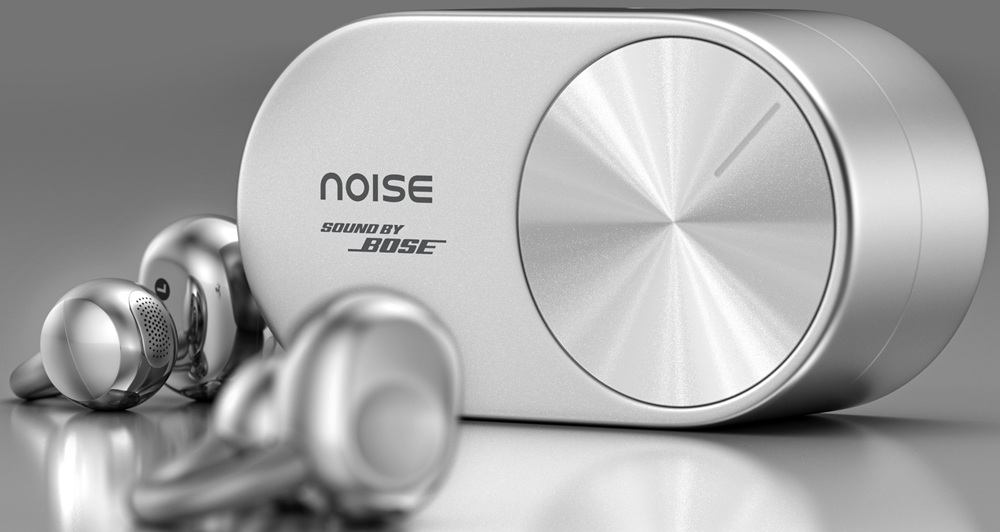

Noise abre la reserva en India de los Master Buds Open, sus primeros auriculares de tipo abierto y los primeros de la marca con tecnología «Sound by Bose». El precio de lanzamiento es de 7.999 rupias y la venta oficial arranca el 23 de octubre. La propuesta es la habitual de este formato: sonido sin obstruir el canal auditivo para no perder de vista el entorno, algo pensado para desplazamientos, jornadas de trabajo y actividad al aire libre.

## Qué traen los Master Buds Open

El apartado acústico se apoya en un driver dinámico personalizado de 10,8 mm, acompañado de una tecnología Dynamic EQ desarrollada en conjunto y seis preajustes de sonido. El diseño abierto con puente en forma de C deja libre el conducto auditivo, de modo que el usuario sigue oyendo lo que ocurre a su alrededor mientras escucha.

Para las llamadas, Noise recurre a un sistema de cuatro micrófonos con ENC y DNN orientado a reducir el ruido del entorno y mejorar la captación de la voz. En conectividad hay Bluetooth 5.4, conexión dual para emparejar dos dispositivos y alternar entre ellos, y Google Fast Pair en Android. La autonomía declarada alcanza las 28 horas contando el estuche de carga, con soporte de carga rápida, y la resistencia al agua es IPX4, suficiente para sudor y salpicaduras ligeras. Desde la aplicación Noise Audio se añaden controles táctiles, ecualizador, preajustes de «Sound by Bose», audio espacial, asistente de voz con IA y funciones de transcripción.

## Precio y disponibilidad

Los Master Buds Open se ofrecen en dos acabados metálicos, Carbon y Mercury, y ya se pueden reservar en la web oficial de Noise. La puesta a la venta en India está fijada para el 23 de octubre, a un precio de lanzamiento de 7.999 rupias, con distribución además a través de Reliance Digital, Croma y Vijay Sales.

## Qué cambia para el lector

Para quien sigue el segmento de auriculares abiertos, la noticia no es tanto un salto técnico como una alternativa con sintonización de Bose a precio contenido. La categoría venía moviéndose este año con ejemplos como los [Ugreen ClipBuds Pro 2](/noticias/audio/ugreen-clipbuds-pro-2/), que también apuestan por el formato abierto, y los [Samsung Galaxy Buds On](/noticias/audio/samsung-galaxy-buds-on/), primeros clip-on de la firma coreana. Los Master Buds Open se suman a esa lista con un encuadre claro: comodidad y conciencia del entorno por encima del aislamiento.

Conviene tener presente que las 28 horas de batería y el IPX4 son cifras declaradas por el fabricante, no medidas de forma independiente, y que ni el precio ni la disponibilidad anunciados salen por ahora de India: no hay fecha ni tarifa para España. Quien busque aislamiento activo o la máxima fidelidad en un formato cerrado tendrá que mirar otro tipo de producto; quien priorice llevar los oídos despejados durante horas ya tiene una opción más que valorar cuando llegue, si llega, al mercado europeo.
