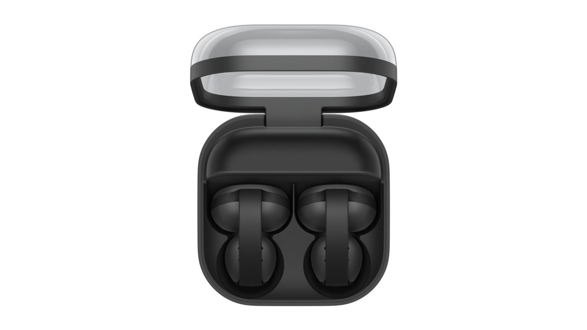
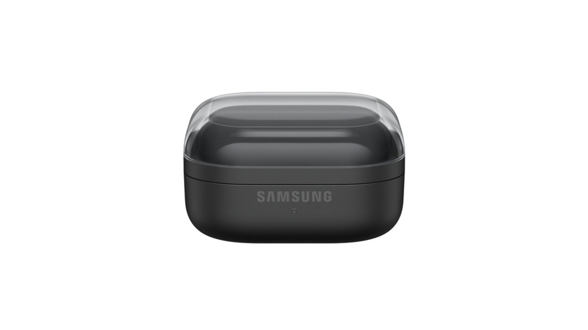
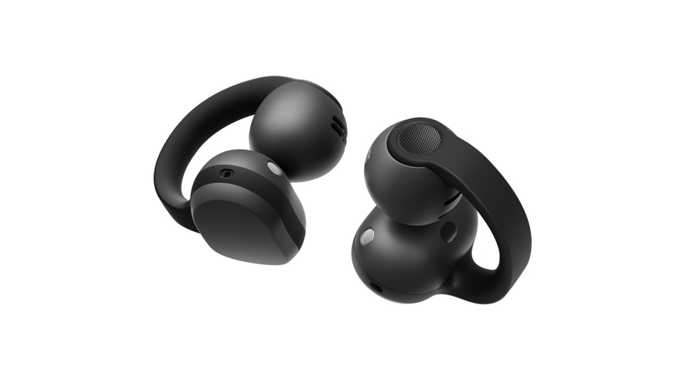

Samsung ha puesto fecha y precio a su primera incursión en el formato clip-on: los Galaxy Buds On llegan a Corea del Sur el 27 de octubre en color negro por 299.000 wones, unos 220 dólares al cambio. La compañía no ha concretado todavía cuándo dará el salto global, aunque ha confirmado que lo habrá.

Son los primeros auriculares de Samsung que no se introducen en el oído. Se enganchan por fuera y dejan el canal auditivo completamente libre, una decisión que cambia por completo la experiencia respecto a unos auriculares inalámbricos convencionales.

## Un diseño que renuncia al aislamiento a propósito

El clip se sujeta alrededor de la oreja, así que el aislamiento no es comparable al de unos auriculares cerrados de toda la vida. Ese es, en realidad, el objetivo del formato: escuchar un pódcast mientras se corre y seguir oyendo la bicicleta que llega por detrás, o mantener música en el gimnasio sin desconectar del entorno.

Samsung asegura que estudió distintas formas de oreja para decidir dónde colocar el altavoz y la batería, y que ensanchó la parte en contacto con la oreja para repartir la presión. La banda flexible también se ha ajustado para que los auriculares no se muevan al caminar o entrenar. La propia SoundGuys advierte de que las orejas no son todas iguales, así que la comodidad real habrá que comprobarla con el producto puesto. Los controles son sencillos: basta con tocar la parte trasera de cada auricular para pausar una canción o responder una llamada.

## El reto del sonido abierto: la fuga y el volumen

Los auriculares abiertos tienen un problema evidente: si tú oyes el exterior, el exterior también puede oír lo que reproduces. Samsung dice haber desarrollado un sistema de reducción de fuga de audio específicamente para ese punto. Si funciona como promete, debería ser posible escuchar música en una cafetería, una biblioteca o un vuelo tranquilo sin compartir la lista de reproducción con quien se sienta al lado.

El fabricante combina además un sistema de altavoces que denomina TwinBoost con un ajuste automático de volumen que reacciona al entorno. En la práctica, eso podría traducirse en menos veces ajustando el volumen a mano al pasar de una sala silenciosa a una calle ruidosa.

## Batería, micrófonos y Galaxy AI

Los Buds On emplean la [plataforma de sonido Snapdragon S7 Gen 1 de Qualcomm](/noticias/qualcomm-snapdragon-sound-elite-gen-2/) con un amplificador de clase D, y Samsung afirma hasta 9,5 horas de reproducción musical continua por carga. Es una cifra razonable para un diseño abierto, aunque conviene recordar que se trata de un dato del fabricante y no de una medición independiente.

Para las llamadas, integra tres micrófonos y un sensor de captación de voz que detecta las vibraciones al hablar. Con ayuda de aprendizaje automático, el sistema separa la voz del ruido de fondo durante la conversación.

Como no podía ser de otro modo en unos auriculares de Samsung, hay extras para quien ya use un móvil Galaxy. Emparejados con un dispositivo compatible con Galaxy AI, permiten ciertas tareas sin sacar el teléfono del bolsillo. También se integra Gemini Live, de modo que la conversación con el asistente de Google puede mantenerse a través de los auriculares; tiene sentido si se cocina, se entrena o se camina con las manos ocupadas.

## Precio y disponibilidad de los Galaxy Buds On

Queda la letra pequeña. El lanzamiento se limita por ahora a Corea del Sur, en negro, desde el 27 de octubre por 299.000 wones (unos 220 dólares), sin fecha para el resto del mundo.

Los Buds On aterrizan en una categoría todavía pequeña frente a los auriculares inalámbricos tradicionales, pero con rivales asentados como los Sony LinkBuds Clip, los Shokz OpenDots One y los Bose Ultra Open Earbuds. La entrada de Samsung puede dar otro empujón al segmento, sobre todo entre usuarios de Galaxy que buscan algo que encaje en su ecosistema.

¿Merece la pena esperar? Con los datos disponibles, la respuesta depende de tres cosas que aún no se pueden medir: cómo suenan, qué tal aguantan la comodidad después de varias horas y si la reducción de fuga cumple de verdad. Samsung ha puesto sobre la mesa una propuesta coherente para quien prioriza seguir oyendo el entorno; la confirmación llegará con las primeras pruebas.
