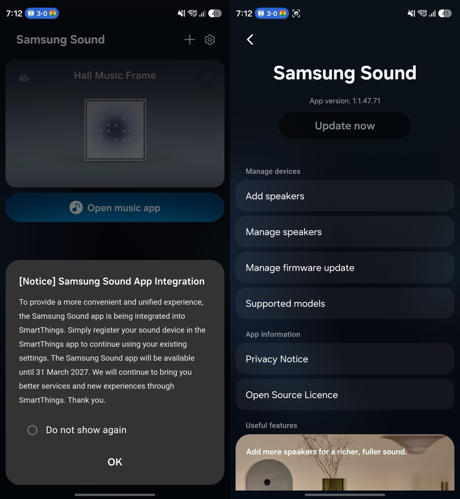

Samsung ha empezado a notificar dentro de su propia aplicación que **Samsung Sound** dejará de funcionar el **31 de marzo de 2027**. A partir de esa fecha, quien quiera seguir controlando sus barras de sonido y altavoces inalámbricos tendrá que hacerlo desde **SmartThings**, la aplicación que la compañía ya emplea para el resto de su ecosistema conectado.

## Qué era Samsung Sound y por qué desaparece

Samsung Sound se presentó como una aplicación dedicada a controlar y ajustar barras de sonido y altavoces con conectividad Bluetooth y Wi-Fi. Su ámbito eran los modelos lanzados a partir de 2024. La idea de partida era sustituir a SmartThings en el terreno del audio doméstico, pero la app se quedó corta en algunas funciones clave frente a la plataforma general de Samsung, y la compañía ha decidido dar marcha atrás.

En lugar de mantener dos aplicaciones en paralelo, Samsung pliega ahora esas funciones dentro de SmartThings. El aviso, enviado a través de la propia aplicación, pide a los usuarios que trasladen su uso a SmartThings.

## Qué cambia para quien tiene una barra o un altavoz Samsung

El cambio afecta al software, no al hardware: las barras de sonido y los altavoces Bluetooth y Wi-Fi lanzados en 2024 o después siguen funcionando, pero su gestión pasa por SmartThings. El calendario es claro:

- **Hasta el 31 de marzo de 2027**: Samsung Sound sigue operativa, aunque ya con el aviso de cierre.
- **Desde esa fecha**: la app deja de prestar servicio y el control de audio se centraliza en SmartThings.

Para el usuario, el paso práctico es instalar SmartThings, vincular allí los dispositivos de audio que tuviera en Samsung Sound y comprobar que los ajustes —ecualización, conexión a la red y actualizaciones— siguen accesibles. La consolidación evita mantener dos apps con funciones solapadas, aunque en la práctica obliga a reconfigurar los equipos una vez.

## Un patrón que se repite en el software de Samsung

El cierre de Samsung Sound llega pocos meses después de que la compañía retirara Samsung Messages, otro caso de aplicación propia que acaba integrándose en un servicio más amplio. SmartThings es la pieza sobre la que Samsung está unificando su ecosistema, y buena parte de ese esfuerzo se ha centrado en el software: hace apenas unos días conocimos que [el rediseño de SmartThings llega antes a iPhone que a los Galaxy](/noticias/smartthings-redesign-iphones/), una señal de que la app es hoy la apuesta principal de la compañía para gestionar sus dispositivos.

Para quien tenga una barra de sonido o un altavoz Samsung compatible, la recomendación es no esperar al último día: migrar a SmartThings con margen evita quedarse sin control cuando la aplicación antigua se apague. La pregunta razonable no es si Samsung Sound era mejor o peor, sino si SmartThings cubre ahora todo lo que ofrecía; según el propio aviso de la compañía, esa es su intención.
