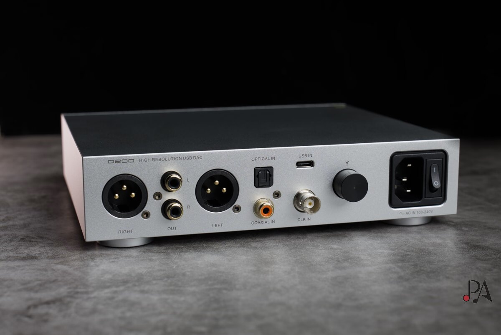
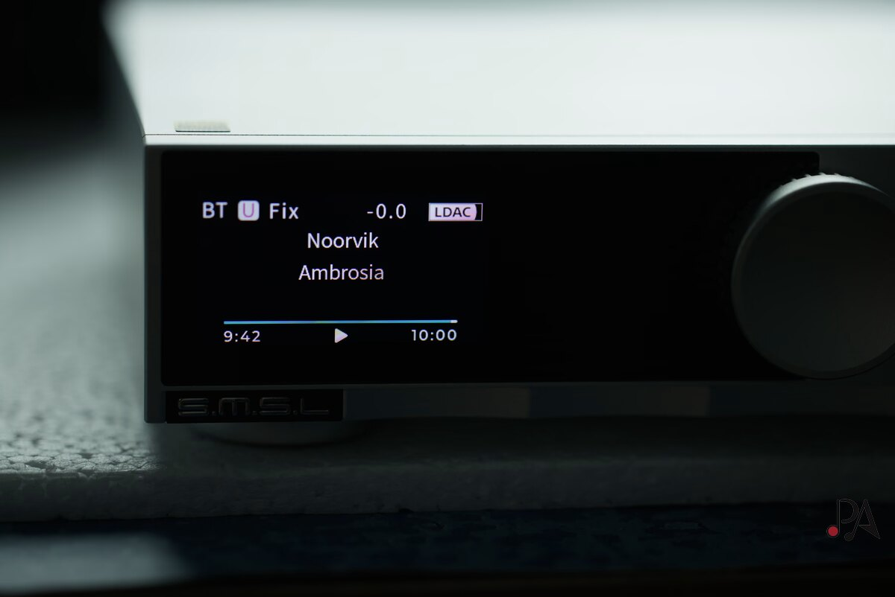
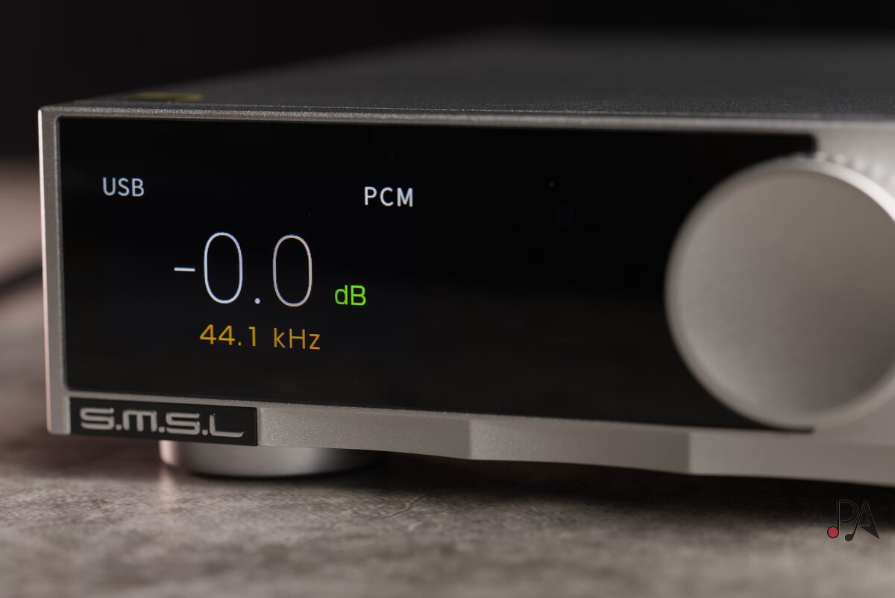

La mayoría de los convertidores de escritorio montan chips de AKM, ESS o Cirrus Logic. El SMSL D200 rompe esa costumbre: su DAC es un ROHM BD34352EKV, un integrado que el análisis sitúa en Kioto (Japón) y que rara vez aparece en esta franja de precio. El equipo parte de 319 dólares, el mismo terreno en el que compiten el FiiO K13 R2R y el Topping D50 Mark III.

## Qué ofrece el D200

El D200 se apoya en la interfaz USB XMOS XU316, con soporte de hasta 32 bits, DSD512 nativo y 768 kHz, además de decodificación completa de MQA. La conexión inalámbrica corre a cargo de un chip Qualcomm compatible con LDAC y aptX HD. La alimentación usa una fuente lineal con conmutación adaptativa de tensión patentada, y el equipo se conecta directamente a la red eléctrica: no necesita transformador externo.

Su panel trasero cubre las salidas balanceadas XLR y las single-ended RCA, y suma entradas óptica, coaxial y USB. El detalle poco habitual en esta gama es la entrada de reloj externo: aunque el reloj interno CK03 desarrollado por SMSL es correcto, quien quiera controlar el jitter puede saltárselo y sincronizar con una referencia propia.

El frontal incluye un mando de volumen que también funciona como botón multifunción y una pantalla de 1,9 pulgadas. Con la entrada USB activa muestra volumen y frecuencia de muestreo; al reproducir por Bluetooth, añade información de la canción y del álbum. El menú es directo: permite elegir entradas, tipo de salida (completa, solo balanceada o solo no balanceada), reloj, filtro PCM, filtro DSD y «sound color», además de fijar el modo pre-out o línea completa y personalizar la tecla de función.

## Cómo suena y qué distingue a este chip

El perfil tonal que describe el análisis es neutro y lineal, coherente con la línea habitual de SMSL. Según esta lectura, el chip ROHM se colocaría en un punto intermedio entre la calidez de los R2R o AKM y el carácter más analítico de ESS, con un resultado que recuerda a la neutralidad de soluciones Cirrus Logic como el CS43131.

En la parte baja, el grave tiene cuerpo y buena extensión de extremo a extremo, sin realce: el control y la firmeza dependen, como siempre, de los altavoces o auriculares que reciba la señal. Donde el analista pone el foco es en los agudos: los describe como ligeros y aireados, con brillo pero sin dureza, lo que a su juicio ensancha la escena y mejora la imagen. Es una valoración de escucha subjetiva, no una medición de laboratorio.

Un dato que conviene no pasar por alto: el D200 no integra amplificador de auriculares. Para usar auriculares o IEM hay que añadir una [etapa de amplificación de escritorio](/noticias/audio/fiio-class-a/) aparte; en la prueba se combinó con un Burson Soloist GT4, y como alternativa económica se menciona el xDuoo MT-602.

## Qué cambia para el comprador

Frente al FiiO K13 R2R, que sí incluye una etapa de auriculares potente y un sonido más orgánico por su escalera de resistencias, el D200 apuesta por la precisión y el detalle antes que por el todo en uno. Para montar un sistema con altavoces y un amplificador ya disponible, el análisis considera que el SMSL es la opción más lógica. La pega señalada es menor: el mando a distancia es el habitual de la marca, ligero y de acabado modesto.

¿Merece la pena? A 319 dólares, el D200 incluye salidas balanceadas, entrada de reloj externo, Bluetooth LDAC y un menú fácil de usar, con una puntuación de 4,5 sobre 5 en el análisis. Quien busque un convertidor neutro para alimentar una etapa externa tiene aquí una candidata sólida; quien quiera conectar auriculares directamente, tendrá que sumar el coste de un amplificador.
