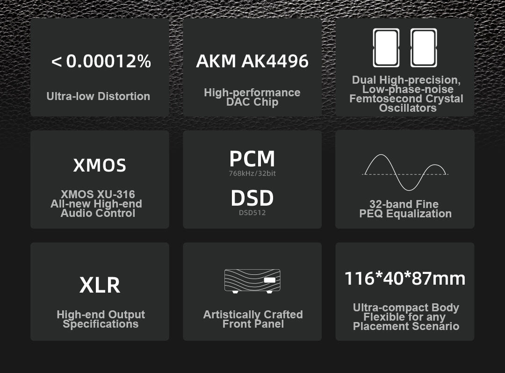

El SMSL SU-3 ya está a la venta en la tienda Apos por 189 dólares. Es un convertidor digital-analógico de escritorio que ocupa algo más de 11 centímetros de ancho y que la marca ha construido alrededor de un chip AKM AK4496 y una interfaz USB XMOS XU-316. Sobre el papel, admite PCM de hasta 32 bits y 768 kHz y DSD512 nativo, y suma un ecualizador paramétrico de 32 bandas que conserva sus ajustes después de apagarlo.

## Qué ofrece el SMSL SU-3

La conversión corre a cargo del AKM AK4496, acompañado de dos osciladores de cristal de femtosegundo de bajo ruido de fase que sirven de referencia de reloj. SMSL declara además una etapa de filtrado dedicada a limpiar el ruido y la interferencia de la alimentación que llega por USB, un detalle poco habitual en un equipo de este precio y tamaño.

En cuanto a conexiones, el panel trasero ofrece entradas USB-C, óptica y coaxial, y salidas de línea balanceadas XLR y single-ended RCA. La entrada USB admite señal asíncrona, mientras que las entradas óptica y coaxial se quedan en PCM de hasta 24 bits y 192 kHz: es el límite del formato, no del DAC. La salida balanceada entrega 4 Vrms y la RCA, 2 Vrms.

El chasis es de aluminio anodizado mecanizado por CNC y mide 116 × 40 × 87 mm, con un peso de 310 gramos. El consumo se queda por debajo de 5 W en funcionamiento y de 0,1 W en reposo, y el equipo funciona con Windows 7 o posterior, macOS 10.6 o posterior y Linux.

## Qué se mide y qué se percibe

SMSL especifica una distorsión armónica total más ruido (THD+N) de 0,00012 % (–118 dB) y un rango dinámico y una relación señal-ruido de 126 dB en la salida balanceada. La propia marca publica mediciones con un analizador Audio Precision APx555B: 0,000114 % de THD+N en el canal 1 y 0,000125 % en el canal 2, medidas en XLR a unos 4,1 Vrms. Son cifras buenas, pero conviene recordar que describen el comportamiento del convertidor, no el sonido final: eso depende del amplificador, los auriculares o los altavoces que reciban la señal.

El ecualizador paramétrico de 32 bandas es el rasgo que más lo distingue de otros DAC de su franja. Permite ajustar la respuesta en frecuencia para adaptarla a unos auriculares, unos altavoces o una sala concreta, y mantiene la configuración tras reiniciar. Para quien corrige curvas a mano, es una función que en esta gama suele pedir software externo.

Conviene tener claro qué es y qué no es el SU-3. No incluye amplificador de auriculares ni conectividad inalámbrica: es una fuente de línea que entrega señal a un amplificador o a unos altavoces activos. Por eso mismo no compite con los DAC-amp todo en uno, sino con los convertidores que se colocan delante de una etapa ya existente.

## Qué cambia para el comprador

En el catálogo reciente de SMSL, el SU-3 convive con el [SMSL D200](/noticias/audio/smsl-d200/), un DAC de 319 dólares que cambia el chip AKM por un ROHM, añade Bluetooth LDAC y se alimenta directamente de la red eléctrica, aunque también prescinde de amplificador de auriculares. El SU-3 se coloca por debajo en precio y apuesta por el EQ paramétrico como argumento; el D200, por conectividad y una fuente de alimentación más elaborada.

¿Merece la pena? Por 189 dólares, el SU-3 cubre lo básico de un DAC de escritorio —AKM, USB asíncrono, salidas XLR y RCA— y añade un ecualizador de 32 bandas difícil de encontrar a este precio. Quien ya tenga un amplificador o unos monitores activos y quiera corregir la respuesta sin depender del software del ordenador tiene aquí una opción sensata; quien pretenda escuchar con auriculares directamente tendrá que sumar el coste de una [etapa de amplificación](/noticias/audio/fiio-class-a/) aparte.
