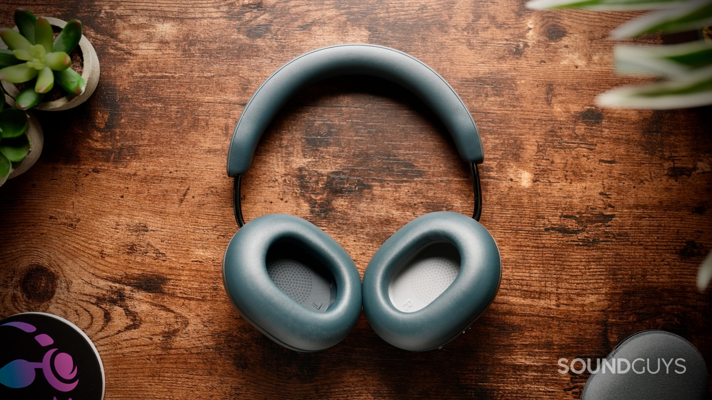
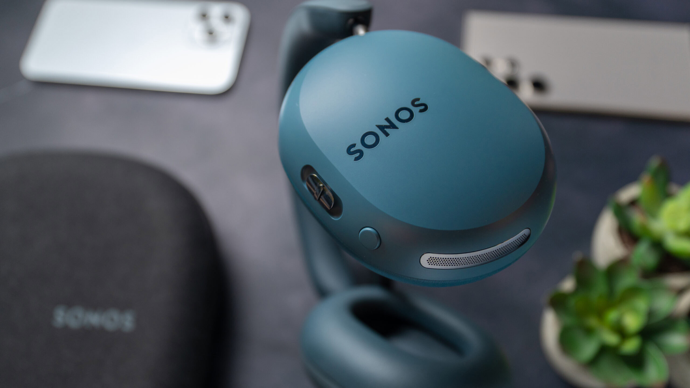
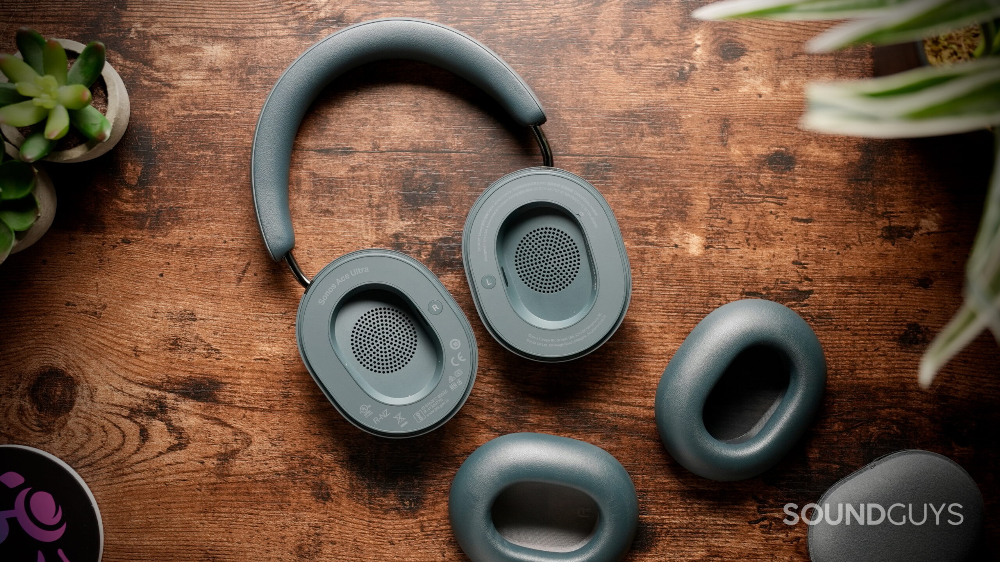
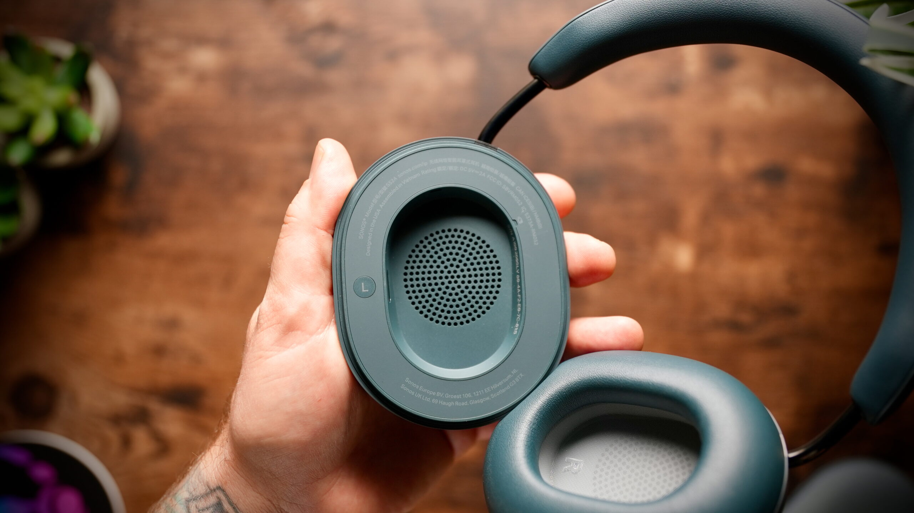
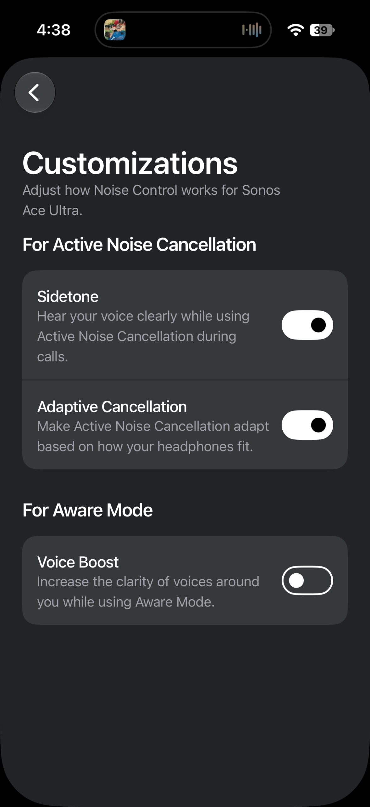
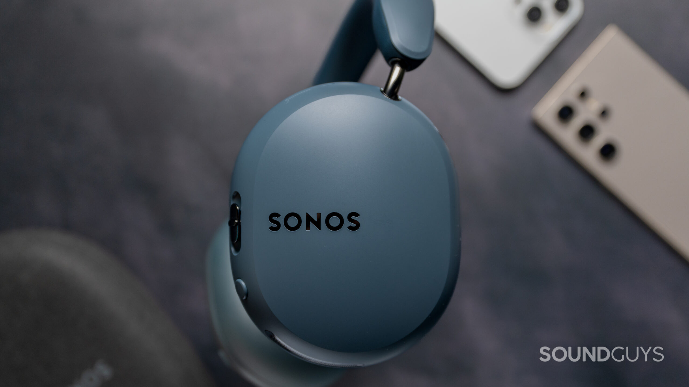

Los **Sonos Ace Ultra** ya están a la venta por 449 dólares y llegan como una evolución del Ace original, no como unos auriculares nuevos desde cero. Sonos conserva el diseño, la construcción premium y la cancelación de ruido activa, pero añade dos cambios que sí se notan en el uso diario: un ecualizador de 8 bandas y una batería reemplazable. SoundGuys les otorga un 7,9 sobre 10 tras dos semanas de pruebas.

## Sonos Ace Ultra: un Ace con retoques, no un rediseño

El Ace Ultra no se aleja del Ace original en lo esencial. El acabado Azul Agave es nuevo y hay más colores disponibles, pero la forma, los materiales y la mezcla de plástico y metal se mantienen. Sonos sigue apostando por controles físicos: la combinación de botones y el deslizador Content Key se maneja con el tacto, sin depender de superficies táctiles.

El precio de esa construcción robusta es el peso: 322 gramos, bastante por encima de los 254 gramos de unos Sony WH-1000XM6. La firma de audio señala que no resulta incómodo de llevar, pero conviene tenerlo en cuenta si se viaja mucho con ellos. El acolchado de la diadema y las almohadillas mantiene bien el sellado, incluso con gafas, y la fuerza de sujeción está ajustada. El punto débil para orejas grandes es el espacio interior de las almohadillas, algo justo aunque no determinante.

Aquí está una de las mejoras de fondo: las almohadillas son magnéticas y se cambian con facilidad, y la batería también es reemplazable. Sonos vende un kit oficial para sustituirla, aunque no es un recambio de un minuto: hay que retirar la almohadilla izquierda, abrir la carcasa con un destornillador Torx, desconectar varios componentes internos y retirar la placa antes de llegar a la celda. Como contrapartida, no hay certificación IP, así que la lluvia sigue siendo un riesgo.

## Lo que se mide: cancelación de ruido y autonomía

En las mediciones de SoundGuys, el aislamiento pasivo reduce la sonoridad percibida del ruido externo una media del 69,7 %. Con la cancelación activa encendida, la cifra sube al 88,1 %, un resultado que los coloca junto a referentes del sector como los Sony WH-1000XM6, en torno al 87 %, y los Apple AirPods Max 2, en el 89,4 %.

Sin embargo, frente al Ace original no hay una mejora significativa: el modelo anterior ya rondaba el 88 % con ANC. Las diferencias de ajuste, de gafas o de cómo se colocan los auriculares explican esa variación mínima. En el uso real, el rendimiento se mantiene sólido para cortar el ruido de tráfico y el ambiente de una ciudad.

La autonomía supera lo prometido. En la prueba estandarizada del medio, los Ace Ultra alcanzaron **35 horas y 53 minutos**, por encima de las 35 horas que Sonos anuncia con ANC activo. La carga rápida de tres minutos aporta hasta tres horas de reproducción, y una carga completa desde el 0 % puede llevar hasta tres horas. Si el acumulador se agota con el tiempo, es sustituible, de modo que una batería gastada no condena unos auriculares de 449 dólares.

En cuanto a la aplicación, Sonos ofrece bastante control: se puede elegir qué modos de control de ruido recorre el botón físico, desactivar por completo la cancelación, activar la Cancelación Adaptativa según el ajuste, usar el sidetone para oír la propia voz en llamadas y recurrir al modo Aware con Voice Boost. El nuevo ecualizador de 8 bandas sustituye a los básicos deslizadores de graves y agudos del Ace original, y admite ajustes simples de graves, medios y agudos sin abandonar el modo avanzado.

## Conectividad y ecosistema: donde está el valor

El Ace Ultra usa **Bluetooth 6.0** con soporte de aptX Lossless y multipunto para mantener dos dispositivos conectados a la vez. SoundGuys no registró cortes ni microcortes durante el uso diario. La conexión con cable también está bien resuelta: se puede escuchar por USB-C y en la caja se incluye un cable de USB-C a 3,5 mm para fuentes analógicas, así que no hace falta comprar nada aparte.

La novedad frente al Ace original es el Wi-Fi, pero con matices: los auriculares no funcionan como reproductor autónomo en red. El Wi-Fi se reserva a funciones como Headphone Linking con otros productos Sonos compatibles —Era 100, Era 300, Five, Arc Ultra y el nuevo Beam Ultra—, y llega como función de Acceso Anticipado con limitaciones, entre ellas la falta de soporte para fuentes Bluetooth o AirPlay.

La función estrella del ecosistema es TV Audio Swap: manteniendo pulsada la tecla Content Key, el audio de una barra de sonido Sonos compatible salta a los auriculares en pocos segundos. SoundGuys lo probó con la Beam Ultra, cuyo análisis [ya publicamos en TechSpain24](/noticias/audio/sonos-beam-ultra-analisis/), y lo describe como una solución práctica para seguir viendo la televisión sin molestar a nadie.

## ¿Merece la pena?

Los Ace Ultra tienen sentido, sobre todo, si ya hay otros productos Sonos en casa: funciones como TV Audio Swap y Headphone Linking no se aprovechan sin ellos. Para quien no esté en el ecosistema, el medio destaca su construcción premium, la cancelación de ruido y el control del sonido, pero recuerda que 449 dólares es una cifra alta si no se usan esas funciones exclusivas.

El veredicto de SoundGuys es un 7,9 sobre 10, una nota que refleja unos auriculares competentes y bien construidos, con la relación calidad-precio condicionada al ecosistema. Entre las alternativas directas que apunta el medio figuran los Sony WH-1000XM6 y los Sennheiser Momentum 5 Wireless, que compiten en sonido, cancelación y funciones del día a día sin depender de una marca concreta.

