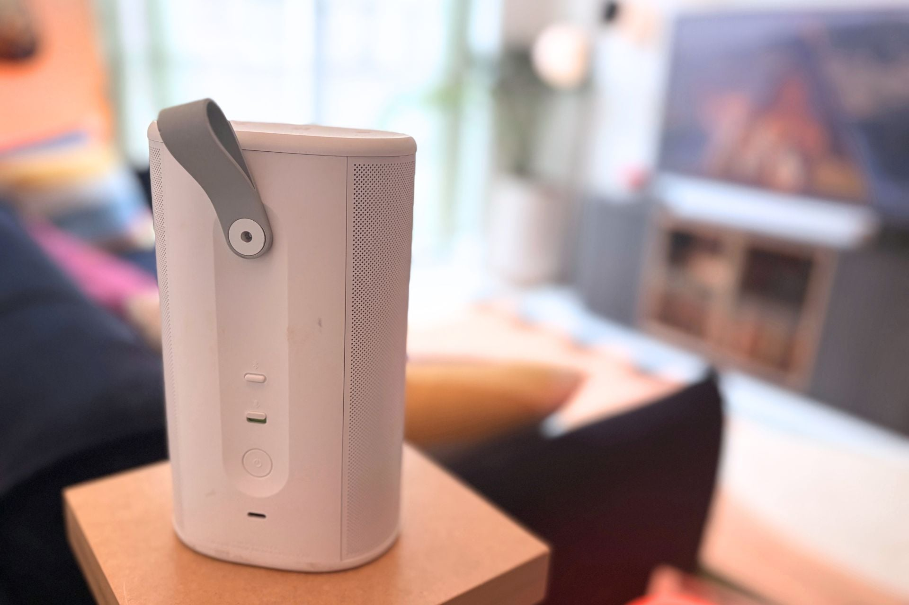
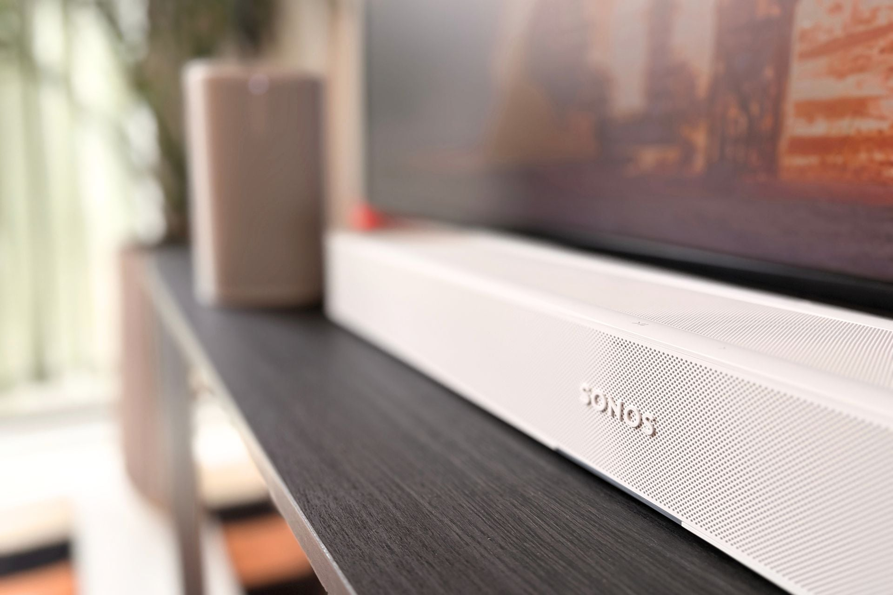

La Sonos Beam Ultra es la nueva barra de sonido compacta de Sonos y llega con un precio de 699 dólares. Monta nueve altavoces, presume de Dolby Atmos 7.1.2 y añade funciones de software pensadas sobre todo para quien ya tiene otros productos de la marca. Gizmodo la ha analizado y le ha dado un 4,5 sobre 5, además de su sello Editor's Choice 2026.

## Qué cambia respecto a la Beam Gen 2

El salto de hardware más evidente está en el número de altavoces: la Beam Ultra monta nueve, frente a los cinco de la Sonos Beam Gen 2. Sonos describe el sistema como 7.1.2 con «Dolby Atmos real», lo que en la práctica da más margen para repartir el sonido por todo el rango de frecuencias. En las pruebas, la barra ofreció una escena amplia y envolvente incluso con contenido de mucha carga sonora, y los efectos se desplazaron de un lado a otro sin necesidad de altavoces traseros. Parte de esa sensación de espacio proviene de los controladores que apuntan hacia arriba.

En los graves, Sonos promete un sonido «más cálido» que la generación anterior. El análisis lo describe como un bajo decente, aunque por debajo de rivales como la barra Bose Lifestyle Ultra. Quien busque más pegada tendrá que sumar un subwoofer: el Sonos Sub Mini cuesta 499 dólares y el Sonos Sub 4, 899 dólares.

## Un software que por fin juega a favor

Para Gizmodo, la mayor mejora no está en el hardware, sino en varias funciones nuevas. Una actualización permite usar altavoces inalámbricos como los Sonos Play —lanzados este año— o los Move 2 como canales de sonido envolvente. El emparejamiento se hace desde la app: basta con seleccionar la Beam Ultra y pulsar «Add surrounds». El sistema detecta cuándo un altavoz se aleja y lo desconecta, y lo vuelve a conectar al regresar sin cortar la reproducción.

Entre las funciones nuevas y heredadas destacan tres. «Speech Enhancement» emplea inteligencia artificial para realzar los diálogos y ofrece cuatro niveles: bajo, medio, alto y máximo. «Night Sound» recorta los picos de volumen para no despertar a la casa en sesiones nocturnas. Y «TV Audio Swap» traslada el audio a unos auriculares Sonos Ace con solo mantener pulsada la tecla de contenido.

## Diseño, puertos y lo que no convence

La Beam Ultra mantiene el aspecto redondeado y minimalista de la marca, disponible en blanco o negro, y es más compacta que otras barras del mercado. Se puede montar en la pared. En conectividad incorpora eARC por HDMI y añade un puerto USB-C que sirve como entrada de línea para un tocadiscos, un reproductor de CD o un ordenador, además de Bluetooth para conectar el móvil.

El punto flojo son los controles táctiles capacitivos de la parte superior: según el análisis, fallan pulsaciones al ajustar el volumen y reaccionan con cierta lentitud. El mando del televisor evita el problema en la mayoría de los casos.

## ¿Merece la pena la Sonos Beam Ultra?

Con 699 dólares, la Beam Ultra es cara, y más si se le añade un subwoofer, pero el análisis concluye que cumple con su apellido: diálogos claros, una sensación de espacio sorprendente para su tamaño y un software que convierte tus altavoces Sonos en un sistema de cine en casa. Quien ya tenga productos de la marca sacará mucho más partido. Frente a la competencia, la [JBL Cinema SB Mk2](/noticias/jbl-cinema-sb-mk2/) propone una vía distinta, con altavoces Flip 7 como canales traseros inalámbricos. Bose intenta disputarle el terreno con su Lifestyle Ultra, pero, según Gizmodo, Sonos sigue por delante en ecosistema de audio doméstico.
