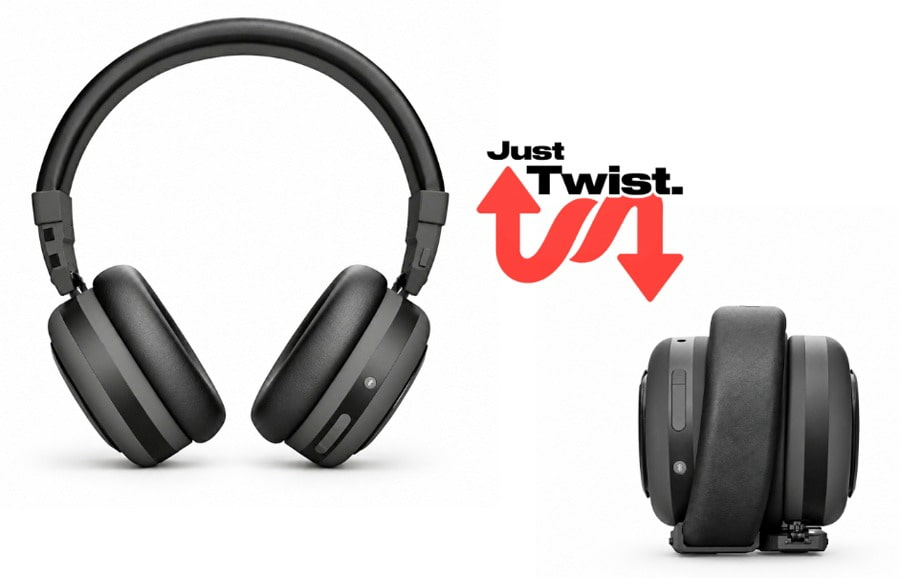
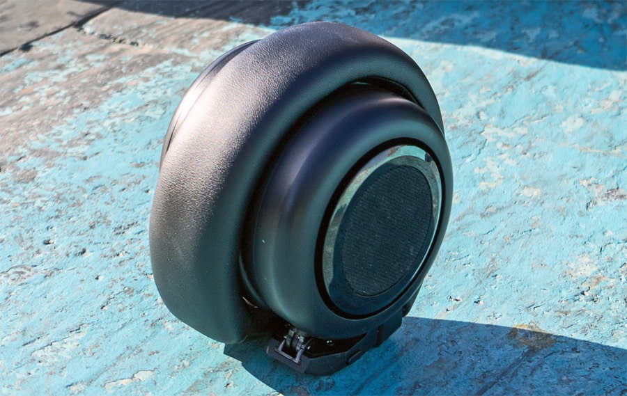
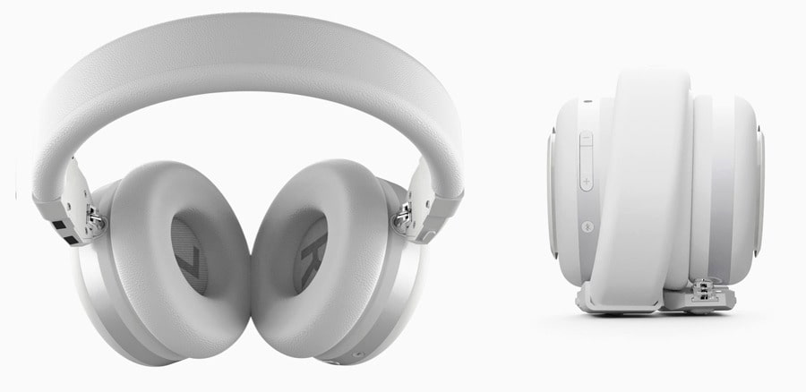

Los TDM Neo ya están a la venta por 249 dólares. Son unos auriculares over-ear que, girando las copas sobre la diadema, pasan a funcionar como un altavoz Bluetooth portátil de 5 W por canal. La propuesta cubre con un solo aparato dos situaciones que normalmente exigen dos: la escucha personal en el transporte y la música compartida en un grupo pequeño. TDM los presenta como los primeros auriculares de alta fidelidad capaces de transformarse en altavoz con un solo giro.

## Cómo el TDM Neo pasa a modo altavoz

El cambio de modo no depende de piezas desmontables ni de un accesorio aparte: el mecanismo va integrado en la propia diadema y basta con rotar las copas para que el equipo pase de auricular a altavoz. El sistema de audio se apoya en cuatro drivers de 40 mm: dos miran hacia dentro para la escucha personal y dos hacia fuera para reproducir en modo altavoz.

Esa separación de drivers es la parte interesante del diseño. En vez de reutilizar los mismos transductores apuntando hacia otro sitio, TDM dedica dos unidades a cada uso, lo que sobre el papel evita el compromiso de un único conjunto que tenga que sonar bien en dos posiciones físicas distintas. En modo altavoz los dos drivers exteriores entregan 5 W por lado, suficiente para una sala pequeña, aunque el resultado real dependerá del tamaño del espacio y de dónde se coloque el dispositivo.

## Qué se mide y qué no

La conectividad es Bluetooth 6.0 con multipoint, de modo que los Neo pueden mantener el enlace con varios equipos y saltar entre fuentes sin desemparejar. En el apartado de códecs, TDM se queda en SBC y AAC: no hay rastro de aptX ni de LDAC, y tampoco se anuncia cancelación activa de ruido (ANC). Lo que sí incluye es aislamiento pasivo y un sistema de micrófonos en matriz con cancelación de ruido ambiental (ENC) que funciona en los dos modos, para llamadas privadas o para usarlos como altavoz de conferencia.

En autonomía la cifra llama la atención: más de 200 horas en modo auricular y hasta 16 horas en modo altavoz. La carga es por USB-C, con unas tres horas para una carga completa y un extra de hasta ocho horas de escucha tras cinco minutos conectados a la corriente. El conjunto pesa 340 gramos, un dato contenido teniendo en cuenta que lleva drivers, amplificación y batería para dos modos. La diadema es ajustable, las almohadillas son de espuma viscoelástica de doble capa y el módulo de batería es reemplazable. Hay cuatro botones físicos para encendido, volumen y cambio de modo, y la acción del giro se puede personalizar desde la app gratuita (iOS y Android), que añade ecualizadores independientes para cada modo, Game Mode, localización del dispositivo y gestión de energía.

## ¿Merece la pena?

TDM no es la primera firma que intenta fusionar auriculares y altavoz; propuestas similares de HyperGear y Sharper Image ya existían. La diferencia del Neo está en el mecanismo patentado, los cuatro drivers dedicados y la amplificación separada, que hacen de él una interpretación más ambiciosa del concepto. El coste de esa versatilidad aparece en las especificaciones: quien busque cancelación de ruido o códecs de alta resolución —habituales en alternativas como los [Technics EAH-A1000](/noticias/technics-eah-a1000/)— no los encontrará aquí.

A 249 dólares, en acabados negro y blanco y con funda de transporte incluida, el Neo tiene sentido para quien realmente quiera un único dispositivo para escucha personal y compartida y no le importe renunciar a lo que no ofrece. Para el resto, sigue siendo más razonable comprar unos buenos auriculares y un altavoz por separado.
