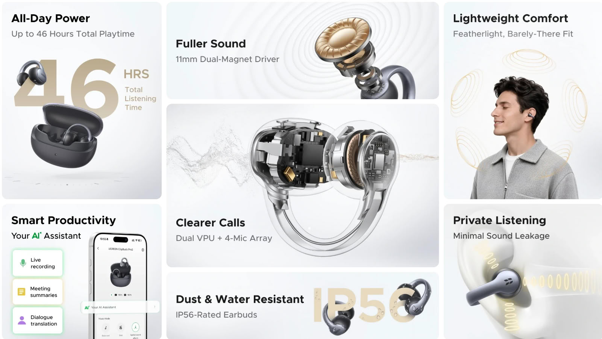

Ugreen ha puesto a la venta los ClipBuds Pro 2, unos auriculares de tipo clip que se sujetan por fuera del pabellón auditivo en lugar de introducirse en el conducto. Llegan con un precio recomendado de 99,99 dólares y están disponibles tanto en la tienda oficial de la marca como en Amazon. La propuesta se apoya en tres ejes: captación de voz, calidad de sonido y funciones de IA.

## Seis micrófonos y conducción ósea para las llamadas

El sistema de captación de voz combina seis micrófonos: una matriz de cuatro más dos sensores de conducción ósea, denominados Voice Pickup Unit, que detectan las vibraciones que genera el habla para aislar la voz del ruido circundante. Ugreen añade reducción de ruido asistida por IA orientada a atenuar conversaciones de oficina, tráfico y viento. La firma sitúa el escenario exigente en calles con niveles de ruido de hasta 75 dB, donde asegura que la voz llega clara y natural a quien está al otro lado.

Esta es, precisamente, la baza diferencial frente a los auriculares cerrados: al no tapar el oído, el reto no es cancelar el ruido para el usuario, sino evitar que ese ruido se cuele en el micrófono. De ahí el recurso a la conducción ósea, que aporta una referencia de la voz independiente del aire.

## Driver de 11 mm, LDAC y audio espacial

Cada auricular monta un driver de 11 mm de doble imán con diafragma de compuesto de titanio. La certificación Hi-Res Wireless y la transmisión LDAC, el códec de alta tasa de bits de Sony, apuntan a que el límite de calidad no esté en el enlace inalámbrico. El modo Bass añade peso y textura a los graves, mientras que el audio espacial busca una escena más amplia y por capas.

Para el uso en espacios compartidos, la acústica direccional concentra el sonido hacia el oído y reduce la fuga, algo que en un diseño abierto conviene vigilar. El perfil tonal se ajustó junto a la baterista, compositora y productora Terri Lyne Carrington, ganadora de cuatro premios Grammy, con el objetivo de equilibrar voces, instrumentos y ritmo sin renunciar al carácter aireado del formato abierto.

## Diseño ligero y autonomía

Cada auricular pesa unos 6 g. El puente en C integra un alma de titanio con memoria de 0,5 mm que se deforma para adaptarse a distintas formas de oreja y reparte mejor la presión, con un acabado mate en la superficie. La autonomía declarada es de 10 horas con una sola carga y de hasta 46 horas contando el estuche. Las imágenes promocionales de la marca acreditan además resistencia al polvo y al agua bajo el estándar IP56.

## Funciones de IA y disponibilidad de los ClipBuds Pro 2

Sobre reconocimiento de voz y modelos de IA —la marca cita GPT y Gemini— el sistema ofrece traducción simultánea y traducción cara a cara en más de 130 idiomas, además de grabación en vivo, transcripción y resúmenes de reuniones generados de forma automática. La conectividad de doble dispositivo permite mantener enlazados a la vez el portátil y el móvil, con el objetivo de reducir las interrupciones al saltar de una reunión a una llamada.

El apartado de IA es hoy el terreno donde más se están diferenciando los auriculares TWS, y aquí Ugreen lo integra en el propio producto en lugar de depender solo de una app. Los ClipBuds Pro 2 ya están a la venta por 99,99 dólares, un precio contenido para un formato abierto que suele moverse en esa franja.

## ¿Merece la pena?

Por precio y enfoque, los ClipBuds Pro 2 caen de lleno en el segmento de los auriculares clip-on, un formato que ha dejado de ser una curiosidad: recientemente Samsung ha presentado sus [Galaxy Buds On](/noticias/audio/samsung-galaxy-buds-on/), también de tipo clip. Frente a los modelos cerrados de precio similar, la ventaja es la comodidad y la conciencia del entorno; la contrapartida es un aislamiento pasivo escaso, que en entornos muy ruidosos se nota. La ficha técnica es sólida —LDAC, seis micrófonos, 46 horas y funciones de IA—, así que la duda razonable no es qué trae, sino cómo suena una vez medido y cómo se comporta de verdad en llamadas.
