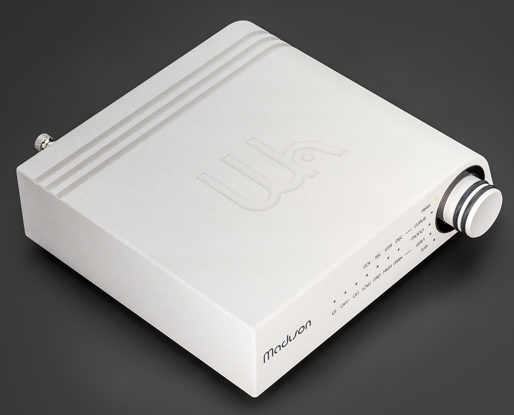
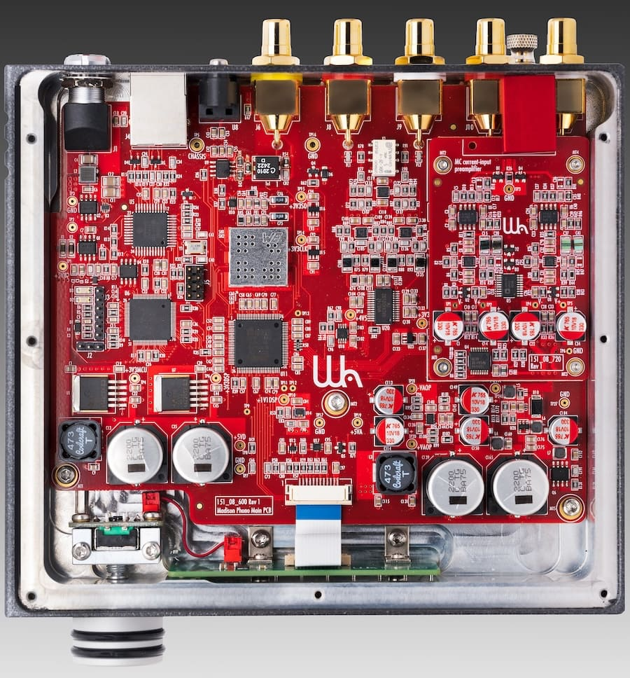
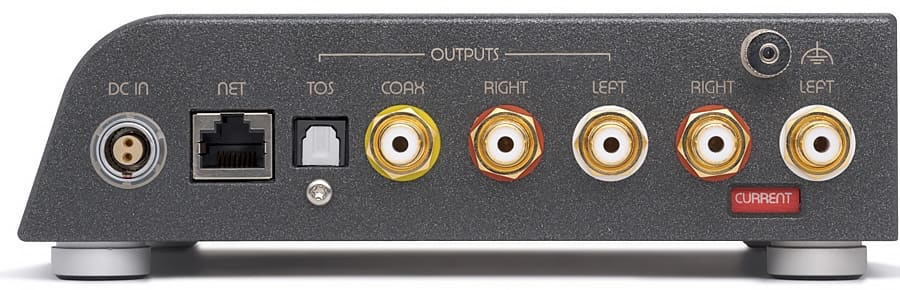
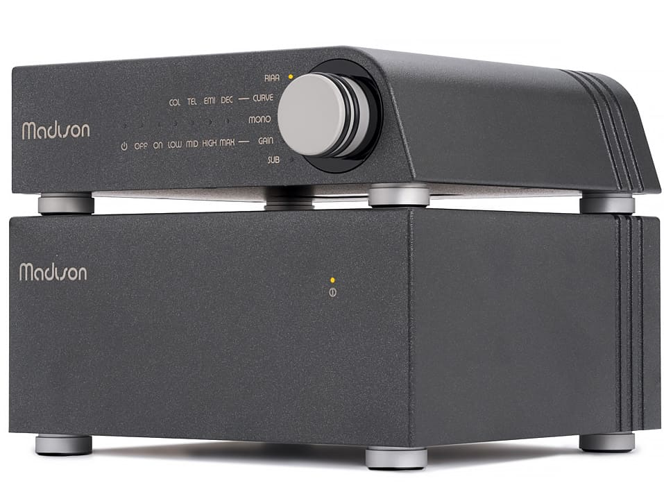

Wattson Audio ha presentado el Madison Phono, un previo de fono de fabricación suiza que cuesta 5.495 dólares y que convierte la señal del cartucho a 32 bits/384 kHz antes de aplicar la ecualización en el dominio digital. La idea de digitalizar el vinilo no es nueva: la propia Linn ya demostró con su Urika II que la corrección RIAA digital puede funcionar bien. Lo que cambia en el enfoque de Wattson es que no trata todos los cartuchos como variaciones del mismo problema eléctrico.

## Madison Phono: un previo compacto con conversión de alta resolución

El chasis mide 175 x 185 x 52 mm y pesa 1,7 kg, bastante menos que la mayoría de previos de fono de gama alta. La circuitería de entrada sí es específica para cada tipo de cápsula; a partir de ahí, la señal amplificada se convierte a 32 bits/384 kHz y el filtrado y la ecualización se resuelven en digital.

De fábrica se incluyen las curvas RIAA, Columbia, Teldec, EMI y Decca, que Wattson cifra en una precisión de ±0,1 dB. Es una afirmación del fabricante, no una medición independiente, pero marca el argumento del producto: varias curvas históricas implementadas con una repetibilidad que en el dominio analógico resulta mucho más difícil de garantizar.

## Tres placas de entrada intercambiables

La parte más singular del Madison Phono es que cada unidad se pide con una de tres placas de entrada sustituibles:

- **Voltage**: para cápsulas de imán móvil (MM) y de bobina móvil (MC) de mayor impedancia.
- **Current**: pensada para MC de baja impedancia, con un amplificador de transimpedancia activo derivado de la tecnología de CH Precision.
- **Optical**: diseñada para los cartuchos fotoeléctricos de DS Audio, también con topología de transimpedancia activa.

Cada placa adicional cuesta 500 dólares y puede cambiarse más adelante si el propietario migra a otra tecnología de cartucho. Sobre el papel, esto importa más de lo que parece: la mayoría de previos ofrecen distintos valores de ganancia y carga sobre una misma arquitectura de entrada, mientras que aquí cambia la etapa de entrada completa en función de cómo genera la señal el cartucho.

## Por qué digitalizar el vinilo

El razonamiento de Wattson es directo: sacar la corrección RIAA de la etapa analógica elimina las grandes redes de ecualización pasiva y permite aplicar varias curvas con mucha mayor repetibilidad. La sección de amplificación analógica puede así mantenerse lineal en lugar de encargarse a la vez de la ganancia y de la ecualización.

La señal puede salir por las salidas RCA analógicas convencionales o quedarse en digital a través de S/PDIF coaxial u óptico a hasta 192 kHz, con reducción opcional a 96 kHz. Eso lo hace interesante en sistemas construidos alrededor de un DAC o un previo digital de calidad: quien use el Madison Streamer de la misma casa puede mantener la señal del vinilo en digital después del previo de fono en lugar de reconvertirla a analógico de inmediato.

## Para quién tiene sentido y con qué compite

El Madison Phono encaja sobre todo en quien ya tiene un tocadiscos y un cartucho serios y, además, un sistema centrado en lo digital, como los altavoces activos [PSB iQ2](/noticias/psb-iq2-altavoces/) que ya analizamos. Un coleccionista con prensajes antiguos de Columbia, Decca o EMI accede a las curvas históricas correspondientes; quien use una MC de baja salida puede optar por amplificación en modo corriente sin la carga convencional del cartucho; y un propietario de DS Audio entra en la reproducción óptica sin comprar una plataforma de ecualización aparte. Si cambia de tecnología de cartucho, no se queda con un pisapapeles de aluminio caro.

Entre los previos que hemos cubierto, ninguno replica la arquitectura completa. El MoFi Electronics MasterPhono (5.995 dólares) es un previo MM/MC totalmente analógico y balanceado, con entradas de tensión y de corriente y mucha flexibilidad de carga. La serie Aavik R-x88 admite MC y cartuchos ópticos de DS Audio, pero arranca en 20.000 dólares, no ofrece MM y mantiene un camino analógico convencional. El Backert Labs Optik Phono 1.1 (11.500 dólares) también da soporte a DS Audio, aunque es un ecualizador óptico dedicado y no un previo multiformato.

El atractivo del Madison Phono no está en digitalizar el vinilo, sino en reunir MM, MC en modo tensión, MC en modo corriente, soporte óptico de DS Audio, placas de entrada intercambiables, curvas históricas y salidas analógica y digital en una sola caja compacta y actualizable. Es menos un previo de fono convencional y más un puente entre la reproducción analógica seria y los sistemas digitales actuales. Quien piense que un conversor analógico-digital (ADC) no debería acercarse a un tocadiscos no lo comprará; para el resto, resuelve en un solo equipo lo que normalmente exige varios. La fuente de alimentación Madison Power S se vende por separado, a 2.750 dólares.
