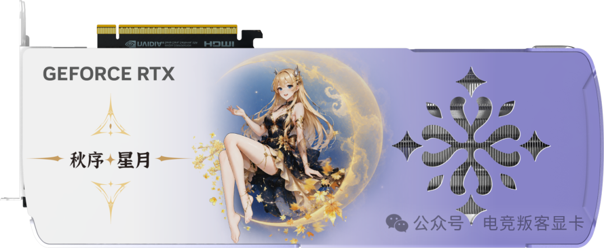
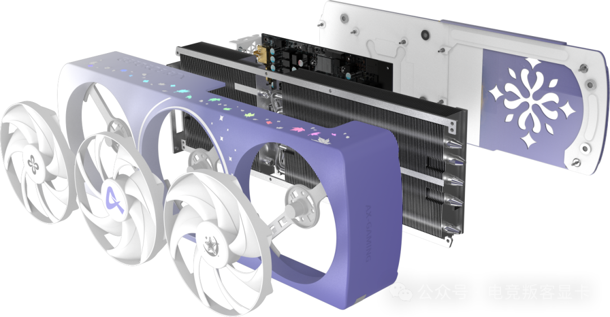
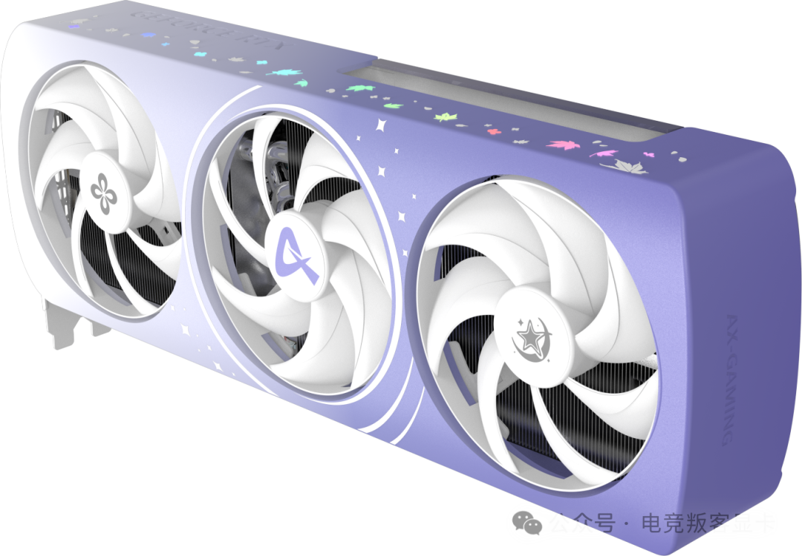
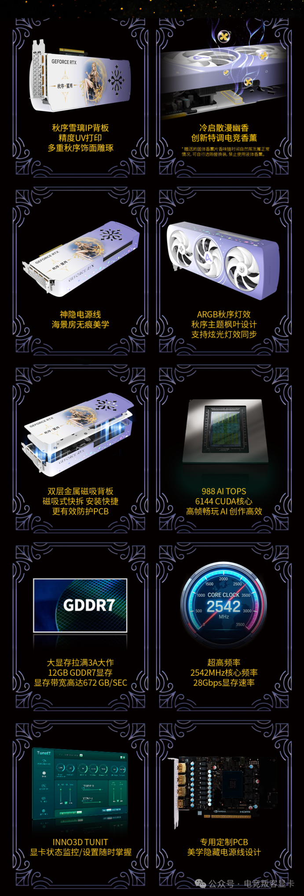

AX Gaming (电竞叛客), el ensamblador chino especializado en ediciones temáticas,
ha presentado la GeForce RTX 5070 12 GB «Edición de Otoño», la tercera tarjeta
de su serie limitada de las cuatro estaciones de 2026. El modelo mantiene la
base de hardware de la RTX 5070 de referencia y traslada el esfuerzo al
apartado estético y, sobre todo, a un detalle poco habitual en una tarjeta
gráfica: una lámina de aromatizante integrada que libera fragancia cuando el
equipo arranca en frío, según recoge MyDrivers.

## Una edición de otoño con identidad anime

La tarjeta sigue el tema «秋序星月, 璃逐枫芒» (algo así como «estrellas y luna de
otoño, hojas de arce al vuelo») y abandona los acabados sobrios habituales del
segmento. El cuerpo combina un degradado de blanco y morado inspirado en la
paleta otoñal, con tres ventiladores de color blanco en los que se imprimen
distintos motivos: una flor de osmanto, el logotipo de AX y un emblema de
estrella y luna. Los bordes del carenado se decoran con hojas de arce y puntos
luminosos, un lenguaje visual que mezcla la estética de personaje anime con
líneas propias del hardware de juego.

El elemento central del diseño es la parte trasera. AX Gaming recurre a
impresión UV y a un tallado de varias capas para reproducir sobre el backplate
metálico la figura de «Xueli», un personaje anime, acompañada del lema temático
en el lateral. El conjunto se completa con iluminación ARGB en forma de hoja de
arce: los orificios de ventilación alojan pequeños LED y admiten sincronización
con otros componentes del equipo.

En el montaje, el fabricante apuesta por ocultar el cableado. Su diseño
«神隐电源线» integra el tendido de alimentación dentro de la propia estructura de
la tarjeta, de modo que el conector no queda a la vista y encaja mejor en cajas
con panel lateral de cristal y gran visibilidad interior. La cubierta posterior
es un backplate doble de metal con anclaje magnético y extracción rápida, que se
alinea y encaja sin necesidad de tornillos y que, según la marca, también
refuerza la protección de la PCB frente a deformaciones.

## El aromatizante, la novedad más disruptiva

El toque diferencial no es de rendimiento, sino olfativo. La tarjeta incorpora
un aromatizante de tipo sólido —presentado como «aromaterapia de juego»— que
comienza a desprender su aroma en los arranques en frío, de manera que la
primera puesta en marcha del equipo va acompañada de una fragancia. Es una
propuesta insólita incluso dentro de un mercado acostumbrado a las ediciones de
coleccionista, donde la personalización suele limitarse a colores, iluminación y
insignias.

MyDrivers señala que, por ahora, el fabricante no ha detallado cuál es la vida
útil de la fragancia ni si el usuario podrá sustituirla. Esa falta de datos deja
abiertas las dos preguntas prácticas del invento: cuánto dura el efecto y qué
ocurre cuando se agota.

## Especificaciones y refrigeración

En el plano técnico, AX Gaming no altera el silicio de la RTX 5070. La ficha
recogida por la fuente es la siguiente:

| Especificación | Valor |
| --- | --- |
| Núcleos CUDA | 6144 |
| Frecuencia de boost | Hasta 2542 MHz |
| Memoria | 12 GB GDDR7 |
| Ancho de banda de memoria | 672 GB/s |
| Velocidad de memoria | 28 Gbps |
| Potencia de IA | 988 TOPS |

Para refrigerar la GPU, la marca emplea su módulo «Punk 4.0», con un disipador
de dos tramos que ocupa tres ranuras y cinco heat pipes compuestos de 8 mm. La
tarjeta es compatible con el software de monitorización y ajuste TUNIT de Inno3D
(映众), pensado para consultar en tiempo real el estado del componente.

## Qué cambia para el comprador hispanohablante

Para quien busque rendimiento, esta edición no supone ninguna mejora: las cifras
de núcleos, memoria y frecuencias son las de una RTX 5070 12 GB convencional, y
el valor añadido está en el acabado, el personaje y el aromatizante. La
información publicada no incluye precio ni planes de distribución fuera de
China, algo habitual en este tipo de series temáticas, que suelen quedarse en el
mercado local o llegar a otros países más tarde, en cantidades limitadas y con
sobreprecio.

Quien valore lo coleccionable por encima de lo funcional encontrará aquí una
propuesta coherente con la fiebre de los montajes coordinados; quien solo quiera
una GPU para jugar tiene alternativas de la misma RTX 5070 sin el componente
olfativo ni el coste extra de una edición de temporada.
