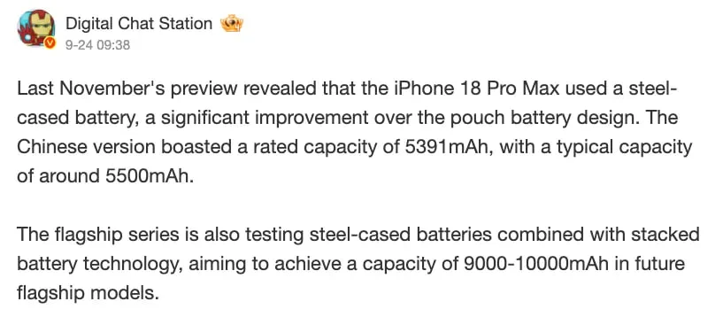

Digital Chat Station, uno de los filtradores más citados del ecosistema chino, asegura que un gran fabricante de smartphones está probando **baterías con carcasa de acero combinadas con celdas apiladas**. GizmoChina recoge la información, que hasta ahora es solo un rumor de filtrador: la publicación no identifica a la marca ni concreta ningún modelo, y no hay ninguna confirmación oficial.

## Lo que dice la filtración

Según la publicación de Digital Chat Station en Weibo, esa serie de gama alta está probando celdas con carcasa de acero unidas a tecnología de batería apilada, con el objetivo de alcanzar entre **9.000 y 10.000 mAh** en futuros modelos insignia. El mismo mensaje recuerda que el iPhone 18 Pro Max pasaría de la batería en bolsa a la carcasa metálica, con una capacidad nominal de 5.391 mAh en la versión china y unos 5.500 mAh como valor típico.

GizmoChina encaja ese dato en una tendencia que Apple inauguró con el iPhone 16 Pro, el primer modelo de la marca en llevar un envoltorio de aluminio alrededor de la celda: una carcasa rígida que aporta resistencia estructural a la batería y permite trabajar con un paquete más compacto. Según el medio, el iPhone 18 Pro Max —al menos en las versiones con bandeja SIM física— se quedaría en esos 5.391 mAh, unos 12 % por encima de la generación anterior.

## Baterías de acero: del aluminio a la pila apilada

La novedad no está solo en el material. Los fabricantes chinos estarían sustituyendo el aluminio por **acero** y, sobre todo, cambiando el diseño interno de la celda: en lugar de la configuración enrollada tradicional —la llamada «jelly roll», por su parecido con un rollo— pasarían a **celdas apiladas**, que aprovechan mejor el volumen disponible dentro del cuerpo del teléfono y admiten una densidad de energía más alta.

A esa combinación se suma el ánodo de silicio-carbono, la química que ya ha llevado a muchos móviles chinos de gama alta por encima de los 7.000 mAh. Con más espacio útil por capa apilada y una química ya probada, la cifra de 9.000 a 10.000 mAh deja de parecer un objetivo lejano.

## Qué cambiaría para el usuario

Las marcas chinas ya ofrecen una autonomía sólida gracias a esa densidad, pero superar la cifra de cinco dígitos en un cuerpo de gama alta de verdad fijaría un nuevo listón. El primer límite no es la celda, sino el reparto interior: seguirá habiendo que convivir con un bloque de cámaras avanzado del tamaño que exige la fotografía móvil actual.

Hay precedentes cercanos en el mercado. El [Redmi K100 estándar ya pasó por certificación en China con la vista puesta en una batería de 10.000 mAh](/noticias/redmi-k100-large-battery/), y modelos como el OPPO Find X10 adelantan 8.000 mAh en su gama alta. Samsung, por su parte, seguiría con una lógica más conservadora: aunque [los Galaxy S Ultra repiten la misma batería de 5.000 mAh desde 2020](/noticias/galaxy-s-ultra-bateria-cambio/), las filtraciones sitúan al Galaxy S27 Pro en torno a 5.200 mAh y a la versión Ultra cerca de 5.700 mAh, el primer aumento real de capacidad de la línea Ultra en años, apoyado en el silicio-carbono que la marca ya usa en sus plegables.

De momento, lo que cambia es la forma de exprimir la capacidad: celdas con carcasa metálica y distribuciones internas más inteligentes dan a los fabricantes nuevos caminos para meter más miliamperios en el mismo espacio. Si la filtración se confirma, el próximo salto de autonomía en Android vendrá de la estructura de la batería, no solo de su química.
