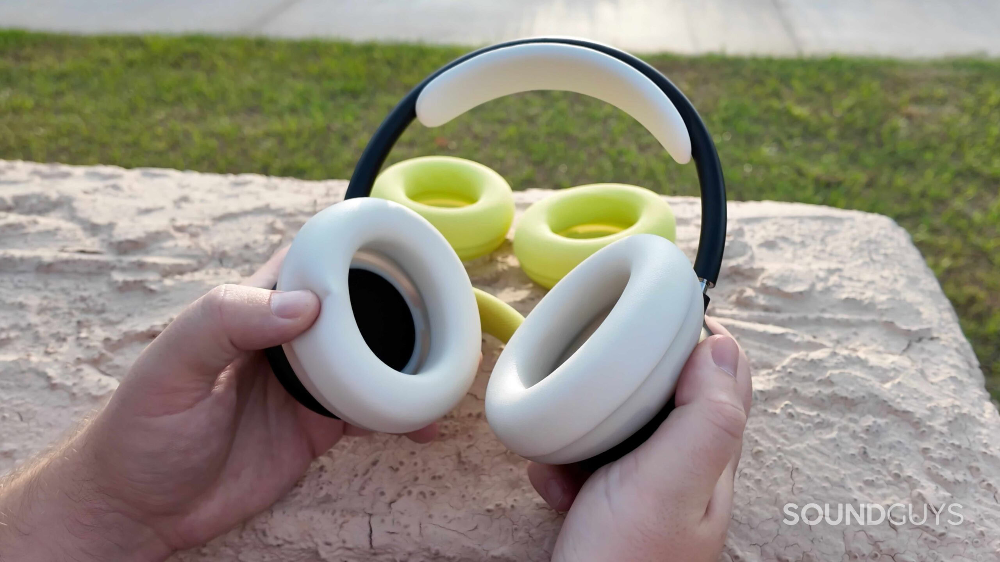
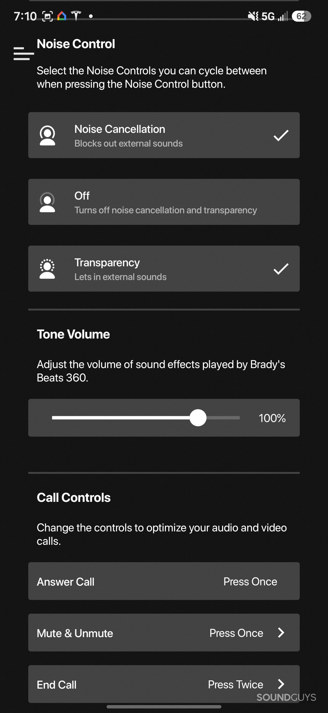
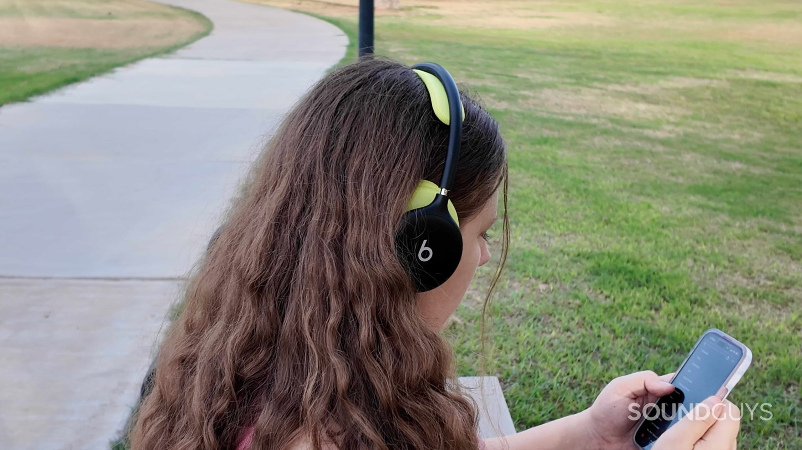
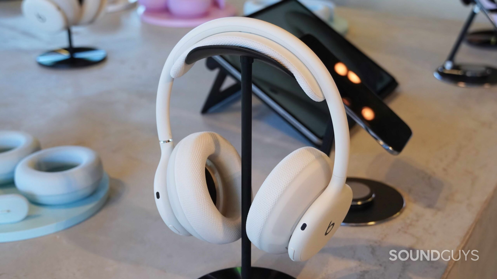
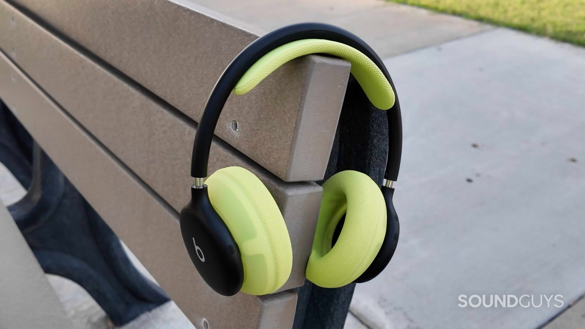

Beats ha puesto a la venta los Beats 360, sus primeros auriculares over-ear genuinamente nuevos en varios años. Llegan con un diseño modular que permite sustituir las almohadillas y la diadema, resistencia al agua IPX4 y un precio de 349 dólares. SoundGuys los ha analizado tras casi dos semanas de uso y su veredicto es claro: son unos auriculares cómodos y versátiles para el día a día, pero no son la mejor opción para quien prioriza la calidad de sonido.

## Qué son los Beats 360

El Beats 360 se apoya en una arquitectura totalmente inalámbrica: batería, antena y procesador viven en cada uno de los auriculares, como ocurre en unos auriculares TWS. Eso permite un diseño modular y un reparto de peso más equilibrado. Pesan 294,5 gramos, algo más que los Studio Pro, pero su diadema ligera hace que se sientan más cómodos.

Beats ofrece dos materiales de almohadilla. Las Performance Knit son de un tejido nuevo pensado para absorber el sudor y son las más cómodas; las UltraPlush, de cuero sintético, sellan mejor contra la cabeza y favorecen la cancelación de ruido, aunque generan más presión. La marca también ha trasladado los controles a la parte trasera de los auriculares: en el derecho hay un balancín de volumen y un botón de reproducción, y en el izquierdo, un botón para alternar los modos de cancelación y otro de encendido y emparejamiento que queda al ras del chasis.

El único puerto es un USB-C situado en la parte inferior del auricular izquierdo, y sirve exclusivamente para cargar. No hay jack de 3,5 mm ni audio por USB, así que los Beats 360 no pueden reproducir sonido a través de un cable.

## Conectividad, batería y funciones

La conexión pasa únicamente por Bluetooth 5.3 con códecs AAC y SBC. Los auriculares admiten el emparejamiento en un toque de Apple y el Fast Pair de Google, además del audio espacial personalizado con seguimiento dinámico de la cabeza, aunque esta función exige un iPhone con cámara TrueDepth para configurarla y no está disponible en Android. También son compatibles con Find My de Apple y Find Hub de Google, y con el cambio automático de dispositivo dentro de cada ecosistema.

En el apartado de ajustes, los Beats 360 se quedan sin ecualizador personalizado. Solo incorporan un modo Adaptive EQ que ajusta el sonido según el sellado de cada usuario, y que únicamente se activa cuando la cancelación de ruido y la transparencia están desactivadas. Ese modo Off no viene configurado por defecto: hay que habilitarlo antes desde los ajustes del iPhone, del Mac o desde la app de Beats en Android.

La batería está cifrada en 32 horas de reproducción con cancelación o Adaptive EQ activos, y la carga rápida aporta una hora de uso con cinco minutos enchufados. SoundGuys comprobó que la autonomía real puede superar esa cifra: en un vuelo de casi seis horas con cancelación activa, los auriculares apenas consumieron un 14 %.

## Qué dice la review de SoundGuys

SoundGuys otorga a los Beats 360 una nota de 7,3 sobre 10. Entre sus puntos fuertes destacan la comodidad, la resistencia al agua, la calidad de las llamadas y la batería; entre los débiles, la ausencia de audio por cable, la falta de ecualizador manual y el precio.

En cancelación de ruido, Beats recurre a ocho micrófonos MEMS y a su chip de cuarta generación, y asegura que los 360 ofrecen 1,75 veces más cancelación que los Studio Pro. En la práctica, el análisis señala que funcionan bien con ruidos constantes —el zumbido de un aire acondicionado o la cabina de un avión a volumen medio-alto—, pero no eliminan del todo las voces ni los sonidos agudos. El sellado de las almohadillas UltraPlush, junto con la mayor fuerza de sujeción, puede resultar incómodo.

El sonido es lo más discutido de la reseña. Con la cancelación o la transparencia activadas, el grave se impone con fuerza y tapa detalles como los hi-hats; al pasar al modo Off entra Adaptive EQ, que contiene esos graves y devuelve una firma más equilibrada. SoundGuys indica además que el laboratorio todavía está completando las mediciones de respuesta en frecuencia y de cancelación, y que publicará los gráficos cuando termine.

El modo transparencia, en cambio, sale bien parado: suena casi como no llevar auriculares, hasta el punto de que filtra conversaciones cercanas y la propia respiración. En llamadas, los 360 suman nueve micrófonos en total, tres de ellos con formación de haz para la voz, y en una prueba junto a la playa el interlocutor no llegó a oír las olas.

## ¿Merecen la pena los Beats 360?

Las conclusiones apuntan a un público concreto: quien busca un solo par de auriculares para el gimnasio, el trayecto diario y los viajes. La resistencia IPX4 y las almohadillas intercambiables están pensadas justo para ese uso, algo poco habitual en auriculares over-ear. El compromiso más evidente es la calidad de sonido y, sobre todo, la imposibilidad de escuchar audio sin pérdidas por cable.

Como alternativa dentro de la propia marca, SoundGuys sigue recomendando los Beats Studio Pro: cuestan 50 dólares menos, admiten audio por USB-C y jack de 3,5 mm, y ofrecen más autonomía. Si la comodidad y las almohadillas intercambiables pesan más en el día a día, los Beats 360 son una compra sensata; si lo que importa es el sonido, los Studio Pro siguen siendo la opción más lógica.

La marca ya había aparecido en la actualidad reciente del portal con otro producto: el [supuesto mando de juego de Apple bajo la marca Beats](/noticias/beats-iphone-game-controller-rumor/), un proyecto muy distinto que, a diferencia de estos auriculares, todavía no se ha materializado.
