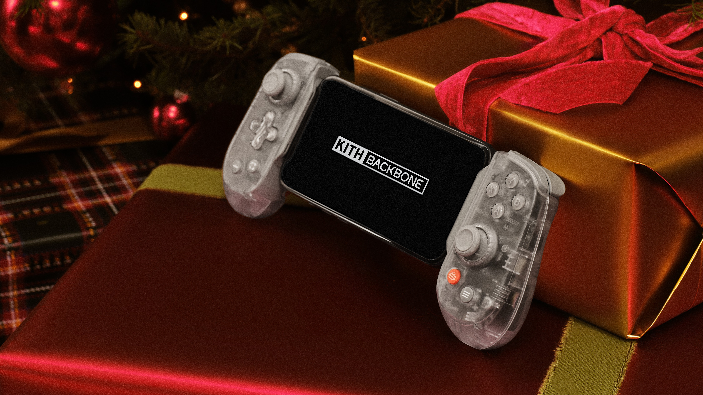

Apple podría estar dando un paso más en su apuesta por el juego en móviles con un accesorio
que, a primera vista, llama la atención: un mando de juego para iPhone firmado por Beats.
La información no es oficial y conviene leerla como un rumor, aunque tiene un origen con peso.

Según recoge TechRadar, el código de la versión 26.7 de macOS contendría referencias a dos
mandos de juego para iPhone que todavía no se han presentado. Los dispositivos, descubiertos
por MacRumors, aparecerían bajo los nombres en clave T6502 y T1057 y, según apunta el
periodista Mark Gurman de Bloomberg, Apple llevaría trabajando en ellos casi un año.

Lo más llamativo del rumor es el papel que jugaría Beats, la marca de audio que Apple compró
en 2014. Gurman sugiere que el equipo de Beats lideraría tanto la ingeniería del producto
como su concepción, lo que abre la puerta a que estos accesorios se lancen directamente bajo
la marca Beats y no como un producto genérico de Apple.

## Qué se sabe hasta ahora

La información disponible es todavía escasa y se apoya en fragmentos de código y en las
declaraciones de un periodista con buena trayectoria en filtraciones de Apple. Los puntos
clave son los siguientes:

- **Dos mandos en desarrollo**, identificados internamente como T6502 y T1057.
- **Diseños hápticos distintos** entre ambos, además de las funciones habituales de un mando.
- **Participación de Beats** en la ingeniería y el diseño del producto.
- **Un proyecto con casi un año de recorrido**, si se confirma el plazo que maneja Gurman.

Beats ha dejado de ser solo una marca de auriculares dentro de Apple: también firma cables
USB-C y fundas para iPhone. Que ahora se baraje su nombre para accesorios de juego encajaría
con esa evolución hacia productos más amplios.

## Por qué importa para el usuario

Detrás del rumor hay una lógica de mercado. Gurman señala que Apple ve los accesorios de juego
para teléfonos como un mercado en crecimiento y quiere entrar en él. El contexto también ayuda:
la crisis de memoria que afecta a la industria del PC y de las consolas hace que el iPhone,
con una base instalada enorme y un ecosistema de títulos en crecimiento, resulte un terreno
atractivo para llevar el juego portátil a más gente.

Queda por ver, en cualquier caso, si los mandos se materializan y con qué forma. El propio
artículo de TechRadar apunta a una posibilidad interesante: que Beats aproveche su experiencia
en audio para crear un accesorio híbrido que combine mando y altavoz, una idea con precedentes
en accesorios de ASUS para su línea ROG Phone. Por ahora no es más que especulación, pero
explica por qué la implicación de Beats tiene sentido más allá del nombre.

Hasta que Apple confirme algo, conviene tratar esta información como lo que es: una pista
en el código y un rumor con fundamento, no un anuncio oficial.
