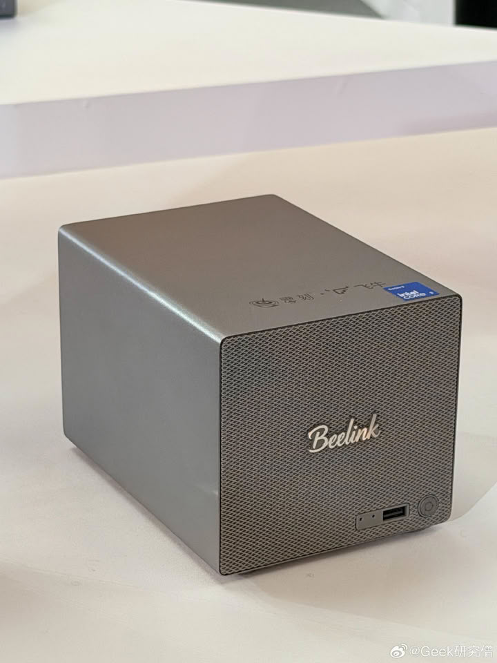
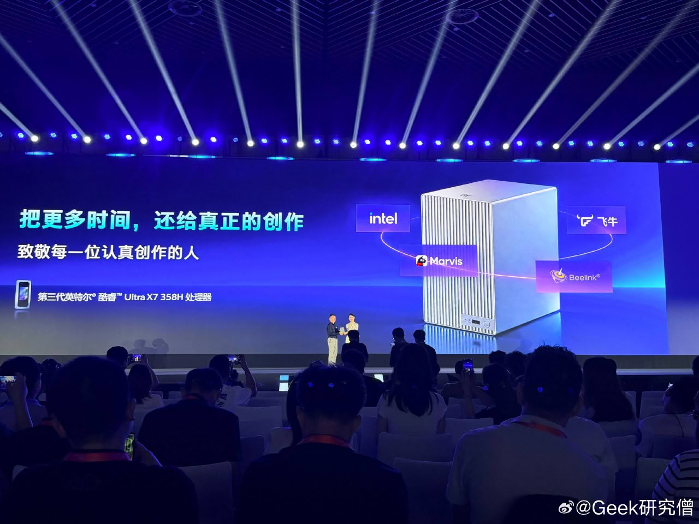

Beelink ha vuelto a mover las piezas de su familia ME Pro. Después de detallar en mayo de 2026 la actualización de sus soluciones NAS de dos y cuatro bahías, la compañía ha anunciado una nueva revisión de esas mismas unidades que eleva el techo de rendimiento hasta el Intel Core Ultra X7 358H. El cambio no es cosmético: ese procesador integra gráficos Intel Arc B390, lo que permite que el equipo deje de ser solo un almacén conectado a la red y pueda asumir también tareas de cómputo.

## Qué cambia con el Core Ultra X7 358H

El salto de procesador es el corazón de la actualización. El Core Ultra X7 358H es un chip de 16 núcleos de la plataforma Intel Panther Lake y su punto fuerte está en la gráfica integrada, la Arc B390. Esa iGPU es la que habilita el doble uso del ME Pro como máquina de render conectada a la red o como acelerador de inteligencia artificial para aplicaciones de nube privada.

Beelink ofrecerá también una variante más modesta con el Core Ultra 5 325H, una CPU claramente inferior que encaja mejor en un perfil de uso doméstico. La compañía todavía no ha detallado las especificaciones completas de cada modelo, así que se desconoce qué memoria o qué conectividad acompañarán a cada procesador.

## Para quién está pensado

El ME Pro con Panther Lake apunta a quien quiere algo más que copias de seguridad. Para un hogar o una pequeña oficina que reproduce vídeo en Plex o Jellyfin para varios dispositivos a la vez, contar con una gráfica integrada capaz de transcodificar sin ahogar a la CPU es una ventaja tangible. Y para quien quiera experimentar con modelos de IA en local sin depender de la nube, la Arc B390 abre esa puerta, como ya demuestra el caso de [reconvertir una Intel Arc antigua en servidor de LLM](/noticias/intel-arc-local-llm-server/).

Quien esté valorando [montar un servidor doméstico](/noticias/old-laptop-home-server/) por su cuenta encontrará aquí una alternativa más llave en mano, aunque también más cara que reciclar un portátil antiguo.

En China, estos equipos se enviarán con Feinui fnOS para gestionar copias de seguridad y acceso remoto, además de funciones de organización de vídeo con IA. También incluirán Marvis, de Tencent, para buscar, clasificar y archivar archivos. Está por ver si las unidades que lleguen a los mercados internacionales conservan ese mismo software.

## Capacidad y disponibilidad

La línea ME Pro se comercializa en configuraciones de dos y cuatro bahías. En la variante de cuatro bahías las cifras que se manejan apuntan a un máximo de 132 TB, mientras que los modelos de dos bahías se anuncian con 72 TB. El anuncio también dejó ver una tercera variante compacta, que podría ser un modelo totalmente de estado sólido.

El lanzamiento está previsto para octubre, previsiblemente primero en China, y no se ha aclarado si la versión internacional llegará con las funciones de IA ya incluidas. Tampoco hay precios confirmados, un dato clave para saber si la apuesta por un NAS con gráficos de portátil se traduce en una prima razonable o en un salto de gama difícil de justificar.
