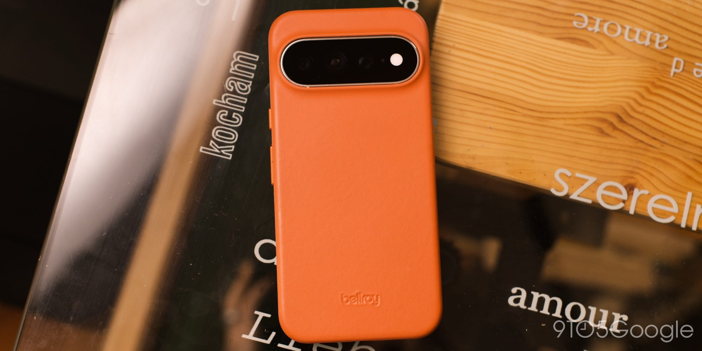
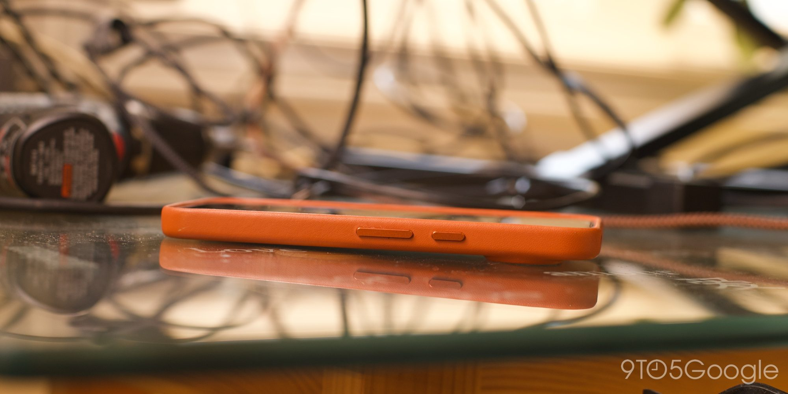
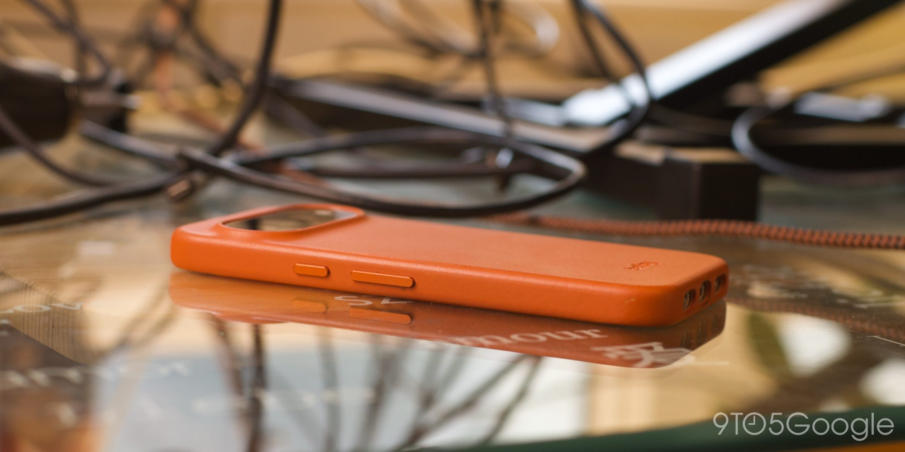
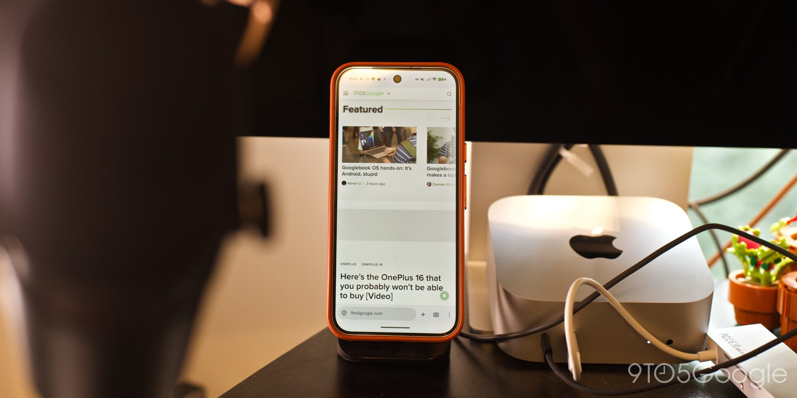
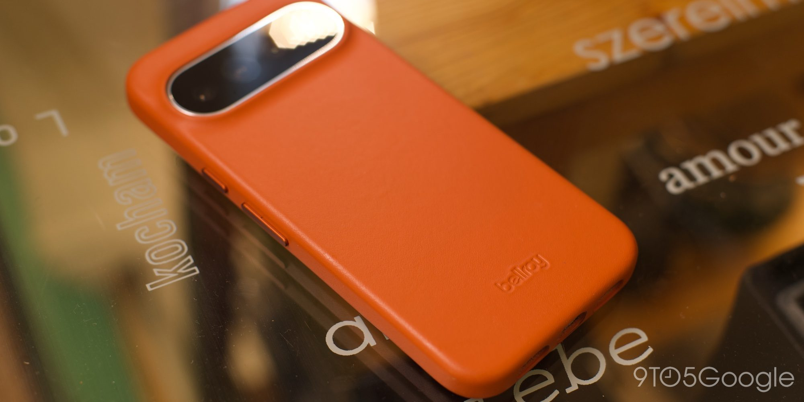

El redactor Daniel Bader, de 9to5Google, lleva más de tres semanas usando la funda de cuero de Bellroy para el Pixel 11 Pro XL en su variante Red Ochre, y su veredicto es claro: es una funda para quedarse. Bellroy, compañía de Melbourne y socio oficial del programa Made by Google, suele estar entre los primeros fabricantes en presentar sus fundas cada mes de agosto, y esta generación mantiene ese nivel.

## Un cuero pensado para envejecer bien

El atractivo de una buena funda de cuero está en cómo envejece: la pátina que el material adquiere al absorber los aceites de la piel, los roces y las inclemencias del uso diario. Según la prueba, el cuero de Bellroy es fino y rígido, con un tratamiento que retrasa el desgaste, por lo que tarda más en desarrollar esa pátina que, por ejemplo, el cuero Horween de una funda de Nomad.

A cambio, conserva el aspecto de nuevo durante más tiempo: salvo algunos arañazos menores, la unidad probada superó sin marcas varias caídas relacionadas con niños pequeños.

## La funda de Bellroy para el Pixel 11 Pro XL por dentro: construcción y PixelSnap

En el apartado estructural, el cuero va reforzado con un marco rígido de plástico que sobresale alrededor de un milímetro por encima de la pantalla, y el interior está forrado con microfibra. La parte trasera incorpora imanes compatibles con PixelSnap, el sistema magnético de Google, y los botones están fabricados en aluminio anodizado, con un tacto que, según el autor, recuerda al de los propios botones del teléfono.

La funda cuesta 59 dólares y se ofrece en cuatro colores: el rojo ocre (Red Ochre) de la unidad analizada, además de negro, alcachofa (Artichoke) y peltre (Pewter) para quienes prefieran tonos más discretos.

## Qué cambia para quien tiene un Pixel en España

A diferencia de lo que ocurre con el iPhone o los Galaxy, donde sobran las opciones de fundas de cuero de calidad, en el ecosistema Pixel la oferta es escasa. La prueba menciona como alternativa una funda de Snakehive de unos 40 dólares, con un cuero aparentemente más flexible que desarrolla la pátina con mayor rapidez, pero con una cobertura incompleta: deja al descubierto la parte superior, la inferior y el lateral de los botones, un compromiso que el autor no comparte. Bellroy, en cambio, combina protección completa, imanes PixelSnap y un cuero que mejora con el tiempo.

Para el lector que busque una funda de cuero duradera para su [Pixel 11 Pro XL, cuyas cámaras y funciones de IA analizamos en detalle](/noticias/google-pixel-11-pro-xl-review/) y esté dispuesto a pagar el precio premium, la propuesta de Bellroy queda, según 9to5Google, como la referencia a batir hasta que aparezca algo mejor.
