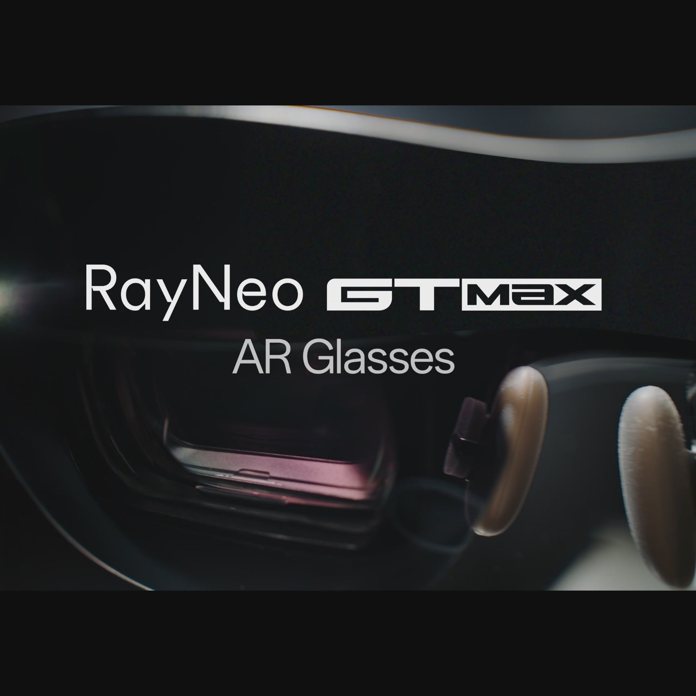

Para jugar en un PC, las gafas AR de RayNeo plantean dos caminos que se separan por una sola línea: tamaño de pantalla o nitidez de texto. Las **RayNeo GT Max** ofrecen la imagen más grande, una pantalla virtual de 267 pulgadas y un campo de visión de 59 grados, con un precio de 429 dólares que baja a 399 tras un descuento de 30 dólares aplicado en el pago. Las **RayNeo Air 3s Pro** apuestan por lo contrario: 201 pulgadas y 46 grados por 279 dólares y, como meten el mismo panel de 1920x1080 por ojo en un campo más estrecho, el detalle fino se ve más denso.

Ambos modelos alcanzan los 120 Hz en contenido 2D, bajan a 60 Hz en 3D y pesan menos de 80 gramos: 78 gramos la GT Max y 76 gramos la Air 3s Pro. Los dos se conectan a un PC con un solo cable USB-C, siempre que el puerto admita salida de vídeo. Esa condición decide la mayoría de las configuraciones, así que conviene empezar por ahí.

## Qué decide si las gafas funcionan con tu PC

Estas gafas son pantallas y necesitan una señal de vídeo, pero un puerto USB-C solo la transporta si soporta **DisplayPort Alt Mode**, una especificación que permite dedicar parte de los carriles del cable a una señal de pantalla en vez de solo datos. Muchos puertos USB-C, incluso en equipos actuales, sirven únicamente para carga y datos.

Eso divide a los jugadores de PC en tres grupos. Los portátiles gaming con salida de vídeo por USB-C necesitan un solo cable y Windows las detecta como un segundo monitor de 1920x1080, sin comprar nada más. En los PC de sobremesa, las tarjetas gráficas suelen exponer HDMI y DisplayPort en lugar de USB-C con DP Alt Mode, así que hace falta el adaptador HDMI de RayNeo, de 64 dólares y vendido por separado. Los portátiles sin vídeo por USB-C siguen esa misma ruta a través de su salida HDMI.

Conviene retener un detalle que suele pillar por sorpresa: **el adaptador HDMI necesita su propia fuente de alimentación USB-C**. El HDMI transporta vídeo, pero no energía, y sin esa alimentación las gafas no arrancan. RayNeo lo deja claro en las preguntas frecuentes de la GT Max.

Otra duda habitual entre quienes tienen un sobremesa es si el adaptador les cuesta los 120 Hz. La respuesta es que no: el adaptador funciona con HDMI 2.0, que transporta 1080p a 120 Hz con margen de sobra. Basta con fijar 1920x1080 a 120 Hz en el panel de control de la tarjeta gráfica. La forma más rápida de saber en qué grupo estás es buscar en las especificaciones de tu equipo el término «DisplayPort Alt Mode» o «salida de vídeo por USB-C»; si no aparece, toca comprar el adaptador.

## Compatibilidad según el dispositivo

| Dispositivo | Cómo se conecta | Qué hace falta comprar |
| --- | --- | --- |
| Portátil gaming con USB-C DisplayPort Alt Mode | USB-C directo | Nada, el cable está incluido |
| PC de sobremesa (salida HDMI o DisplayPort) | Mediante el adaptador HDMI (HDMI 2.0) | Adaptador HDMI (64 dólares) y una fuente de alimentación USB-C PD |
| Portátil sin salida de vídeo por USB-C | Mediante el adaptador HDMI | Lo mismo que en el sobremesa |
| Portátil para juegos USB-C con salida DisplayPort | USB-C directo | Nada |
| Portátil acoplado a la salida HDMI de una base | Mediante el adaptador HDMI | Adaptador HDMI y alimentación PD |
| Consolas PlayStation y Xbox | Mediante el adaptador HDMI | Adaptador HDMI y alimentación PD |
| Nintendo Switch y Switch 2 | Mediante JoyDock | JoyDock (89 dólares) más el soporte para Switch 2 (15 dólares) |
| Móvil o tableta con vídeo por USB-C, para juego en la nube y en remoto | USB-C directo | Nada |
| Dispositivos Lightning antiguos | Mediante el adaptador Digital AV de Apple | Adaptador, no incluido |

RayNeo agrupa sus listas de compatibilidad por tipo de conexión y no por nombre de modelo, que es la forma más útil de plantearlo: la pregunta no es si tu PC exacto aparece en la lista, sino si ese puerto envía vídeo.

## 120 Hz, modos de imagen y densidad de píxeles

Ambos modelos ofrecen 1920x1080 por ojo a hasta 120 Hz en 2D y bajan a 60 Hz con contenido 3D, así que el PC envía una señal de 1080p sea cual sea la resolución configurada en el escritorio. La diferencia está en qué hacen con esos píxeles: la GT Max los reparte en 267 pulgadas a 59 grados para ofrecer la imagen más grande, y la Air 3s Pro los concentra en 201 pulgadas a 46 grados para ofrecer la más densa. Tamaño y densidad son un intercambio, y cada modelo elige un bando.

Las pruebas de terceros completan el cuadro. Gaming Nexus conectó la Air 3s Pro a una Steam Deck y comprobó que el portátil arrancaba por defecto a 1920x1080 y 120 Hz, sin estelas en juegos rápidos. TechRadar Pro llegó a la misma conclusión desde el otro lado: describió el montaje como plug-and-play, con una imagen instantánea, brillante y nítida a través de un solo cable.

En cuanto a los modos de imagen, la GT Max incluye cuatro (Standard, Movie, Eye Protection y Office) más tres modos espaciales que controlan cómo se comporta la pantalla al mover la cabeza. Para jugar, **Follow** mantiene la pantalla centrada al girar, útil al moverse en la silla, mientras que **Pinned** la ancla a un punto fijo, más cómodo para sentarse quieto ante una sesión cargada de escenas cinemáticas. Hay que tener en cuenta un compromiso: Pinned limita el brillo a 336 nits, frente a los 1.200 nits de Follow y Steady. Si un juego se ve más apagado de lo esperado, el modo espacial es lo primero que conviene revisar. Ese seguimiento de la rotación es justamente el [3DoF que explicamos en esta guía](/noticias/what-is-3dof-ar-glasses/).

La Air 3s Pro, por su parte, lista seis modos optimizados: Game, Movie, Eye-Care, Professional, Vision Boost y Standard, con elección entre 60 y 120 Hz y 20 niveles de brillo. Gaming Nexus destacó los mandos separados de brillo y volumen en las patillas, porque permiten ajustar sin entrar en menús a mitad de partida.

## Qué modelo elegir para un PC de juego

**Elige la GT Max si quieres que la pantalla se sienta grande.** Los 59 grados de campo de visión y la pantalla virtual de 267 pulgadas, con variantes de 227 y 307 pulgadas, son la razón de pagar 120 dólares más. También se ofrece en tres tallas de distancia interpupilar (S por debajo de 64 mm, M de 64 a 67 mm y L por encima de 67 mm), un dato relevante en sesiones largas, e incluye cuatro altavoces ajustados por Bang & Olufsen con audio espacial.

**Elige la Air 3s Pro si te importa más la nitidez por dólar.** Comparte el panel de 1080p, pero su campo más estrecho de 46 grados concentra los píxeles: Gaming Nexus la sitúa en 49 píxeles por grado frente a los 38 de la GT Max. Una mayor densidad se traduce en texto de interfaz más nítido, y por 279 dólares es la entrada más económica, 120 dólares por debajo de los 399 de la GT Max.

Por géneros, la división queda así: los juegos de mundo abierto, carreras, vuelo y todo lo cinematográfico agradecen la vista más amplia, así que apuntan a la GT Max; los juegos de estrategia, MMO, simuladores de gestión y los shooters con mucha interfaz piden leer texto pequeño durante horas, donde compensa la Air 3s Pro. Las bibliotecas mixtas suelen caer del lado de la GT Max, porque una pantalla más grande también agranda el texto, aunque sea a menor densidad.

En lo que coinciden: certificación TÜV SÜD de baja luz azul y ausencia de parpadeo, atenuación de alta frecuencia de 3.840 Hz y compatibilidad con lentes graduadas a través del socio óptico Lensology. El chat de voz queda del lado del PC, ya que ambas están pensadas alrededor de altavoces y no de micrófonos: la imagen y el audio del juego salen por las gafas y el micrófono de casco, de mesa o de webcam sigue gestionando la conversación. El modo Whisper reduce la fuga de audio en entornos silenciosos, un detalle útil para jugar de madrugada sin molestar.

En el apartado de software no hay instalación alguna: las gafas se presentan ante Windows como una pantalla DisplayPort o HDMI estándar, la misma categoría que el sistema ya gestiona para cualquier monitor externo. Por eso el trabajo de configuración se reduce a elegir entre duplicar o extender en los ajustes de pantalla, e incluso es posible usarlas junto al monitor habitual para dejar el chat o una guía en la pantalla física mientras el juego llena la virtual.
