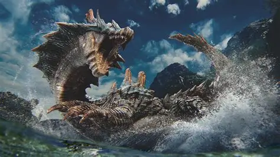
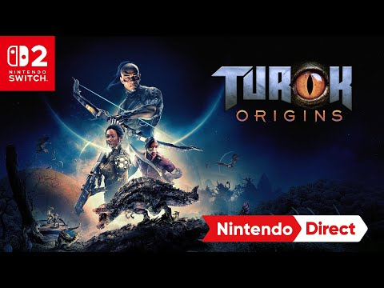
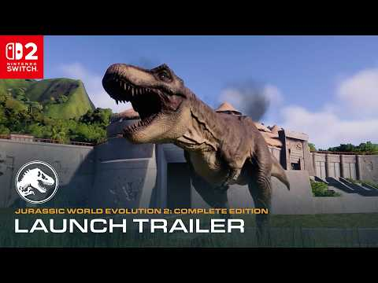

Los dinosaurios viven una edad dorada en el videojuego y el catálogo de Nintendo Switch 2 lo va a notar. El medio especializado Nintenderos ha reunido los seis títulos de dinosaurios que, según su repaso, marcarán el calendario de la consola híbrida a lo largo de 2026 y 2027. La selección mezcla reinicios de sagas de culto, propuestas de acción y supervivencia, y algún gestor de parques, con la potencia gráfica de la nueva máquina como denominador común.

La premisa del medio es clara: el salto técnico de Switch 2 permite por fin desplegar selvas hiperrealistas, físicas de vegetación avanzadas e inteligencias artificiales capaces de simular ecosistemas vivos sin renunciar al formato portátil.

## Seis juegos de dinosaurios para el catálogo de Switch 2

### 1. Turok: Origins

La franquicia de cazar dinosaurios con armamento pesado vuelve tras años en la sombra, ahora de la mano de Saber Interactive. El reinicio plantea una aventura de acción en primera persona con combate en solitario y modo cooperativo online, en la que encarnamos a un cazador espacial atrapado en un planeta salvaje repleto de velocirraptores, tiranosaurios cibernéticos y facciones alienígenas hostiles. Nintenderos destaca una tasa de imágenes por segundo estabilizada en la consola y el rediseño de armas clásicas como el arco tecno.

### 2. Tomb Raider: Legacy of Atlantis

Lara Croft regresa a las raíces de su primera aventura para reimaginar el mito de la Atlántida con la tecnología actual. El planteamiento combina un diseño de plataformas exigente con combates claustrofóbicos en ruinas olvidadas, y reserva al T-Rex el papel de gran jefe final. La potencia de Switch 2 permite renderizar las escamas y el comportamiento de los reptiles con un detalle que, según el medio, pondrá a prueba la agilidad del jugador.

### 3. Glaciered

La propuesta de Studio Tsurugidake traslada la acción a un escenario poco habitual: las profundidades de un océano helado, en una Tierra congelada tras un cambio climático severo. Controlamos a un «Tuai», una especie evolucionada a partir de aves y dinosaurios marinos que nada a gran velocidad mientras se enfrenta a cazadores primigenios. El combate dinámico en tres dimensiones y la iluminación submarina en alta resolución aprovechan, según el repaso, las capacidades de la pantalla portátil.

### 4. ARK: Ultimate Survivor Edition

La conocida propuesta de supervivencia en islas repletas de dinosaurios salvajes recibe una revisión técnica pensada para aprovechar la memoria RAM y el procesador de Switch 2. Esta edición definitiva promete acabar con las caídas de fotogramas del pasado y permitir domar, criar y equipar armaduras a tiranosaurios y espinosaurios en servidores masivos. Construir fortalezas tribales mientras se sobrevuela el mapa a lomos de un Pteranodon se convierte así, siempre según el medio, en una experiencia portátil sólida.

### 5. Monster Hunter Wilds

La entrega principal de Capcom ambientada en ecosistemas salvajes debuta en la plataforma, y su gran expansión *Ascendance* llegará después para exprimir la caza de grandes saurios y leviatanes. Los mapas reúnen manadas de terópodos y grandes wyverns territoriales, con persecuciones a lomos de la montura y una variabilidad climática extrema. La miniatura del tráiler que acompaña al repaso sitúa su llegada a Switch 2 el 4 de diciembre de 2026.

### 6. Jurassic World Evolution 2: Complete Edition

El gestor de parques jurásicos de Frontier Developments se adapta al hardware de la nueva consola integrando todas las expansiones de eras cinematográficas y especies lanzadas hasta la fecha. El título permite diseñar recintos de alta seguridad, gestionar brotes genéticos y observar el comportamiento de más de setenta especies de dinosaurios, con controles táctiles o botones tradicionales. Es, en palabras del medio, la opción perfecta para quien prefiera la estrategia y la gestión biológica a la acción en primera persona.

## Por qué importa

El interés por los dinosaurios no es una moda pasajera: el medio lo enmarca en un auténtico resurgir del género, con la supervivencia y el enfrentamiento contra depredadores colosales como principales ganchos. La lista también deja entrever cómo está cambiando el desarrollo en Switch 2, donde los estudios ya cuentan con margen para recrear vegetación, agua e iluminación con un nivel que hasta ahora quedaba reservado a las consolas de sobremesa.

## Qué cambia para el jugador

La selección cubre perfiles muy distintos, así que hay hueco tanto para quien busca acción en primera persona y cooperativo como para quien prefiere la exploración en solitario o la gestión de un parque. Eso sí, conviene tomar la lista como una hoja de ruta orientativa y no como fechas cerradas: varias de las propuestas apuntan a un margen amplio entre 2026 y 2027.

Quien quiera ir ampliando la lista de espera para la consola tiene otros lanzamientos confirmados en el radar, como [Far Cry 3 y su expansión Blood Dragon](/noticias/far-cry-3-blood-dragon-switch-2/), previstos para la primavera de 2027, o la segunda oportunidad que recibirá [Marvel's Guardians of the Galaxy](/noticias/guardians-galaxy-switch-2/) en la plataforma.
