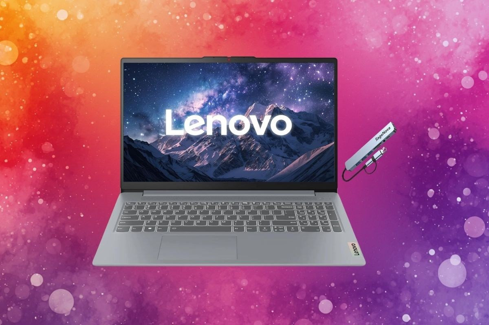
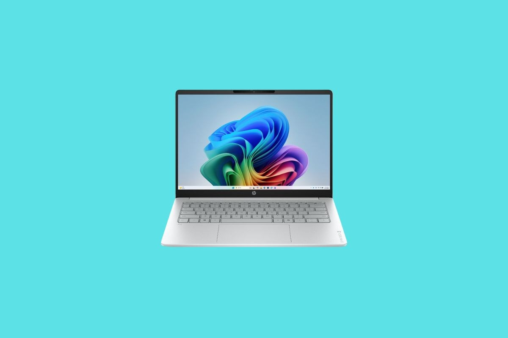
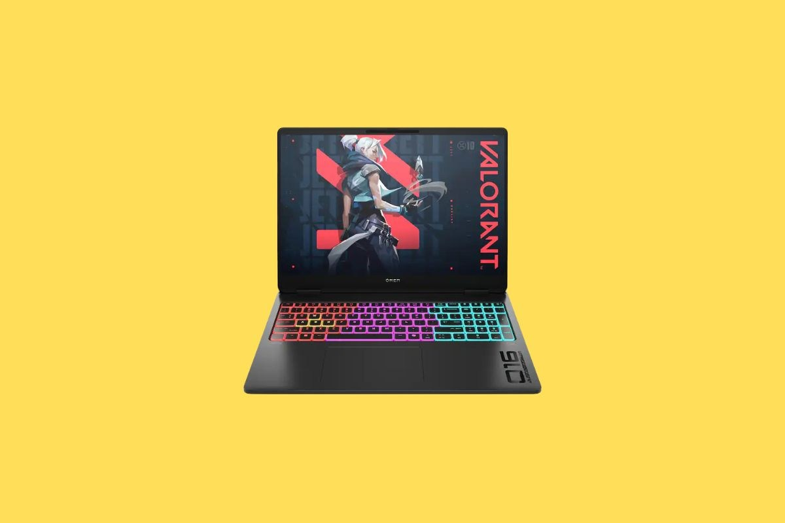
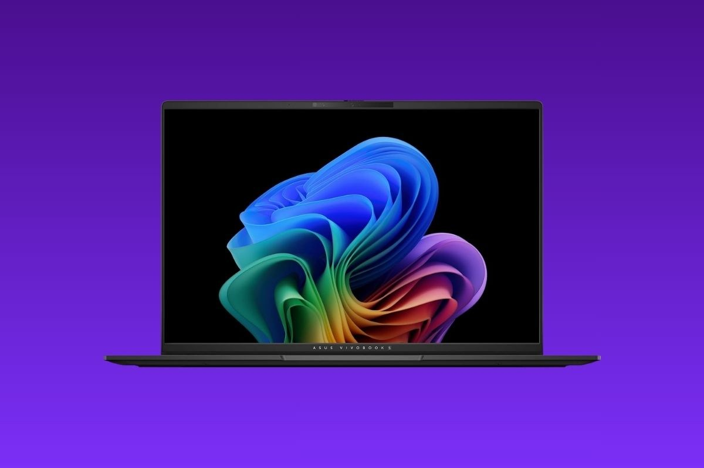

Encontrar un portátil que encaje con el presupuesto y con lo que cada uno necesita no siempre depende de esperar a la gran campaña de descuentos. PCWorld mantiene una selección de ofertas que revisa cada día laborable, y en su última actualización conviven equipos básicos por poco más de 300 dólares con portátiles gaming que recortan más de 1.000 dólares de su precio habitual.

Conviene tener presente desde el principio que se trata de precios en dólares y de minoristas estadounidenses, por lo que sirven sobre todo como referencia de mercado y de posicionamiento de modelos. Aun así, la lista es útil para entender qué configuraciones se están abaratando y en qué franjas conviene rastrear rebajas.

## Hasta 500 dólares: lo básico bien resuelto

La apuesta de PCWorld en este tramo es el Lenovo IdeaPad Slim 3i, que se queda en 329,99 dólares con 70 dólares de descuento en Amazon. Su procesador Intel N150 y su pantalla de 15,6 pulgadas a 1080p bastan para navegar, ver vídeo y trabajar con ofimática ligera, aunque la configuración de entrada se queda en 4 GB de RAM y 128 GB de SSD. Quien quiera algo más de margen tiene una variante en Best Buy con Core i3-N305, 8 GB de RAM y 128 GB de almacenamiento UFS por 362 dólares.

En el resto de la lista aparecen alternativas interesantes: el HP OmniBook 3 con Ryzen 5, pantalla táctil de 16 pulgadas y 256 GB por 475 dólares (304,99 de descuento); el LG gram Book 15 por 499,99 dólares; el Dell con Core i5-1334U por 499,99 dólares (350 de rebaja); y el HP 17 con pantalla de 17,3 pulgadas por 379,99 dólares en Adorama.

## Gama media: el equilibrio entre precio y prestaciones

Si el presupuesto permite subir un escalón, el elegido es el HP OmniBook 3 por 899,99 dólares en Microcenter, con 300 dólares de descuento. Monta un Ryzen AI 5 430, 16 GB de RAM y una pantalla táctil de 14 pulgadas a 1920×1200, una combinación que debería moverse con soltura en multitarea y cargas de trabajo algo más exigentes.

La franja media es también la más poblada de la lista: el Asus Vivobook 16 con procesador Snapdragon baja a 594,70 dólares; el Lenovo IdeaPad Slim 3i con Core i5-1335U se queda en 549,99 dólares; y el HP OmniBook X con Core Ultra 7 256V y pantalla táctil de 17,3 pulgadas cae hasta los 799,99 dólares, 549,01 menos que su precio de referencia.

## Gaming: las rebajas más agresivas

El mayor recorte lo protagoniza el HP Omen Max 16, que se queda en 1.799,99 dólares con 1.000 dólares de descuento en Best Buy. Combina un Intel Core Ultra 7 255HX con gráficos RTX 5070, una pantalla de 16 pulgadas a 1920×1200 y 165 Hz, y 16 GB de RAM con 1 TB de SSD, una base sólida para jugar con soltura y para tareas creativas.

La competencia no se queda atrás. El HP Victus con RTX 4050 baja a 949,99 dólares; el Lenovo LOQ con RTX 5060 se queda en 1.428 dólares; y una segunda variante del Omen Max 16 con Ryzen AI 7 H 350 y RTX 5070 alcanza los 1.349,99 dólares en Adorama, con un descuento de 1.349,01 dólares. Para quien busque el máximo de memoria, el MSI Crosshair A16 ofrece 32 GB de RAM y 1 TB por 1.599 dólares en Newegg.

## Premium: OLED y ultraligeros por debajo de 1.100 dólares

En la parte alta, la recomendación es el Asus Vivobook S16 por 1.099,99 dólares con 100 dólares de descuento en Amazon. Su Ryzen AI 7 350 se acompaña de 16 GB de RAM, 1 TB de SSD y una pantalla OLED de 16 pulgadas a 2880×1800, pensada para quien trabaja con color, vídeo o simplemente quiere una experiencia visual muy por encima de la media.

Junto a él destacan el HP OmniBook 5 con Snapdragon X y panel OLED por 994,01 dólares, el Microsoft Surface Laptop de 2024 con Snapdragon X Elite por 1.349 dólares y el Samsung Galaxy Book6 por 969 dólares, todos ellos en Amazon o Best Buy.

## Nuestra lectura

Esta lista es, ante todo, un termómetro del mercado estadounidense, y ahí está su principal limitación para el lector español: los precios no incluyen impuestos estatales, no contemplan el IVA ni los gastos de importación, y varios de los minoristas citados no envían a España o aplican costes que se comen buena parte del ahorro. Tomar los importes como referencia de qué configuración debería costar cada modelo es más realista que intentar replicar la compra tal cual.

Dicho esto, la foto de fondo es reveladora. Que un portátil con Snapdragon X, un Ryzen AI o una RTX 5070 aparezca con descuentos de tres y hasta cuatro cifras indica que estas plataformas ya han dejado de ser novedad y empiezan a competir por precio, algo que suele anticipar mejores ofertas también en el mercado europeo. El consejo clásico sigue vigente: si puedes, no bajes de 8 GB de RAM y evita configuraciones con menos de 128 GB de almacenamiento; y si no hay prisa, las ventanas de Prime Day (mediados de julio), Black Friday y la vuelta al cole (de junio a agosto) concentran los recortes más profundos. Para el resto del año, la referencia de PCWorld sirve para saber cuándo una rebaja es realmente buena y cuándo es solo ruido.
